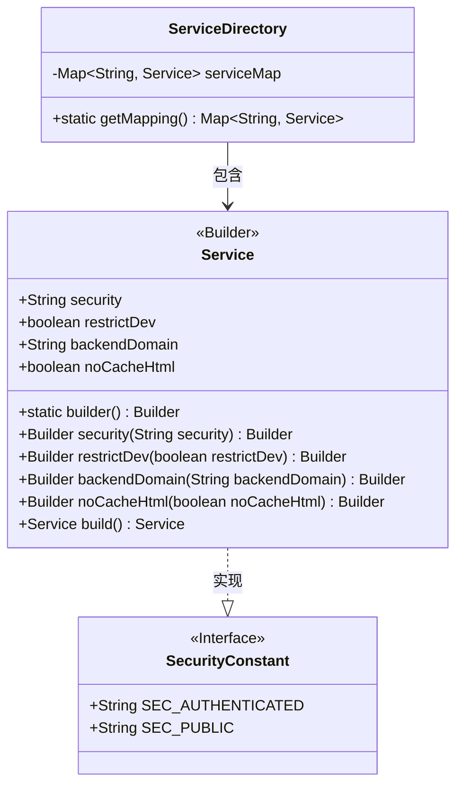
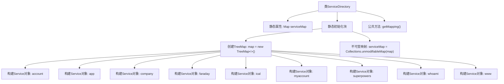

# 基础信息

|      |      |
|------|------|
| 名称 | ServiceDirectory |
| 编码语言 | .java |
| 代码路径 | staffjoy/common-lib/src/main/java/xyz/staffjoy/common/services/ServiceDirectory.java |
| 包名 | xyz.staffjoy.common.services |
| 依赖项 | ['java.util.Collections', 'java.util.Map', 'java.util.TreeMap'] |
| 概述说明 | ServiceDirectory类静态初始化服务映射，包含9个服务配置，涉及认证、开发限制及后端域名。 |

# 说明

ServiceDirectory类通过静态初始化块创建了一个不可修改的服务映射表，包含9个服务配置。每个服务设置了安全级别（SEC_AUTHENTICATED或SEC_PUBLIC）、开发环境限制标志、后端域名，部分服务启用了HTML无缓存选项。服务包括account、app、company等业务服务，以及faraday调试代理和www公共服务。该映射表通过getMapping方法对外提供只读访问。

# 类列表 Class Summary

| 名称   | 类型  | 说明 |
|-------|------|-------------|
| ServiceDirectory | class | ServiceDirectory类静态初始化服务映射，包含9个服务配置，涉及安全、开发限制和后端域名等属性。 |

## 类 ServiceDirectory

|      |      |
|------|------|
| 访问范围 | public |
| 类型 | class |
| 名称 | ServiceDirectory |
| 说明 | ServiceDirectory类静态初始化服务映射，包含9个服务配置，涉及安全、开发限制和后端域名等属性。 |

### UML类图

这段代码展示了一个服务目录系统，其中ServiceDirectory类通过静态初始化块创建了一个不可修改的服务映射表(serviceMap)，包含9种不同配置的服务实例。每个服务通过Service类的建造者模式创建，具有安全级别(security)、开发环境限制(restrictDev)、后端域名(backendDomain)和HTML缓存控制(noCacheHtml)等属性。SecurityConstant接口定义了两种安全级别常量(SEC_AUTHENTICATED和SEC_PUBLIC)。系统通过getMapping()方法提供只读访问服务映射的功能。

### 内部方法调用关系图

这段代码展示了一个服务目录类，通过静态初始化块预定义了9种不同的服务配置。每个服务通过Builder模式设置安全级别、开发限制、后端域名等属性，并存入TreeMap。最后将映射转为不可变集合，通过getMapping()方法对外提供只读访问。流程图清晰呈现了从类结构到服务初始化的完整过程，突出了静态初始化阶段的多服务构建逻辑。

### 字段列表 Field List

| 名称  | 类型  | 说明 |
|-------|-------|------|
| serviceMap | Map<String, Service> | 私有静态映射，键为字符串，值为服务对象。 |

### 方法列表 Method List

| 名称  | 类型  | 说明 |
|-------|-------|------|
| getMapping | Map<String, Service> | 静态方法返回服务映射表。 |

