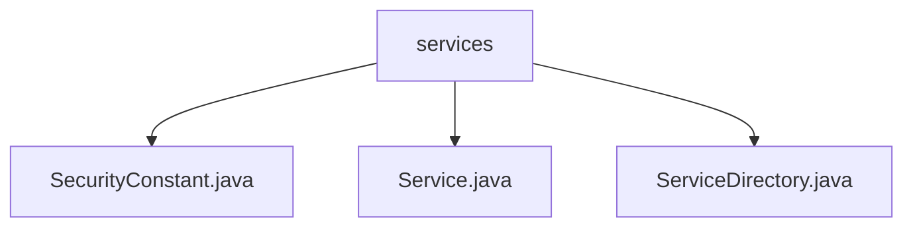

# 基础信息

|      |      |
|------|------|
| 名称 | services |
| 编码语言 | .java |
| 代码路径 | staffjoy/common-lib/src/main/java/xyz/staffjoy/common/services |
| 包名 | staffjoy.docs.common-lib.src.main.java.xyz.staffjoy.common.services |
| 概述说明 | SecurityConstant类定义安全级别常量。Service类配置服务属性。ServiceDirectory类创建服务映射表。 |

# 说明

## 概述
该代码模块是StaffJoy项目中的通用服务配置模块，主要提供安全级别定义、服务属性配置以及服务目录管理功能。核心功能包括：
1. 定义标准化的安全级别常量（公开/认证/管理员）
2. 封装服务的基础配置属性（安全级别、环境限制等）
3. 维护系统内所有服务的静态注册表

## 主要业务场景
1. **访问权限控制**：通过`SecurityConstant`定义的三个安全级别，实现不同业务场景的权限控制：
   - 公开访问（SEC_PUBLIC）
   - 认证用户访问（SEC_AUTHENTICATED）
   - 管理员特权访问（SEC_ADMIN）

2. **服务属性配置**：通过`Service`类支持的服务配置包括：
   - 安全级别选择
   - 开发环境限制（restrictDev）
   - 后端服务域名配置（backendDomain）
   - HTML缓存控制（noCacheHtml）

3. **服务目录管理**：`ServiceDirectory`维护了包含9个服务的静态映射表，典型业务服务包括：
   - 账户服务（account）
   - 应用服务（app）
   - 公司服务（company）
   - 公共服务（www）
   - 调试代理服务（faraday）

该模块为微服务架构提供了统一的安全标准和配置管理方案，支持不同环境下的服务部署和访问控制需求。

### 包内部结构视图

该流程图展示了staffjoy/common-lib项目下services目录的层级结构，包含三个Java文件：SecurityConstant.java定义安全常量，Service.java提供基础服务功能，ServiceDirectory.java实现服务目录管理。所有文件都直接位于services目录下，没有更深层级的嵌套关系，结构清晰简单。

# 文件列表 File List

| 名称   | 类型  | 说明 |
|-------|------|-------------|
| [ServiceDirectory.java](ServiceDirectory.md) | file | ServiceDirectory类静态初始化服务映射，包含9个服务配置，涉及认证、开发限制及后端域名。 |
| [Service.java](Service.md) | file | 服务类定义：权限等级、开发限制、后端域名、HTML缓存控制。 |
| [SecurityConstant.java](SecurityConstant.md) | file | 安全常量：公开0，需登录1，需管理员2。 |

