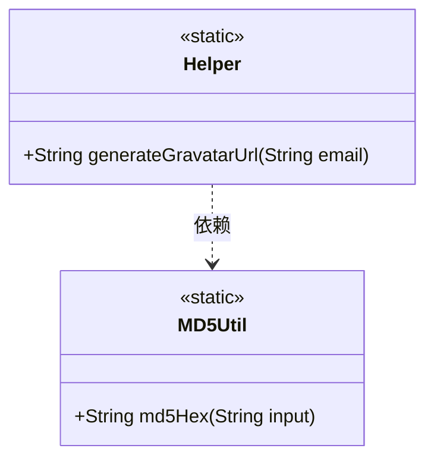
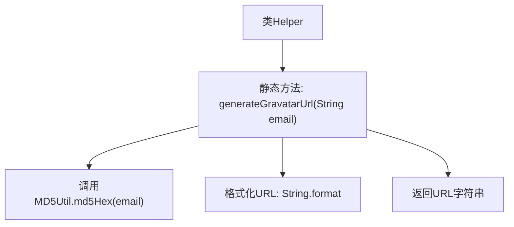

# 基础信息

|      |      |
|------|------|
| 名称 | Helper |
| 编码语言 | .java |
| 代码路径 | staffjoy/common-lib/src/main/java/xyz/staffjoy/common/utils/Helper.java |
| 包名 | xyz.staffjoy.common.utils |
| 依赖项 | [] |
| 概述说明 | 生成Gravatar头像URL的静态方法，输入邮箱返回400像素头像链接。 |

# 说明

这段内容描述了一个名为Helper的公共类，其中包含一个静态方法generateGravatarUrl。该方法接收一个字符串参数email，使用MD5Util工具类将email转换为MD5哈希值，然后拼接生成Gravatar头像服务的URL。生成的URL格式为固定前缀加上MD5哈希值，并指定图片大小为400像素，默认头像类型为identicon。该方法最终返回完整的Gravatar头像URL字符串。整个功能实现了根据用户邮箱自动生成对应Gravatar头像链接的功能。

# 类列表 Class Summary

| 名称   | 类型  | 说明 |
|-------|------|-------------|
| Helper | class | 生成Gravatar头像URL的静态方法，输入邮箱返回400像素头像链接。 |

## 类 Helper

|      |      |
|------|------|
| 访问范围 | public |
| 类型 | class |
| 名称 | Helper |
| 说明 | 生成Gravatar头像URL的静态方法，输入邮箱返回400像素头像链接。 |

### UML类图

这段代码的类图展示了`Helper`工具类通过静态方法`generateGravatarUrl`生成Gravatar头像URL的过程。该方法依赖`MD5Util`的静态方法`md5Hex`对邮箱进行MD5哈希处理，最终拼接成完整的Gravatar服务地址。图中明确标注了静态类和方法，以及类之间的依赖关系，体现了工具类协作处理字符串转换的核心逻辑。

### 内部方法调用关系图

这段流程图描述了Helper类中generateGravatarUrl方法的执行过程。该方法接收一个email字符串参数，首先通过MD5Util工具类生成MD5哈希值，然后使用String.format方法将哈希值嵌入到Gravatar头像服务的URL模板中，最终返回完整的头像请求地址。整个过程展示了从输入处理到结果返回的完整数据流转路径，涉及字符串加密和格式化两个关键操作。

### 字段列表 Field List

| 名称  | 类型  | 说明 |
|-------|-------|------|

### 方法列表 Method List

| 名称  | 类型  | 说明 |
|-------|-------|------|
| generateGravatarUrl | String | 生成Gravatar头像URL，使用邮箱MD5哈希值。 |

