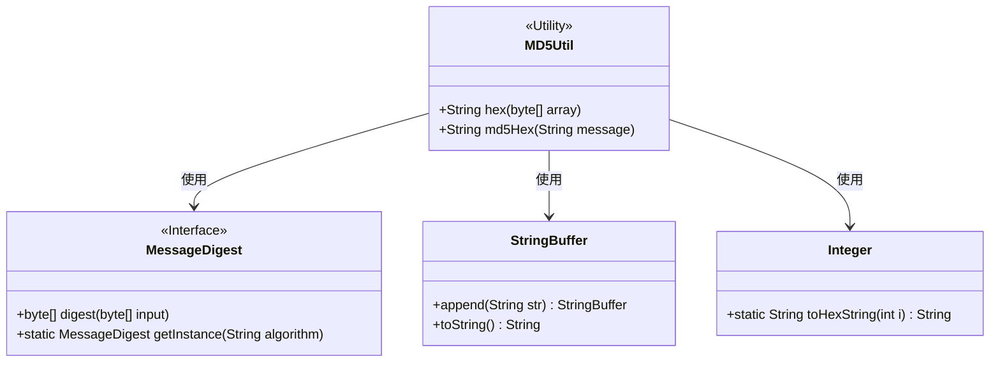
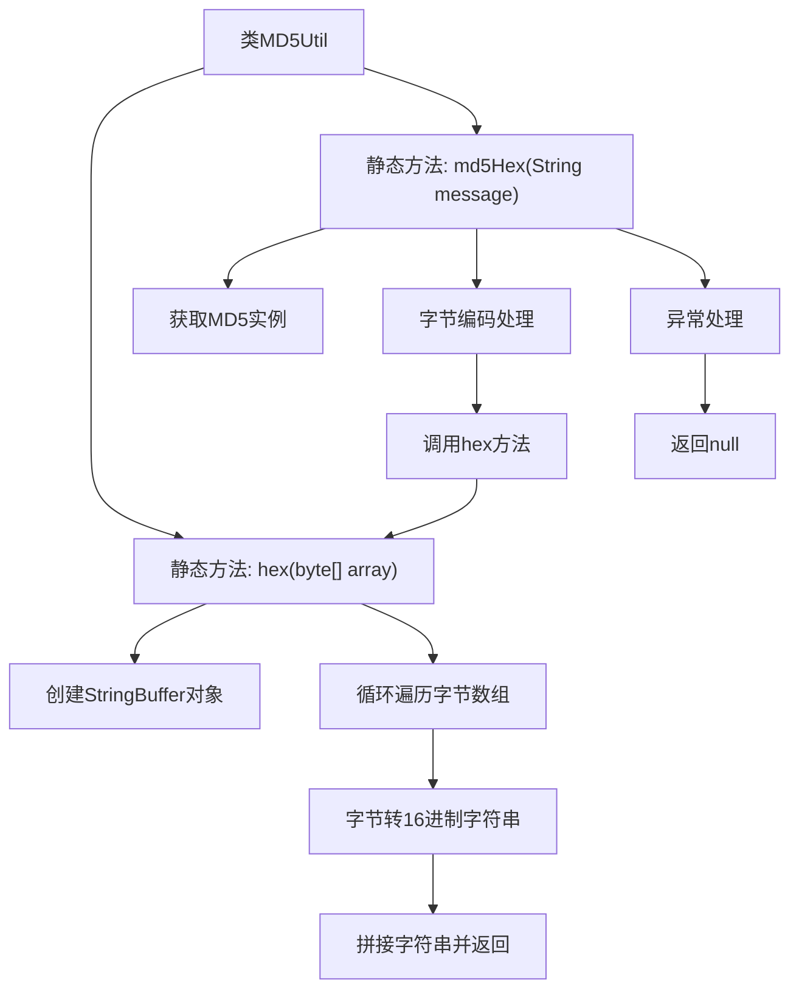

# 基础信息

|      |      |
|------|------|
| 名称 | MD5Util |
| 编码语言 | .java |
| 代码路径 | staffjoy/common-lib/src/main/java/xyz/staffjoy/common/utils/MD5Util.java |
| 包名 | xyz.staffjoy.common.utils |
| 依赖项 | ['java.io.UnsupportedEncodingException', 'java.security.MessageDigest', 'java.security.NoSuchAlgorithmException'] |
| 概述说明 | MD5工具类，包含字节数组转16进制和字符串MD5加密方法。 |

# 说明

这是一个名为MD5Util的工具类，提供两个静态方法实现MD5哈希功能。hex方法将字节数组转换为16进制字符串表示，通过位运算和字符串处理确保每个字节转为两位16进制。md5Hex方法接收字符串参数，使用MessageDigest获取MD5算法实例，将输入字符串按CP1252编码转为字节数组进行哈希计算后调用hex方法转换输出。方法捕获了可能出现的NoSuchAlgorithmException和UnsupportedEncodingException异常，异常时返回null。

# 类列表 Class Summary

| 名称   | 类型  | 说明 |
|-------|------|-------------|
| MD5Util | class | MD5工具类，提供字节数组转十六进制和字符串MD5加密功能。 |

## 类 MD5Util

|      |      |
|------|------|
| 访问范围 | public |
| 类型 | class |
| 名称 | MD5Util |
| 说明 | MD5工具类，提供字节数组转十六进制和字符串MD5加密功能。 |

### UML类图

这段代码展示了一个MD5工具类MD5Util，它提供了两个静态方法：hex用于将字节数组转换为十六进制字符串，md5Hex用于计算字符串的MD5哈希值。MD5Util依赖于Java标准库中的MessageDigest接口（用于MD5计算）、StringBuffer（用于字符串拼接）和Integer（用于十六进制转换）。类图中清晰地展示了这些类之间的依赖关系，MD5Util作为工具类不保存状态，仅提供静态方法。

### 内部方法调用关系图

这段代码流程图展示了MD5Util工具类的两个核心方法。hex方法负责将字节数组转换为16进制字符串表示，通过循环处理每个字节并使用位运算转换格式。md5Hex方法实现完整的MD5哈希流程，包括获取MessageDigest实例、处理字符串编码、调用hex转换，并包含异常处理机制。两个方法协同工作，最终将任意字符串转换为MD5哈希值，异常情况下返回null。整个流程体现了从原始数据到哈希值的完整转换过程。

### 字段列表 Field List

| 名称  | 类型  | 说明 |
|-------|-------|------|

### 方法列表 Method List

| 名称  | 类型  | 说明 |
|-------|-------|------|
| md5Hex | String | 生成MD5哈希值的静态方法，异常时返回null。 |
| hex | String | 将字节数组转换为十六进制字符串。 |

