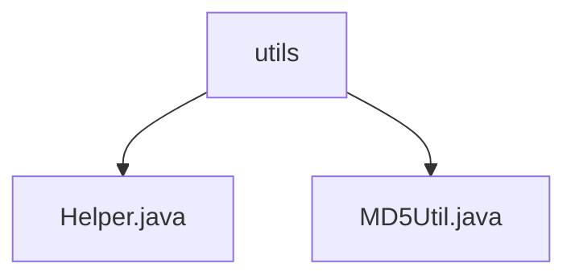

# 基础信息

|      |      |
|------|------|
| 名称 | utils |
| 编码语言 | .java |
| 代码路径 | staffjoy/common-lib/src/main/java/xyz/staffjoy/common/utils |
| 包名 | staffjoy.docs.common-lib.src.main.java.xyz.staffjoy.common.utils |
| 概述说明 | Helper类含静态方法generateGravatarUrl，通过MD5Util将邮箱转为哈希并拼接URL生成400像素Gravatar头像链接。MD5Util提供MD5哈希功能，处理异常返回null。 |

# 说明

## 概述  
该代码模块属于`staffjoy/common-lib`公共库，主要提供与用户头像生成相关的工具类功能。核心功能是通过用户邮箱自动生成对应的Gravatar头像服务链接，依赖MD5哈希算法对邮箱进行加密处理。模块包含以下关键组件：  
1. **Helper类**：提供静态方法`generateGravatarUrl`，封装Gravatar头像URL的生成逻辑。  
2. **MD5Util工具类**：提供MD5哈希算法的实现，支持字符串到16进制哈希值的转换。  

## 主要业务场景  
1. **用户头像动态生成**：  
   - 根据用户邮箱（如注册或登录时提供的邮箱地址）自动生成Gravatar头像链接。  
   - 生成的URL格式固定为：`https://www.gravatar.com/avatar/{MD5哈希值}?s=400&d=identicon`，其中图片大小设为400像素，默认头像类型为`identicon`（几何图案）。  
2. **数据安全处理**：  
   - 使用MD5哈希算法对邮箱等敏感信息进行加密，避免明文传输或存储。  
   - 异常处理覆盖算法不支持（`NoSuchAlgorithmException`）和编码不支持（`UnsupportedEncodingException`）场景，确保健壮性。  

**典型调用流程**：  
用户邮箱 → `MD5Util.md5Hex`生成哈希值 → `Helper.generateGravatarUrl`拼接完整URL → 返回前端用于头像展示。

### 包内部结构视图

该流程图展示了staffjoy/common-lib项目下utils目录的层级结构。根节点为utils文件夹，包含两个工具类文件：Helper.java提供通用辅助功能，MD5Util.java实现MD5加密相关操作。这种简洁的树形结构体现了工具类模块的典型组织方式，所有工具方法都集中在同一目录下便于管理和调用。

# 文件列表 File List

| 名称   | 类型  | 说明 |
|-------|------|-------------|
| [MD5Util.java](MD5Util.md) | file | MD5工具类，包含字节数组转16进制和字符串MD5加密方法。 |
| [Helper.java](Helper.md) | file | 生成Gravatar头像URL的静态方法，输入邮箱返回400像素头像链接。 |

