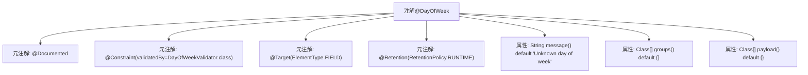

# 基础信息

|      |      |
|------|------|
| 名称 | DayOfWeek |
| 编码语言 | .java |
| 代码路径 | staffjoy/common-lib/src/main/java/xyz/staffjoy/common/validation/DayOfWeek.java |
| 包名 | xyz.staffjoy.common.validation |
| 依赖项 | ['javax.validation.Constraint', 'java.lang.annotation'] |
| 概述说明 | Java注解@DayOfWeek，用于字段校验，默认错误信息"Unknown day of week"。 |

# 说明

这是一个名为DayOfWeek的Java注解，用于验证字段值是否为有效的星期几。该注解使用DayOfWeekValidator类进行校验，仅适用于字段级别（ElementType.FIELD），并在运行时保留（RetentionPolicy.RUNTIME）。默认错误消息为"Unknown day of week"，支持分组校验（groups）和负载传递（payload），均默认为空数组。该注解被标记为@Documented，表示会包含在Javadoc中。

# 类列表 Class Summary

| 名称   | 类型  | 说明 |
|-------|------|-------------|
| DayOfWeek | annotation | Java注解@DayOfWeek，用于字段校验，默认错误消息"Unknown day of week"。 |


## 类 DayOfWeek

|      |      |
|------|------|
| 访问范围 | @Documented;@Constraint(validatedBy = DayOfWeekValidator.class);@Target({ElementType.FIELD});@Retention(RetentionPolicy.RUNTIME);public |
| 类型 | annotation |
| 名称 | DayOfWeek |
| 说明 | Java注解@DayOfWeek，用于字段校验，默认错误消息"Unknown day of week"。 |


### UML类图

```mermaid
classDiagram
    class DayOfWeek {
        <<Interface>>
        +String message() default "Unknown day of week"
        +Class[] groups() default {}
        +Class[] payload() default {}
    }
    
    class DayOfWeekValidator {
        // 验证器实现类
    }
    
    DayOfWeekValidator ..|> DayOfWeek : 实现验证逻辑
```

这段代码定义了一个Java注解接口`DayOfWeek`，用于验证星期几的有效性。该注解通过`DayOfWeekValidator`类实现具体验证逻辑，包含默认错误消息、验证分组和负载配置。类图展示了注解接口的结构及其与验证器的实现关系，符合JSR-303 Bean Validation规范的标准注解格式。注解可应用于字段级别，运行时保留，并通过元注解配置了文档化和目标范围。


### 内部方法调用关系图



该流程图展示了Java注解@DayOfWeek的结构，包含4个元注解声明和3个自定义属性。元注解定义了注解的文档化、校验逻辑绑定(@Constraint)、适用目标(字段)和生命周期(RUNTIME)。自定义属性包括默认错误消息、校验分组和负载配置，构成了一个完整的校验注解框架，适用于字段级别的周历校验场景。

### 字段列表 Field List

| 名称  | 类型  | 说明 |
|-------|-------|------|
| message | String | 未知星期几 |
| groups | Class[] | 定义groups方法，返回Class数组，默认空数组。 |
| payload | Class[] | 定义payload方法，返回Class数组，默认空数组。 |

### 方法列表 Method List

| 名称  | 类型  | 说明 |
|-------|-------|------|


