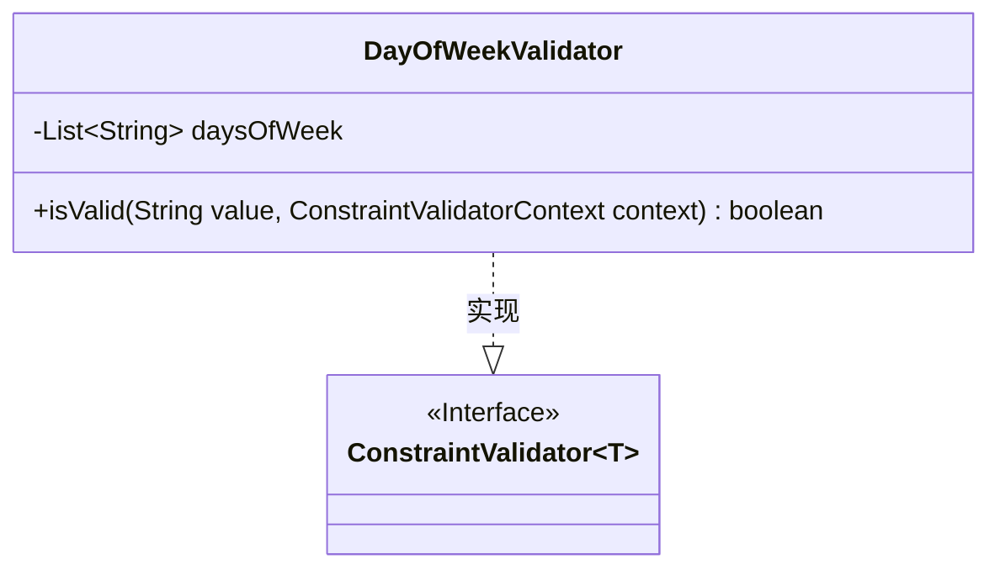
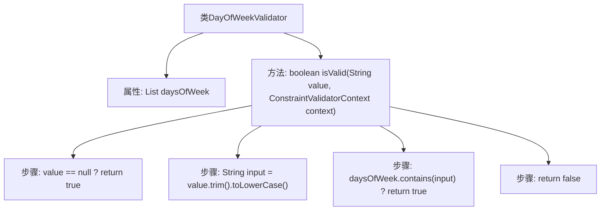

# 基础信息

|      |      |
|------|------|
| 名称 | DayOfWeekValidator |
| 编码语言 | .java |
| 代码路径 | staffjoy/common-lib/src/main/java/xyz/staffjoy/common/validation/DayOfWeekValidator.java |
| 包名 | xyz.staffjoy.common.validation |
| 依赖项 | ['javax.validation.ConstraintValidator', 'javax.validation.ConstraintValidatorContext', 'java.util.Arrays', 'java.util.List'] |
| 概述说明 | 校验字符串是否为有效星期名称，忽略大小写和空格。 |

# 说明

这段内容描述了一个名为DayOfWeekValidator的类，实现了ConstraintValidator接口，用于验证字符串是否为有效的星期几。该类定义了一个包含7个有效星期名称的列表，包括sunday到saturday。isValid方法检查输入值是否为null（允许为null），若不为null则将其转换为小写并去除前后空格后，判断是否存在于有效星期列表中，存在则返回true，否则返回false。该验证器用于确保输入字符串是有效的星期几表示。

# 类列表 Class Summary

| 名称   | 类型  | 说明 |
|-------|------|-------------|
| DayOfWeekValidator | class | 验证字符串是否为有效星期几，忽略大小写和空格，允许空值。 |

## 类 DayOfWeekValidator

|      |      |
|------|------|
| 访问范围 | public |
| 类型 | class |
| 名称 | DayOfWeekValidator |
| 说明 | 验证字符串是否为有效星期几，忽略大小写和空格，允许空值。 |

### UML类图

该代码实现了一个日期验证器，用于检查输入字符串是否为有效的星期几名称。DayOfWeekValidator类实现了ConstraintValidator接口，通过isValid方法验证输入值是否在预定义的星期几列表中。类图中清晰地展示了实现关系，其中泛型接口ConstraintValidator<T>被DayOfWeekValidator具体实现为DayOfWeek类型，验证逻辑包含空值处理和大小写转换等边界情况处理。

### 内部方法调用关系图

这段代码实现了一个日期验证器，用于检查输入的字符串是否代表有效的星期几。流程图展示了类结构和主要验证逻辑：首先检查空值直接通过验证，然后处理字符串格式，最后检查是否在预定义的星期列表中存在。验证过程严格遵循大小写不敏感和空格容错原则，体现了健壮的数据校验设计。

### 字段列表 Field List

| 名称  | 类型  | 说明 |
|-------|-------|------|
| daysOfWeek =            Arrays.asList("sunday", "monday", "tuesday", "wednesday", "thursday", "friday", "saturday") | List<String> | 定义星期列表，包含周日到周六。 |

### 方法列表 Method List

| 名称  | 类型  | 说明 |
|-------|-------|------|
| isValid | boolean | 校验输入是否为有效星期几，忽略大小写和空格，允许空值。 |

