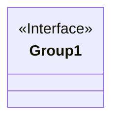
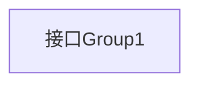

# 基础信息

|      |      |
|------|------|
| 名称 | Group1 |
| 编码语言 | .java |
| 代码路径 | staffjoy/common-lib/src/main/java/xyz/staffjoy/common/validation/Group1.java |
| 包名 | xyz.staffjoy.common.validation |
| 依赖项 | [] |
| 概述说明 | 空接口Group1 |

# 说明

这是一个名为Group1的公共接口定义，使用Java语法声明。接口目前为空，未包含任何方法或常量。作为公共接口，它可被任何其他类或接口访问和实现。这种结构通常用于定义一组相关行为的契约，后续可通过添加抽象方法或默认方法来扩展功能。

# 类列表 Class Summary

| 名称   | 类型  | 说明 |
|-------|------|-------------|
| Group1 | interface | 空接口Group1 |

## 类 Group1

|      |      |
|------|------|
| 访问范围 | public |
| 类型 | interface |
| 名称 | Group1 |
| 说明 | 空接口Group1 |

### UML类图

这段代码定义了一个名为Group1的接口，使用<<Interface>>标记表明这是一个接口类型。由于接口内没有声明任何成员方法或属性，因此类图中仅显示接口名称和标记。接口在面向对象设计中用于定义行为契约，实现类需要遵循接口定义的方法签名。这种空接口可能用作标记接口或为未来扩展预留位置。

### 内部方法调用关系图

这段流程图描述了一个名为Group1的接口结构。由于该接口为空接口（未定义任何方法或属性），图中仅包含一个表示接口本身的节点，没有其他连接关系。这种结构常见于标记接口模式或为未来扩展预留的接口设计场景，当前仅作为类型标识使用。

### 字段列表 Field List

| 名称  | 类型  | 说明 |
|-------|-------|------|

### 方法列表 Method List

| 名称  | 类型  | 说明 |
|-------|-------|------|

