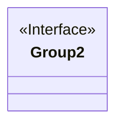
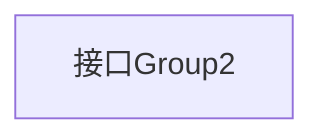

# 基础信息

|      |      |
|------|------|
| 名称 | Group2 |
| 编码语言 | .java |
| 代码路径 | staffjoy/common-lib/src/main/java/xyz/staffjoy/common/validation/Group2.java |
| 包名 | xyz.staffjoy.common.validation |
| 依赖项 | [] |
| 概述说明 | 公开接口Group2，无成员定义。 |

# 说明

这是一个名为Group2的公开接口定义，目前接口内部未声明任何成员或方法。该接口使用public访问修饰符，表明它可以被任何其他代码访问和实现。接口定义仅包含基本框架，没有具体功能实现或属性声明，后续可根据需求扩展方法签名或常量字段。

# 类列表 Class Summary

| 名称   | 类型  | 说明 |
|-------|------|-------------|
| Group2 | interface | 公开接口Group2 |

## 类 Group2

|      |      |
|------|------|
| 访问范围 | public |
| 类型 | interface |
| 名称 | Group2 |
| 说明 | 公开接口Group2 |

### UML类图

这段类图描述了一个名为Group2的接口。由于该接口未定义任何成员方法或属性，图中仅用<<Interface>>标记表明其接口性质，没有展示具体实现细节。接口在面向对象设计中常用于定义行为契约，实现类必须遵循其规范。这种空接口可能作为标记接口使用，或为未来扩展预留位置。

### 内部方法调用关系图

这段流程图描述了一个名为Group2的接口结构。由于该接口为空接口（未定义任何方法或常量），图中仅包含一个表示接口本身的节点。在Java中，接口用于定义行为契约，虽然当前示例未包含具体方法声明，但后续扩展时可在此框架中添加抽象方法或默认方法等元素。空接口通常用作标记接口或为未来功能扩展预留位置。

### 字段列表 Field List

| 名称  | 类型  | 说明 |
|-------|-------|------|

### 方法列表 Method List

| 名称  | 类型  | 说明 |
|-------|-------|------|

