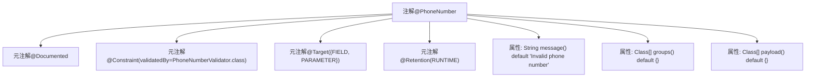

# 基础信息

|      |      |
|------|------|
| 名称 | PhoneNumber |
| 编码语言 | .java |
| 代码路径 | staffjoy/common-lib/src/main/java/xyz/staffjoy/common/validation/PhoneNumber.java |
| 包名 | xyz.staffjoy.common.validation |
| 依赖项 | ['javax.validation.Constraint', 'java.lang.annotation'] |
| 概述说明 | Java注解@PhoneNumber，用于校验电话号码，默认错误信息为"Invalid phone number"。 |

# 说明

这是一个名为PhoneNumber的Java注解，用于验证电话号码格式。它使用PhoneNumberValidator类进行校验，可应用于字段和方法参数。注解保留策略为运行时，默认错误信息是"Invalid phone number"。包含标准的验证组groups和payload参数，遵循Bean Validation规范。

# 类列表 Class Summary

| 名称   | 类型  | 说明 |
|-------|------|-------------|
| PhoneNumber | annotation | Java注解@PhoneNumber，用于验证电话号码，默认错误信息为"Invalid phone number"。 |


## 类 PhoneNumber

|      |      |
|------|------|
| 访问范围 | @Documented;@Constraint(validatedBy = PhoneNumberValidator.class);@Target({ElementType.FIELD, ElementType.PARAMETER});@Retention(RetentionPolicy.RUNTIME);public |
| 类型 | annotation |
| 名称 | PhoneNumber |
| 说明 | Java注解@PhoneNumber，用于验证电话号码，默认错误信息为"Invalid phone number"。 |


### UML类图

```mermaid
classDiagram
    class PhoneNumber {
        <<Interface>>
        +String message() default "Invalid phone number"
        +Class[] groups() default {}
        +Class[] payload() default {}
    }

    class PhoneNumberValidator {
        // 验证器实现类
    }

    PhoneNumberValidator ..|> PhoneNumber : 实现验证逻辑
    PhoneNumberValidator --> ConstraintValidator : 实现接口
    note for PhoneNumber "自定义注解用于验证电话号码格式\n包含默认错误消息和验证组配置"
```

该类图展示了一个电话号码验证注解`PhoneNumber`及其关联的验证器实现。`PhoneNumber`作为接口标注了三个标准注解属性，通过`PhoneNumberValidator`类实现具体验证逻辑。图中明确体现了JSR-303验证规范中注解与验证器的绑定关系，以及验证器对`ConstraintValidator`接口的依赖关系。注解支持自定义错误消息、验证组和负载配置，适用于字段和参数级别的验证场景。


### 内部方法调用关系图



该流程图展示了@PhoneNumber注解的结构，包含4个元注解和3个自定义属性。元注解控制注解的文档化(@Documented)、校验逻辑绑定(@Constraint)、适用目标(@Target)和生命周期(@Retention)。自定义属性包括默认错误消息(message)、校验分组(groups)和负载信息(payload)，共同构成一个完整的JSR-303校验注解。

### 字段列表 Field List

| 名称  | 类型  | 说明 |
|-------|-------|------|
| message | String | 无效电话号码 |
| groups | Class[] | 定义groups方法，返回Class数组，默认空数组。 |
| payload | Class[] | 定义payload方法返回Class数组，默认空数组。 |

### 方法列表 Method List

| 名称  | 类型  | 说明 |
|-------|-------|------|


