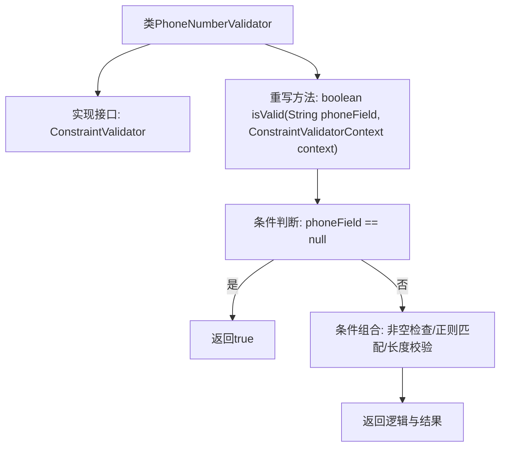

# 基础信息

|      |      |
|------|------|
| 名称 | PhoneNumberValidator |
| 编码语言 | .java |
| 代码路径 | staffjoy/common-lib/src/main/java/xyz/staffjoy/common/validation/PhoneNumberValidator.java |
| 包名 | xyz.staffjoy.common.validation |
| 依赖项 | ['javax.validation.ConstraintValidator', 'javax.validation.ConstraintValidatorContext'] |
| 概述说明 | 验证电话号码格式：非空、纯数字、长度9-13位。 |

# 说明

这段内容描述了一个名为PhoneNumberValidator的Java类，实现了ConstraintValidator接口，用于验证电话号码格式。该类包含一个isValid方法，检查输入字符串是否为有效的电话号码。验证逻辑包括：允许空值，非空时必须是数字组成，长度在9到13位之间。该方法返回布尔值表示验证结果。

# 类列表 Class Summary

| 名称   | 类型  | 说明 |
|-------|------|-------------|
| PhoneNumberValidator | class | 验证电话号码的Java类，非空时检查是否为数字且长度在9到13位之间。 |


## 类 PhoneNumberValidator

|      |      |
|------|------|
| 访问范围 | public |
| 类型 | class |
| 名称 | PhoneNumberValidator |
| 说明 | 验证电话号码的Java类，非空时检查是否为数字且长度在9到13位之间。 |


### UML类图

```mermaid
classDiagram
    class PhoneNumberValidator {
        +isValid(String phoneField, ConstraintValidatorContext context) boolean
    }
    <<Interface>> ConstraintValidator~PhoneNumber, String~
    ConstraintValidator~PhoneNumber, String~ <|.. PhoneNumberValidator : 实现
    // PhoneNumberValidator 实现了 ConstraintValidator 接口
    // 用于验证电话号码格式：非空时必须是8-14位数字
```

这段类图展示了PhoneNumberValidator类实现了ConstraintValidator<PhoneNumber, String>接口的关系。该验证器主要功能是通过isValid方法检查字符串是否符合电话号码格式要求：当不为空时，必须是纯数字且长度在9到13位之间（包含边界值）。接口使用泛型指定了验证注解类型(PhoneNumber)和目标类型(String)，体现了JSR-303 Bean Validation标准接口的实现方式。


### 内部方法调用关系图



这段代码展示了一个手机号验证器实现，通过流程图可清晰看到其验证逻辑分层。核心流程分为空值快速通道和复合校验两条路径：当输入为null时直接通过验证；否则需同时满足非空、纯数字字符、长度在9-13位三个条件。该设计体现了接口实现与业务校验的分离，对边界值（8/14长度）和数据类型（数字正则）进行了严格约束。

### 字段列表 Field List

| 名称  | 类型  | 说明 |
|-------|-------|------|

### 方法列表 Method List

| 名称  | 类型  | 说明 |
|-------|-------|------|
| isValid | boolean | 校验手机号：非空时为数字且长度9-13位。 |


