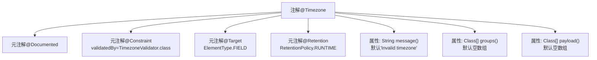

# 基础信息

|      |      |
|------|------|
| 名称 | Timezone |
| 编码语言 | .java |
| 代码路径 | staffjoy/common-lib/src/main/java/xyz/staffjoy/common/validation/Timezone.java |
| 包名 | xyz.staffjoy.common.validation |
| 依赖项 | ['javax.validation.Constraint', 'java.lang.annotation'] |
| 概述说明 | Java注解：校验时区有效性，默认错误信息"Invalid timezone"。 |

# 说明

这是一个Java注解定义，名为Timezone，用于验证时区字段的有效性。该注解使用TimezoneValidator类进行验证，仅适用于字段（ElementType.FIELD），并在运行时保留（RetentionPolicy.RUNTIME）。默认错误消息为"Invalid timezone"，同时支持分组（groups）和负载（payload）配置，默认均为空数组。

# 类列表 Class Summary

| 名称   | 类型  | 说明 |
|-------|------|-------------|
| Timezone | annotation | Java注解@Timezone用于验证时区，默认错误信息为"Invalid timezone"。 |


## 类 Timezone

|      |      |
|------|------|
| 访问范围 | @Documented;@Constraint(validatedBy = TimezoneValidator.class);@Target({ElementType.FIELD});@Retention(RetentionPolicy.RUNTIME);public |
| 类型 | annotation |
| 名称 | Timezone |
| 说明 | Java注解@Timezone用于验证时区，默认错误信息为"Invalid timezone"。 |


### UML类图

```mermaid
classDiagram
    class Timezone {
        <<Interface>>
        +String message() default "Invalid timezone"
        +Class[] groups() default {}
        +Class[] payload() default {}
    }
    class TimezoneValidator {
        // 实现Timezone接口的验证逻辑
    }
    TimezoneValidator ..|> Timezone : 实现
```

这段代码定义了一个Java注解接口`Timezone`，用于验证时区字段的有效性。该注解包含三个默认方法：`message()`用于返回验证失败时的错误信息，`groups()`和`payload()`用于分组验证和传递元数据。`TimezoneValidator`类是实现该注解验证逻辑的具体类。类图清晰地展示了接口与实现类之间的关系，符合Java注解的标准结构，适用于字段级别的时区格式验证场景。


### 内部方法调用关系图



该流程图展示了Timezone注解的结构，这是一个用于字段验证的运行时注解。顶部是主注解声明，向下延伸显示四个元注解（@Documented、@Constraint、@Target、@Retention）和三个属性配置（message错误消息、groups验证组、payload负载数据）。注解通过Constraint指定TimezoneValidator.class实现验证逻辑，限定仅作用于字段且保留至运行时，默认错误消息为"Invalid timezone"。

### 字段列表 Field List

| 名称  | 类型  | 说明 |
|-------|-------|------|
| message | String | 无效时区 |
| groups | Class[] | 定义groups方法，返回Class数组，默认空数组。 |
| payload | Class[] | 定义默认空数组的payload方法参数。 |

### 方法列表 Method List

| 名称  | 类型  | 说明 |
|-------|-------|------|


