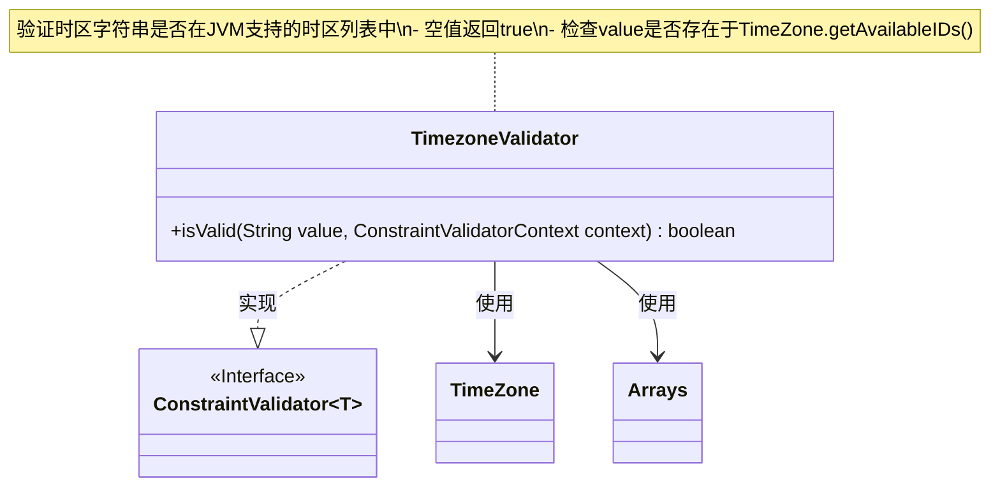
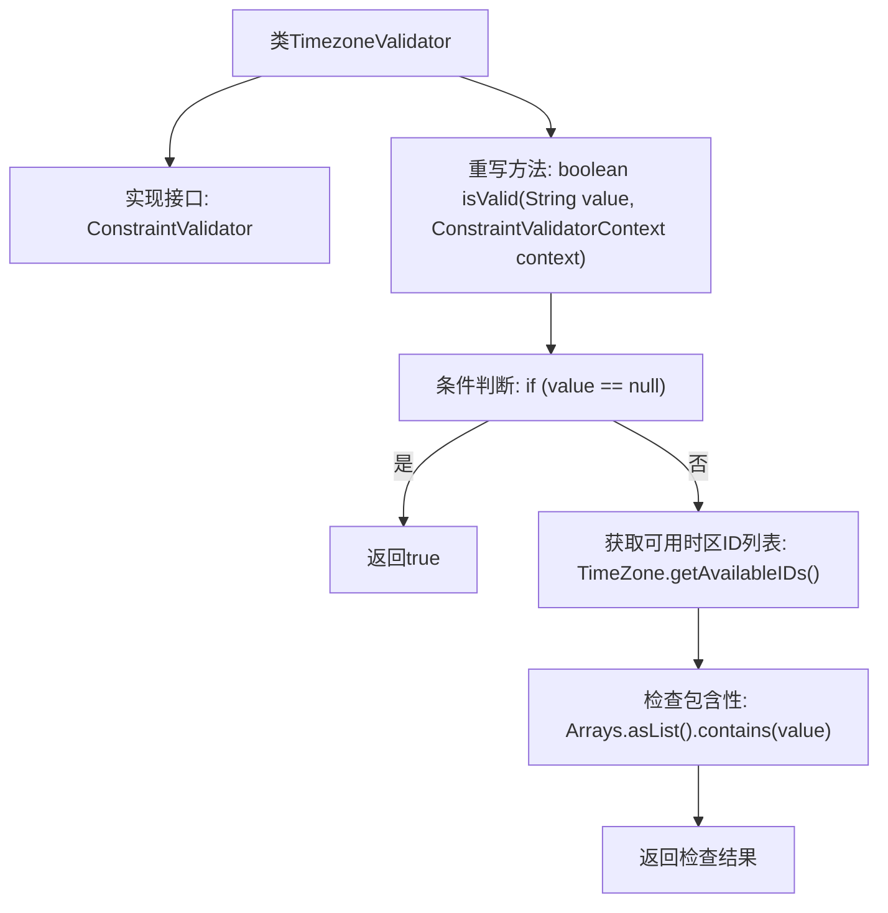

# 基础信息

|      |      |
|------|------|
| 名称 | TimezoneValidator |
| 编码语言 | .java |
| 代码路径 | staffjoy/common-lib/src/main/java/xyz/staffjoy/common/validation/TimezoneValidator.java |
| 包名 | xyz.staffjoy.common.validation |
| 依赖项 | ['javax.validation.ConstraintValidator', 'javax.validation.ConstraintValidatorContext', 'java.util.Arrays', 'java.util.TimeZone'] |
| 概述说明 | 时区验证器类检查输入是否为有效时区ID。 |

# 说明

这段内容描述了一个名为TimezoneValidator的Java类，它实现了ConstraintValidator接口，用于验证时区字符串的有效性。该类包含一个isValid方法，当输入值为null时返回true，否则检查该值是否存在于系统支持的时区ID列表中。该方法通过调用TimeZone.getAvailableIDs()获取所有可用时区ID进行验证。

# 类列表 Class Summary

| 名称   | 类型  | 说明 |
|-------|------|-------------|
| TimezoneValidator | class | 时区验证器类检查输入是否为有效时区ID。 |

## 类 TimezoneValidator

|      |      |
|------|------|
| 访问范围 | public |
| 类型 | class |
| 名称 | TimezoneValidator |
| 说明 | 时区验证器类检查输入是否为有效时区ID。 |

### UML类图

该类图展示了TimezoneValidator实现ConstraintValidator接口的泛型结构，主要用于验证字符串是否为有效时区ID。通过依赖TimeZone和Arrays工具类，它检查输入值是否存在于JVM支持的时区标识符列表中，遵循了空值自动通过的校验逻辑，体现了典型的JSR-303校验器实现模式。

### 内部方法调用关系图

该流程图描述了TimezoneValidator类的验证逻辑流程。首先检查输入值是否为null，若是则直接返回true；否则获取系统所有可用时区ID列表，并检查输入值是否存在于该列表中。整个过程实现了对时区字符串的合法性校验，符合JSR-380 Bean Validation规范。流程图清晰展示了空值处理和时区验证两个关键分支路径。

### 字段列表 Field List

| 名称  | 类型  | 说明 |
|-------|-------|------|

### 方法列表 Method List

| 名称  | 类型  | 说明 |
|-------|-------|------|
| isValid | boolean | 校验字符串是否为有效时区ID，空值返回真。 |

