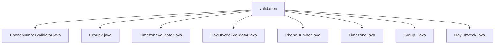

# 基础信息

|      |      |
|------|------|
| 名称 | validation |
| 编码语言 | .java |
| 代码路径 | staffjoy/common-lib/src/main/java/xyz/staffjoy/common/validation |
| 包名 | staffjoy.docs.common-lib.src.main.java.xyz.staffjoy.common.validation |
| 概述说明 | PhoneNumberValidator验证电话号码格式；Group2为空接口；TimezoneValidator验证时区；DayOfWeekValidator验证星期几；PhoneNumber、Timezone、DayOfWeek为对应注解；Group1为空接口。 |

# 说明

## 概述
该代码模块是一个Java验证工具集，位于`staffjoy/common-lib`项目的`xyz.staffjoy.common.validation`包中。模块主要提供数据格式验证功能，包含三个核心验证器实现及其对应的注解，以及两个用于分组校验的空接口。所有组件均遵循Java Bean Validation规范，支持运行时验证和分组校验场景。

## 主要业务场景
1. **电话号码格式验证**
   - 通过`@PhoneNumber`注解和`PhoneNumberValidator`实现
   - 验证规则：允许空值，非空时必须是9-13位数字
   - 应用场景：用户联系方式、注册信息等需要电话号码输入的字段

2. **时区有效性验证**
   - 通过`@Timezone`注解和`TimezoneValidator`实现
   - 验证规则：检查输入值是否存在于JVM支持的时区ID列表中
   - 应用场景：用户偏好设置、国际化系统中的时区选择

3. **星期几格式验证**
   - 通过`@DayOfWeek`注解和`DayOfWeekValidator`实现
   - 验证规则：检查输入是否为标准的星期名称（sunday-saturday）
   - 应用场景：排班系统、周期性任务配置等需要星期输入的字段

4. **验证分组支持**
   - 通过`Group1`和`Group2`空接口提供分组标记能力
   - 应用场景：实现分场景校验（如：新建/更新时采用不同验证规则）

### 包内部结构视图

该流程图展示了`validation`目录下的文件层级关系，包含8个直接子文件：3个验证器类（PhoneNumberValidator、TimezoneValidator、DayOfWeekValidator）、3个注解类（PhoneNumber、Timezone、DayOfWeek）和2个分组接口（Group1、Group2）。所有文件均位于同一层级，没有嵌套子目录结构，完整呈现了Java校验模块的核心组件分布。

# 文件列表 File List

| 名称   | 类型  | 说明 |
|-------|------|-------------|
| [TimezoneValidator.java](TimezoneValidator.md) | file | 时区验证器类检查输入是否为有效时区ID。 |
| [Group2.java](Group2.md) | file | 公开接口Group2，无成员定义。 |
| [PhoneNumberValidator.java](PhoneNumberValidator.md) | file | 验证电话号码格式：非空、纯数字、长度9-13位。 |
| [Group1.java](Group1.md) | file | 空接口Group1 |
| [Timezone.java](Timezone.md) | file | Java注解：校验时区有效性，默认错误信息"Invalid timezone"。 |
| [DayOfWeek.java](DayOfWeek.md) | file | Java注解@DayOfWeek，用于字段校验，默认错误信息"Unknown day of week"。 |
| [PhoneNumber.java](PhoneNumber.md) | file | Java注解@PhoneNumber，用于校验电话号码，默认错误信息为"Invalid phone number"。 |
| [DayOfWeekValidator.java](DayOfWeekValidator.md) | file | 校验字符串是否为有效星期名称，忽略大小写和空格。 |

