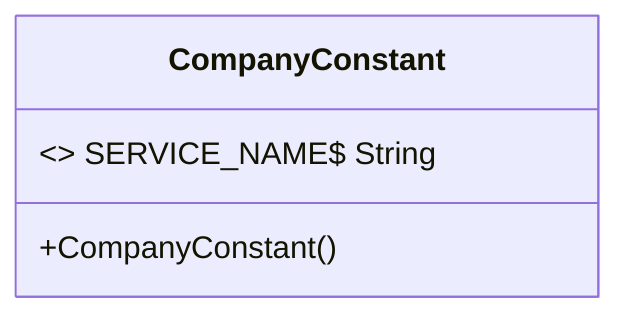
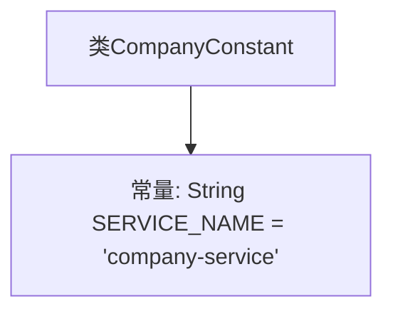

# 基础信息

|      |      |
|------|------|
| 名称 | CompanyConstant |
| 编码语言 | .java |
| 代码路径 | staffjoy/company-api/src/main/java/xyz/staffjoy/company/CompanyConstant.java |
| 包名 | xyz.staffjoy.company |
| 依赖项 | [] |
| 概述说明 | 定义公司服务常量类，包含服务名称常量。 |

# 说明

该内容定义了一个名为CompanyConstant的公共类，其中包含一个静态常量SERVICE_NAME，其值为字符串"company-service"。这个类可能用于存储与公司服务相关的全局常量，便于在项目中统一管理和引用。

# 类列表 Class Summary

| 名称   | 类型  | 说明 |
|-------|------|-------------|
| CompanyConstant | class | 定义公司服务常量类，包含服务名称常量。 |

## 类 CompanyConstant

|      |      |
|------|------|
| 访问范围 | public |
| 类型 | class |
| 名称 | CompanyConstant |
| 说明 | 定义公司服务常量类，包含服务名称常量。 |

### UML类图

这段代码定义了一个名为`CompanyConstant`的公共类，其中包含一个静态常量`SERVICE_NAME`，其值为"company-service"。由于所有成员都是静态的，该类主要用于存储常量值，而不需要实例化。类图展示了这个简单的结构，包括一个标记为final的静态字段和一个隐含的私有构造函数（防止实例化）。这种设计模式常用于集中管理应用程序中的常量值，提高代码的可维护性和可读性。

### 内部方法调用关系图

这段代码定义了一个名为CompanyConstant的类，其中包含一个公开静态常量SERVICE_NAME，其值为"company-service"。该常量通常用于标识或引用公司服务的名称，在整个应用程序中作为统一的服务标识符使用。这种设计模式常用于集中管理应用程序中的常量值，便于维护和避免硬编码字符串分散在代码各处。

### 字段列表 Field List

| 名称  | 类型  | 说明 |
|-------|-------|------|
| SERVICE_NAME = "company-service" | String | 公司服务常量名 |

### 方法列表 Method List

| 名称  | 类型  | 说明 |
|-------|-------|------|

