# 基础信息

|      |      |
|------|------|
| 名称 | company |
| 编码语言 | .java |
| 代码路径 | staffjoy/company-api/src/main/java/xyz/staffjoy/company |
| 包名 | staffjoy.docs.company-api.src.main.java.xyz.staffjoy.company |
| 概述说明 | Feign客户端CompanyClient定义公司服务API，含七类管理接口，需授权头。DTO模块处理公司相关数据传输，含多种数据结构。常量类存服务名。 |

# 说明

# StaffJoy Company API 模块总结

## 概述

该代码模块是StaffJoy公司服务中的company-api模块，主要包含以下三个核心部分：

1. **Feign客户端接口(CompanyClient)**：用于与公司服务进行交互的声明式HTTP客户端
2. **数据传输对象(DTO)**：处理与公司、团队、员工、班次和职位相关的数据传输
3. **常量定义(CompanyConstant)**：存储公司服务相关的全局常量

模块采用Java语言开发，具有以下技术特点：
- 使用Feign实现服务间HTTP调用
- 大量使用Lombok注解简化代码
- 采用建造者模式创建对象
- 包含严格的数据校验逻辑
- 支持分页查询(limit/offset)
- 所有响应类继承自BaseResponse基类，保持统一响应结构

## 主要业务场景

### 1. 公司管理
- 公司信息的创建、查询和列表展示
- 相关数据结构：CompanyDto、CompanyList等

### 2. 团队管理
- 团队信息的创建、查询和列表展示
- 相关数据结构：TeamDto、TeamList及相关请求响应对象

### 3. 员工目录管理
- 员工信息的存储和查询
- 相关数据结构：DirectoryEntryDto、DirectoryList等

### 4. 班次管理
- 班次的创建、查询、批量发布和列表展示
- 相关数据结构：ShiftDto、ShiftList及相关请求对象

### 5. 职位管理
- 职位信息的创建、查询和列表展示
- 相关数据结构：JobDto、JobList等

### 6. 关联关系管理
- 处理员工与团队/公司的关联关系
- 相关数据结构：Association、WorkerOfList等

### 7. 管理员管理
- 公司管理员信息的查询和列表展示
- 相关数据结构：AdminOfList、AdminEntries等

### 8. 统计报表
- 排班统计数据的展示
- 相关数据结构：如GrowthGraphResponse中的排班人数统计

### 9. 服务间通信
- 通过Feign客户端(CompanyClient)实现与其他服务的交互
- 所有请求都需要在请求头中携带授权信息
- 使用统一的服务名称常量(SERVICE_NAME="company-service")进行服务发现

### 包内部结构视图

```mermaid
graph TD
    company --> client
    company --> dto
    company --> CompanyConstant.java
    client --> CompanyClient.java
    dto --> GetAdminOfResponse.java
    dto --> DirectoryList.java
    dto --> ListTeamResponse.java
    dto --> CompanyList.java
    dto --> ListCompanyResponse.java
    dto --> TeamList.java
    dto --> Association.java
    dto --> GenericCompanyResponse.java
    dto --> AdminOfList.java
    dto --> ListWorkerResponse.java
    dto --> GenericShiftResponse.java
    dto --> BulkPublishShiftsRequest.java
    dto --> GenericShiftListResponse.java
    dto --> DirectoryEntryDto.java
    dto --> CompanyDto.java
    dto --> TimeZoneList.java
    dto --> ScheduledPerWeek.java
    dto --> JobList.java
    dto --> ListDirectoryResponse.java
    dto --> JobDto.java
    dto --> ShiftListRequest.java
    dto --> CreateShiftRequest.java
    dto --> GetWorkerOfResponse.java
    dto --> AdminEntries.java
    dto --> ShiftList.java
    dto --> WorkerDto.java
    dto --> CreateJobRequest.java
    dto --> NewDirectoryEntry.java
    dto --> GetAssociationResponse.java
    dto --> ListAdminResponse.java
    dto --> GenericJobResponse.java
    dto --> GenericWorkerResponse.java
    dto --> CreateTeamRequest.java
    dto --> GenericTeamResponse.java
    dto --> WorkerShiftListRequest.java
    dto --> TeamDto.java
    dto --> ListJobResponse.java
    dto --> WorkerOfList.java
    dto --> GenericDirectoryResponse.java
    dto --> ShiftDto.java
    dto --> AssociationList.java
    dto --> GrowthGraphResponse.java
    dto --> DirectoryEntryRequest.java
    dto --> WorkerEntries.java
```

该流程图展示了Staffjoy公司API的Java包结构，以company为根节点，包含client子包、dto子包和CompanyConstant.java文件。dto包下包含大量数据传输对象类文件，主要用于处理公司相关的各种请求和响应数据。client子包仅包含CompanyClient.java文件，可能用于与公司服务交互的客户端实现。整体结构清晰展示了公司模块的数据传输层架构。

# 文件列表 File List

| 名称   | 类型  | 说明 |
|-------|------|-------------|
| [CompanyConstant.java](CompanyConstant.md) | file | 定义公司服务常量类，包含服务名称常量。 |
| [client](client/_module.md) | package | 公司服务客户端接口，包含公司、团队、职位、班次等管理功能。 |
| [dto](dto/_module.md) | package | Java数据传输对象类集合，包含公司、团队、职位、班次等管理相关DTO，使用Lombok简化代码，支持建造者模式。 |

