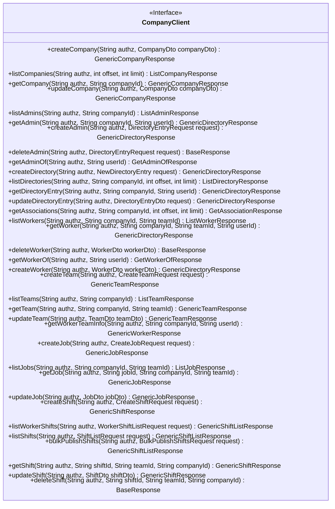

# 基础信息

|      |      |
|------|------|
| 名称 | CompanyClient |
| 编码语言 | .java |
| 代码路径 | staffjoy/company-api/src/main/java/xyz/staffjoy/company/client/CompanyClient.java |
| 包名 | xyz.staffjoy.company.client |
| 依赖项 | ['org.springframework.cloud.openfeign.FeignClient', 'org.springframework.validation.annotation.Validated', 'org.springframework.web.bind.annotation', 'xyz.staffjoy.common.api.BaseResponse', 'xyz.staffjoy.common.auth.AuthConstant', 'xyz.staffjoy.common.validation.Group1', 'xyz.staffjoy.common.validation.Group2', 'xyz.staffjoy.company.CompanyConstant', 'xyz.staffjoy.company.dto'] |
| 概述说明 | 公司服务客户端接口，包含公司、团队、职位、班次等管理功能。 |

# 说明

该内容定义了一个名为CompanyClient的Feign客户端接口，用于与公司服务进行交互。接口包含多个API端点，分为公司管理、管理员管理、目录管理、员工管理、团队管理、职位管理和班次管理七大类。每个API端点都包含请求方法、路径、请求头和参数，部分端点还包含请求体验证。所有请求都需要在请求头中携带授权信息。接口提供了创建、查询、更新和删除等操作，覆盖了公司服务的主要功能模块。

# 类列表 Class Summary

| 名称   | 类型  | 说明 |
|-------|------|-------------|
| CompanyClient | interface | 公司服务客户端接口，包含公司、团队、职位、班次等管理API。 |

## 类 CompanyClient

|      |      |
|------|------|
| 访问范围 | @FeignClient(name = CompanyConstant.SERVICE_NAME, path = "/v1/company", url = "${staffjoy.company-service-endpoint}");public |
| 类型 | interface |
| 名称 | CompanyClient |
| 说明 | 公司服务客户端接口，包含公司、团队、职位、班次等管理API。 |

### UML类图

这段代码定义了一个名为CompanyClient的Feign客户端接口，用于与公司服务进行HTTP通信。该接口包含五大类API：公司管理、管理员管理、目录管理、员工管理和团队/职位/班次管理，每个类别下都有相应的CRUD操作。接口方法通过注解指定了HTTP方法、路径和参数，所有请求都需要授权头，部分请求需要验证请求体。该设计实现了对公司服务所有功能的远程调用封装，遵循RESTful风格。

### 内部方法调用关系图

```mermaid
graph TD
    A["FeignClient接口: CompanyClient"]
    B["公司相关API"]
    C["管理员相关API"]
    D["目录相关API"]
    E["员工相关API"]
    F["团队相关API"]
    G["职位相关API"]
    H["班次相关API"]

    A --> B
    A --> C
    A --> D
    A --> E
    A --> F
    A --> G
    A --> H

    B --> B1["POST /create: 创建公司"]
    B --> B2["GET /list: 公司列表"]
    B --> B3["GET /get: 获取公司"]
    B --> B4["PUT /update: 更新公司"]

    C --> C1["GET /admin/list: 管理员列表"]
    C --> C2["GET /admin/get: 获取管理员"]
    C --> C3["POST /admin/create: 创建管理员"]
    C --> C4["DELETE /admin/delete: 删除管理员"]
    C --> C5["GET /admin/admin_of: 获取用户管理权限"]

    D --> D1["POST /directory/create: 创建目录"]
    D --> D2["GET /directory/list: 目录列表"]
    D --> D3["GET /directory/get: 获取目录项"]
    D --> D4["PUT /directory/update: 更新目录项"]
    D --> D5["GET /directory/get_associations: 获取关联"]

    E --> E1["GET /worker/list: 员工列表"]
    E --> E2["GET /worker/get: 获取员工"]
    E --> E3["DELETE /worker/delete: 删除员工"]
    E --> E4["GET /worker/get_worker_of: 获取员工所属"]
    E --> E5["POST /worker/create: 创建员工"]

    F --> F1["POST /team/create: 创建团队"]
    F --> F2["GET /team/list: 团队列表"]
    F --> F3["GET /team/get: 获取团队"]
    F --> F4["PUT /team/update: 更新团队"]
    F --> F5["GET /team/get_worker_team_info: 获取员工团队信息"]

    G --> G1["POST /job/create: 创建职位"]
    G --> G2["GET /job/list: 职位列表"]
    G --> G3["GET /job/get: 获取职位"]
    G --> G4["PUT /job/update: 更新职位"]

    H --> H1["POST /shift/create: 创建班次"]
    H --> H2["POST /shift/list_worker_shifts: 员工班次列表"]
    H --> H3["POST /shift/list_shifts: 班次列表"]
    H --> H4["POST /shift/bulk_publish: 批量发布班次"]
    H --> H5["GET /shift/get: 获取班次"]
    H --> H6["PUT /shift/update: 更新班次"]
    H --> H7["DELETE /shift/delete: 删除班次"]
```

这段代码定义了一个Feign客户端接口CompanyClient，用于与公司服务进行交互。该接口包含七大类API：公司管理、管理员操作、目录管理、员工管理、团队管理、职位管理和班次管理。每个类别下都有多个具体的HTTP端点方法，涵盖了创建、查询、更新和删除等CRUD操作。所有方法都需要通过Authorization头进行认证，部分方法需要对请求体进行验证。该客户端通过Feign的声明式HTTP客户端简化了远程服务调用。

### 字段列表 Field List

| 名称  | 类型  | 说明 |
|-------|-------|------|

### 方法列表 Method List

| 名称  | 类型  | 说明 |
|-------|-------|------|
| updateShift | GenericShiftResponse | 更新班次接口，需认证和有效请求体。 |
| updateCompany | GenericCompanyResponse | 更新公司信息接口，需授权和验证请求体。 |
| createCompany | GenericCompanyResponse | 创建公司接口，需认证头及验证请求体。 |
| getTeam | GenericTeamResponse | 获取团队信息接口，需认证头和公司及团队ID参数。 |
| updateDirectoryEntry | GenericDirectoryResponse | 更新目录条目接口，需认证头和有效请求体。 |
| getWorkerOf | GetWorkerOfResponse | 获取指定用户的工作者信息接口，需认证和用户ID参数。 |
| deleteAdmin | BaseResponse | 删除管理员接口：需授权头及有效请求体。 |
| updateTeam | GenericTeamResponse | 更新团队信息的API接口，需认证和有效请求体。 |
| getShift | GenericShiftResponse | 获取班次信息的API接口，需验证头、班次ID、团队ID和公司ID参数。 |
| updateJob | GenericJobResponse | 更新作业接口，需认证和有效请求体。 |
| getWorker | GenericDirectoryResponse | 获取员工信息的API接口，需认证和公司、团队、用户ID参数。 |
| getJob | GenericJobResponse | 获取任务接口，需认证和任务、公司、团队ID参数。 |
| getDirectoryEntry | GenericDirectoryResponse | 获取目录条目接口，需认证头、公司ID和用户ID参数。 |
| createAdmin | GenericDirectoryResponse | 创建管理员接口：需授权头，接收验证请求体。 |
| deleteWorker | BaseResponse | 删除员工接口，需认证和有效请求体。 |
| getCompany | GenericCompanyResponse | 获取公司信息接口，需认证头和公司ID参数。 |
| bulkPublishShifts | GenericShiftListResponse | 批量发布班次接口，需认证头和有效请求体。 |
| listCompanies | ListCompanyResponse | 获取公司列表接口，需认证头，支持分页参数。 |
| listJobs | ListJobResponse | 获取职位列表接口，需认证头、公司ID和团队ID参数。 |
| createShift | GenericShiftResponse | 创建班次的API接口，需认证头和有效请求体。 |
| listTeams | ListTeamResponse | 获取团队列表接口，需认证头和公司ID参数。 |
| createTeam | GenericTeamResponse | 创建团队接口：需认证头及有效请求体。 |
| listShifts | GenericShiftListResponse | 获取排班列表接口，需认证和请求体参数。 |
| getAdmin | GenericDirectoryResponse | 获取管理员信息的API接口，需认证头和公司ID、用户ID参数。 |
| deleteShift | BaseResponse | 删除班次接口：需授权头、班次ID、团队ID和公司ID参数。 |
| createJob | GenericJobResponse | 创建作业接口，需认证头和有效请求体。 |
| listAdmins | ListAdminResponse | 获取管理员列表接口，需认证头和公司ID参数。 |
| createWorker | GenericDirectoryResponse | 创建工人的API接口，需认证和有效请求体。 |
| getAdminOf | GetAdminOfResponse | 获取用户管理员信息接口，需认证头和用户ID参数。 |
| getWorkerTeamInfo | GenericWorkerResponse | 获取员工团队信息的API接口，需认证头，可选公司ID和必填用户ID参数。 |
| listDirectories | ListDirectoryResponse | 获取目录列表接口：需认证头、公司ID、分页参数。 |
| listWorkers | ListWorkerResponse | 获取员工列表接口：需认证头、公司ID和团队ID参数，返回员工列表。 |
| getAssociations | GetAssociationResponse | 获取公司关联数据接口，需认证，参数含公司ID、偏移量和限制数。 |
| listWorkerShifts | GenericShiftListResponse | 查询员工班次列表接口，需认证和请求体。 |
| createDirectory | GenericDirectoryResponse | 创建目录接口，需认证和有效请求体。 |

