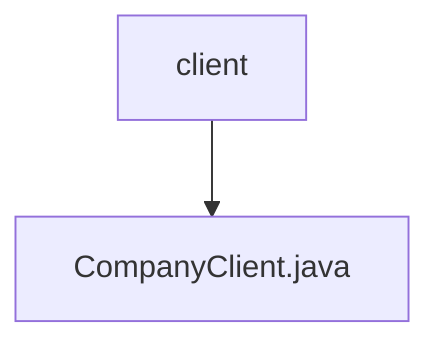

# 基础信息

|      |      |
|------|------|
| 名称 | client |
| 编码语言 | .java |
| 代码路径 | staffjoy/company-api/src/main/java/xyz/staffjoy/company/client |
| 包名 | staffjoy.docs.company-api.src.main.java.xyz.staffjoy.company.client |
| 概述说明 | 公司服务客户端接口，包含公司、团队、职位、班次等管理功能。 |

# 说明

该内容定义了一个名为CompanyClient的Feign客户端接口，用于与公司服务进行交互。接口包含多个API端点，分为公司管理、管理员管理、目录管理、员工管理、团队管理、职位管理和班次管理七大类。每个API端点都包含请求方法、路径、请求头和参数，部分端点还包含请求体验证。所有请求都需要在请求头中携带授权信息。接口提供了创建、查询、更新和删除等操作，覆盖了公司服务的主要功能模块。

### 包内部结构视图

该流程图展示了company-api项目中client目录的层级结构。顶层节点为client目录，其下包含一个CompanyClient.java文件。这是一个典型的客户端接口实现类存放路径，表示该模块提供了公司服务的客户端调用接口。整个结构简洁明了，符合Java项目标准目录规范。

# 文件列表 File List

| 名称   | 类型  | 说明 |
|-------|------|-------------|
| [CompanyClient.java](CompanyClient.md) | file | 公司服务客户端接口，包含公司、团队、职位、班次等管理功能。 |

