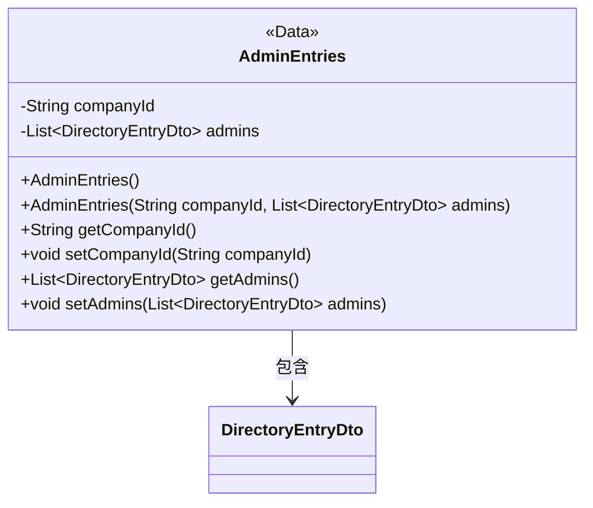
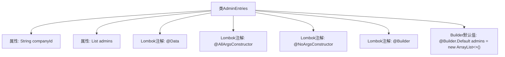

# 基础信息

|      |      |
|------|------|
| 名称 | AdminEntries |
| 编码语言 | .java |
| 代码路径 | staffjoy/company-api/src/main/java/xyz/staffjoy/company/dto/AdminEntries.java |
| 包名 | xyz.staffjoy.company.dto |
| 依赖项 | [None, 'java.util.ArrayList', 'java.util.List'] |
| 概述说明 | Java类AdminEntries，含companyId和admins列表，支持全参无参构造和Builder模式。 |

# 说明

这是一个名为AdminEntries的Java类，使用了Lombok库的注解来简化代码。类中包含两个字段：companyId（字符串类型）和admins（DirectoryEntryDto类型的列表）。通过@AllArgsConstructor和@NoArgsConstructor注解，该类拥有全参数和无参数的构造函数。@Builder注解提供了建造者模式支持，其中admins字段使用@Builder.Default设置了默认值（空ArrayList）。这个类主要用于存储公司ID及其管理员列表信息。

# 类列表 Class Summary

| 名称   | 类型  | 说明 |
|-------|------|-------------|
| AdminEntries | class | Java类AdminEntries，含companyId和admins列表，支持全参无参构造及Builder模式。 |

## 类 AdminEntries

|      |      |
|------|------|
| 访问范围 | @Data;@AllArgsConstructor;@NoArgsConstructor;@Builder;public |
| 类型 | class |
| 名称 | AdminEntries |
| 说明 | Java类AdminEntries，含companyId和admins列表，支持全参无参构造及Builder模式。 |

### UML类图

该类图展示了使用Lombok注解的`AdminEntries`类，包含公司ID和管理员列表两个私有字段，通过注解自动生成构造器、getter/setter和Builder模式方法。类与`DirectoryEntryDto`存在组合关系，表示一个公司对应多个管理员条目。注解标记了类的高级特性，简化了样板代码的编写。

### 内部方法调用关系图

该流程图展示了`AdminEntries`类的结构，它是一个使用Lombok注解简化开发的POJO类。核心包含两个属性：`companyId`字符串和`admins`列表，后者通过`@Builder.Default`初始化为空ArrayList。类被标记为`@Data`自动生成getter/setter，同时支持全参构造器、无参构造器和建造者模式。所有注解和属性通过层级关系清晰呈现，体现了Lombok对样板代码的自动化处理能力。

### 字段列表 Field List

| 名称  | 类型  | 说明 |
|-------|-------|------|
| companyId | String | 私有字符串类型变量companyId |
| admins = new ArrayList<DirectoryEntryDto>() | List<DirectoryEntryDto> | 默认初始化管理员列表为空数组。 |

### 方法列表 Method List

| 名称  | 类型  | 说明 |
|-------|-------|------|

