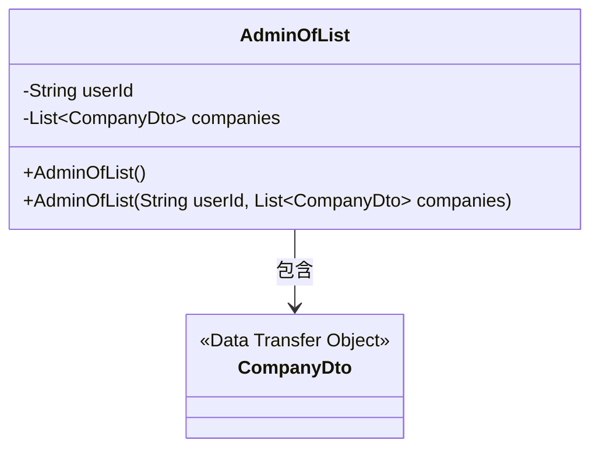
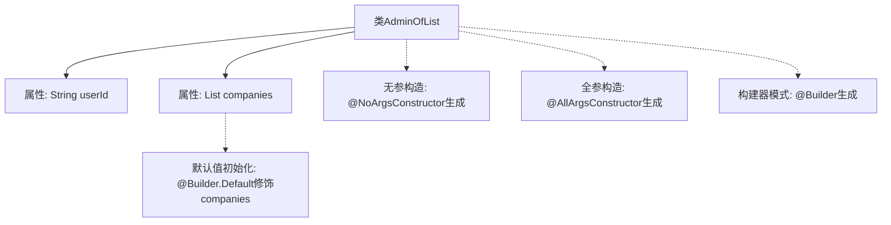

# 基础信息

|      |      |
|------|------|
| 名称 | AdminOfList |
| 编码语言 | .java |
| 代码路径 | staffjoy/company-api/src/main/java/xyz/staffjoy/company/dto/AdminOfList.java |
| 包名 | xyz.staffjoy.company.dto |
| 依赖项 | [None, 'java.util.ArrayList', 'java.util.List'] |
| 概述说明 | Java类AdminOfList，含userId和companies字段，支持无参、全参构造和Builder模式。 |

# 说明

这是一个名为AdminOfList的Java类，使用了Lombok库的注解来简化代码。类中包含两个字段：userId（字符串类型）和companies（CompanyDto对象的列表，默认初始化为空ArrayList）。通过@NoArgsConstructor生成无参构造器，@AllArgsConstructor生成全参构造器，@Builder提供建造者模式支持。companies字段使用@Builder.Default设置了默认值。该类主要用于存储用户ID及其关联的公司列表数据。

# 类列表 Class Summary

| 名称   | 类型  | 说明 |
|-------|------|-------------|
| AdminOfList | class | Java类AdminOfList，含userId和companies字段，支持无参、全参构造及Builder模式。 |

## 类 AdminOfList

|      |      |
|------|------|
| 访问范围 | @Data;@NoArgsConstructor;@AllArgsConstructor;@Builder;public |
| 类型 | class |
| 名称 | AdminOfList |
| 说明 | Java类AdminOfList，含userId和companies字段，支持无参、全参构造及Builder模式。 |

### UML类图

这段类图展示了AdminOfList类与CompanyDto类之间的关系。AdminOfList是一个管理类，包含用户ID(userId)和一个公司列表(companies)，其中companies使用泛型List存储CompanyDto对象。类通过Lombok注解自动生成了无参构造器、全参构造器和建造者模式支持。CompanyDto被标记为数据传输对象(<<Data Transfer Object>>)，表示其主要用于在不同层之间传输数据。AdminOfList对CompanyDto存在单向依赖关系，通过List集合进行关联。

### 内部方法调用关系图

该流程图展示了AdminOfList类的结构，包含两个核心属性(userId和companies)和三个Lombok注解生成的构造方法。特别标注了@Builder.Default对集合属性的初始化逻辑，以及@Builder提供的链式构建能力。类通过注解自动实现了无参构造、全参构造和建造者模式，其中companies属性被默认初始化为空ArrayList。

### 字段列表 Field List

| 名称  | 类型  | 说明 |
|-------|-------|------|
| companies = new ArrayList<CompanyDto>() | List<CompanyDto> | 默认初始化公司列表为空ArrayList。 |
| userId | String | 私有用户ID字符串变量。 |

### 方法列表 Method List

| 名称  | 类型  | 说明 |
|-------|-------|------|

