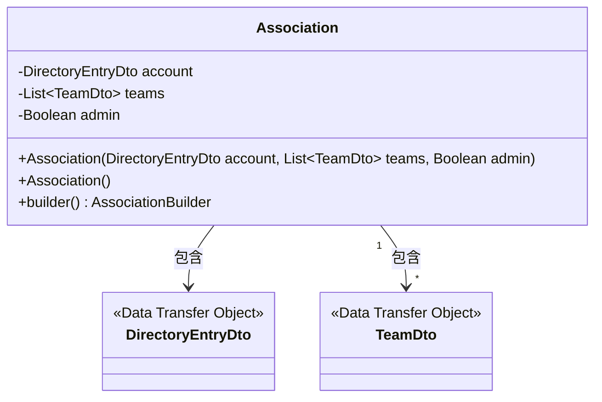
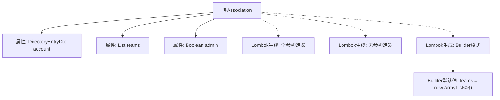

# 基础信息

|      |      |
|------|------|
| 名称 | Association |
| 编码语言 | .java |
| 代码路径 | staffjoy/company-api/src/main/java/xyz/staffjoy/company/dto/Association.java |
| 包名 | xyz.staffjoy.company.dto |
| 依赖项 | [None, 'java.util.ArrayList', 'java.util.List'] |
| 概述说明 | Association类包含账户、团队列表和管理员状态，支持构建器模式。 |

# 说明

这是一个名为Association的Java类，使用了Lombok注解简化代码。类包含三个字段：account（DirectoryEntryDto类型）、teams（TeamDto列表，默认初始化为空ArrayList）、admin（Boolean类型）。通过@AllArgsConstructor生成全参构造函数，@NoArgsConstructor生成无参构造函数，@Builder提供建造者模式支持。teams字段使用@Builder.Default指定默认值。整个类设计用于表示关联关系，包含账户信息、团队列表和管理员标识。

# 类列表 Class Summary

| 名称   | 类型  | 说明 |
|-------|------|-------------|
| Association | class | Java类Association包含账户、团队列表和管理员状态。 |

## 类 Association

|      |      |
|------|------|
| 访问范围 | @Data;@AllArgsConstructor;@NoArgsConstructor;@Builder;public |
| 类型 | class |
| 名称 | Association |
| 说明 | Java类Association包含账户、团队列表和管理员状态。 |

### UML类图

这段类图展示了一个使用Lombok注解的Association类，包含三个主要字段：account（DirectoryEntryDto类型）、teams（TeamDto列表）和admin（布尔值）。通过@Builder注解提供了建造者模式支持，@AllArgsConstructor和@NoArgsConstructor分别生成全参和无参构造器。该类与DirectoryEntryDto和TeamDto两个DTO类存在组合关系，其中Association可以包含一个DirectoryEntryDto和多个TeamDto对象。整体结构体现了DTO的聚合关系和使用建造者模式创建复杂对象的典型实现。

### 内部方法调用关系图

该流程图展示了Association类的结构，这是一个使用Lombok注解简化开发的POJO类。核心包含三个属性：account对象、teams列表和admin布尔值。通过@Builder提供链式构造能力，并为teams设置空列表默认值。全参/无参构造器由Lombok自动生成，整体设计符合DTO模式规范，适用于Spring Boot等框架的数据传输场景。

### 字段列表 Field List

| 名称  | 类型  | 说明 |
|-------|-------|------|
| teams = new ArrayList<TeamDto>() | List<TeamDto> | 默认初始化TeamDto列表。 |
| account | DirectoryEntryDto | 私有账户目录条目对象 |
| admin | Boolean | 私有布尔变量admin |

### 方法列表 Method List

| 名称  | 类型  | 说明 |
|-------|-------|------|

