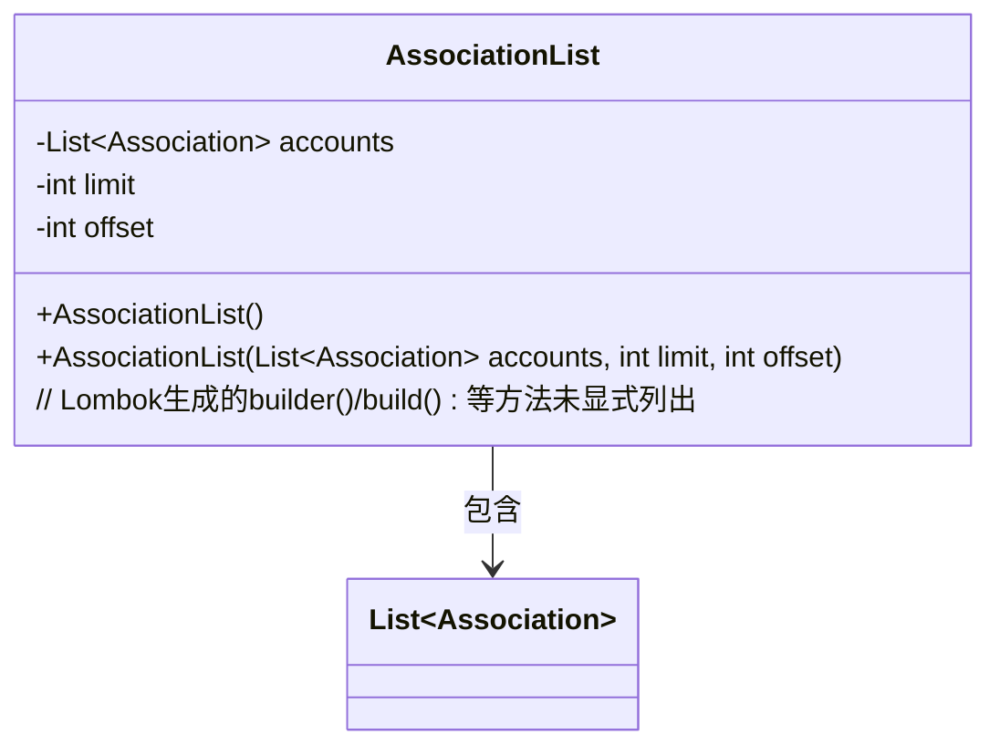
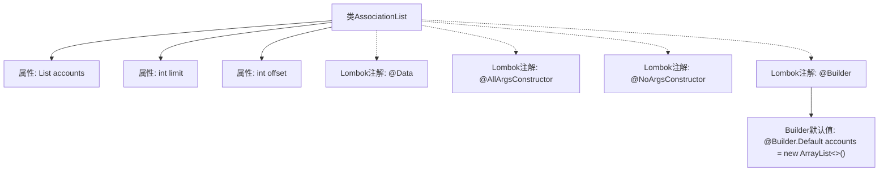

# 基础信息

|      |      |
|------|------|
| 名称 | AssociationList |
| 编码语言 | .java |
| 代码路径 | staffjoy/company-api/src/main/java/xyz/staffjoy/company/dto/AssociationList.java |
| 包名 | xyz.staffjoy.company.dto |
| 依赖项 | [None, 'java.util.ArrayList', 'java.util.List'] |
| 概述说明 | 类AssociationList包含账户列表和分页参数。 |

# 说明

这是一个名为AssociationList的Java类，使用了Lombok库的注解来简化代码。类中包含三个主要部分：一个名为accounts的列表属性，使用ArrayList作为默认实现；一个limit整型属性；一个offset整型属性。类通过注解提供了全参数构造函数、无参构造函数以及建造者模式支持。accounts属性还特别标注了建造者模式的默认值设置。整个类设计用于存储关联对象列表并支持分页功能。

# 类列表 Class Summary

| 名称   | 类型  | 说明 |
|-------|------|-------------|
| AssociationList | class | Java类AssociationList包含账户列表和分页参数limit、offset。 |

## 类 AssociationList

|      |      |
|------|------|
| 访问范围 | @Data;@AllArgsConstructor;@NoArgsConstructor;@Builder;public |
| 类型 | class |
| 名称 | AssociationList |
| 说明 | Java类AssociationList包含账户列表和分页参数limit、offset。 |

### UML类图

这段类图描述了AssociationList类的结构，它是一个使用Lombok注解简化开发的POJO类。该类包含三个核心字段：一个泛型为Association的List集合accounts用于存储关联数据，以及limit和offset两个整型字段用于分页控制。通过@AllArgsConstructor和@NoArgsConstructor注解自动生成全参数和无参构造函数，@Builder注解提供建造者模式支持。类图中通过箭头明确表示了AssociationList对List~Association~的包含关系，体现了聚合设计模式。

### 内部方法调用关系图

该流程图展示了AssociationList类的结构，包含三个主要属性（accounts列表、limit和offset）和四个Lombok注解（@Data、@AllArgsConstructor、@NoArgsConstructor和@Builder）。特别标注了@Builder.Default对accounts列表的初始化行为，整体呈现了类成员与编译时生成代码的注解之间的关联关系。

### 字段列表 Field List

| 名称  | 类型  | 说明 |
|-------|-------|------|
| offset | int | 私有整型变量offset |
| limit | int | 私有整型变量limit |
| accounts = new ArrayList<>() | List<Association> | 默认初始化账户列表为空。 |

### 方法列表 Method List

| 名称  | 类型  | 说明 |
|-------|-------|------|

