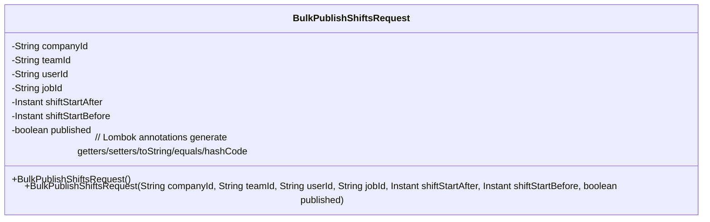
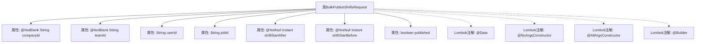

# 基础信息

|      |      |
|------|------|
| 名称 | BulkPublishShiftsRequest |
| 编码语言 | .java |
| 代码路径 | staffjoy/company-api/src/main/java/xyz/staffjoy/company/dto/BulkPublishShiftsRequest.java |
| 包名 | xyz.staffjoy.company.dto |
| 依赖项 | ['lombok.AllArgsConstructor', 'lombok.Builder', 'lombok.Data', 'lombok.NoArgsConstructor', 'java.time.Instant', 'javax.validation.constraints.NotBlank', 'javax.validation.constraints.NotNull'] |
| 概述说明 | 批量发布班次请求类，含公司、团队、用户、岗位ID及班次时间范围，支持构造器与空参。 |

# 说明

这是一个名为BulkPublishShiftsRequest的Java类，用于批量发布班次请求。类中包含以下字段：必填的公司ID（companyId）和团队ID（teamId），可选的用户ID（userId）和职位ID（jobId），必填的班次开始时间范围（shiftStartAfter和shiftStartBefore），以及表示是否已发布的布尔值（published）。类使用了Lombok注解自动生成无参构造器、全参构造器和建造器模式。所有必填字段都通过注解进行了非空校验。

# 类列表 Class Summary

| 名称   | 类型  | 说明 |
|-------|------|-------------|
| BulkPublishShiftsRequest | class | 批量发布班次请求类，含公司、团队、用户、岗位ID及班次时间范围与发布状态。 |

## 类 BulkPublishShiftsRequest

|      |      |
|------|------|
| 访问范围 | @Data;@NoArgsConstructor;@AllArgsConstructor;@Builder;public |
| 类型 | class |
| 名称 | BulkPublishShiftsRequest |
| 说明 | 批量发布班次请求类，含公司、团队、用户、岗位ID及班次时间范围与发布状态。 |

### UML类图

这段代码定义了一个名为BulkPublishShiftsRequest的Java类，使用了Lombok注解自动生成构造函数、getter/setter等方法。该类包含7个字段：companyId和teamId为必填字符串字段（@NotBlank验证），shiftStartAfter和shiftStartBefore为非空Instant类型字段（@NotNull验证），以及可选的userId、jobId字符串字段和published布尔字段。类结构体现了批量发布班次请求所需的核心数据模型，适用于处理批量操作的时间范围筛选和状态标记场景。

### 内部方法调用关系图

该流程图展示了BulkPublishShiftsRequest类的结构，包含7个核心属性和4个Lombok注解。类通过@Data自动生成getter/setter，@NoArgsConstructor/@AllArgsConstructor提供构造方法，@Builder支持建造者模式。关键属性包含公司ID、团队ID等必填字段（@NotBlank/@NotNull校验），以及用于筛选时间范围的shiftStartAfter/shiftStartBefore时间戳。整体设计简洁，利用Lombok减少样板代码，适用于批量发布班次数据的业务场景。

### 字段列表 Field List

| 名称  | 类型  | 说明 |
|-------|-------|------|
| userId | String | 私有字符串变量userId |
| jobId | String | 私有字符串类型变量jobId |
| companyId | String | 非空公司ID字符串字段 |
| teamId | String | 非空团队ID字符串字段 |
| shiftStartAfter | Instant | 非空私有Instant类型变量shiftStartAfter |
| shiftStartBefore | Instant | 非空私有Instant类型变量shiftStartBefore |
| published | boolean | 私有布尔变量published |

### 方法列表 Method List

| 名称  | 类型  | 说明 |
|-------|-------|------|

