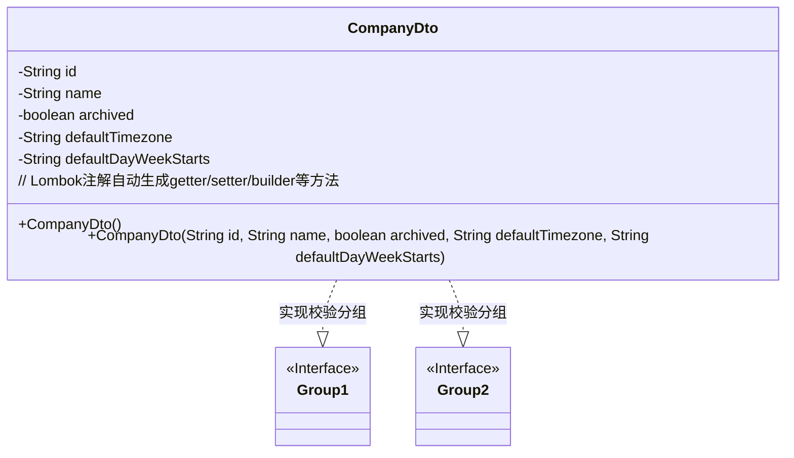
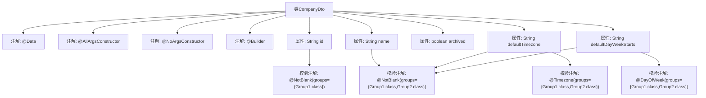

# 基础信息

|      |      |
|------|------|
| 名称 | CompanyDto |
| 编码语言 | .java |
| 代码路径 | staffjoy/company-api/src/main/java/xyz/staffjoy/company/dto/CompanyDto.java |
| 包名 | xyz.staffjoy.company.dto |
| 依赖项 | ['lombok.AllArgsConstructor', 'lombok.Builder', 'lombok.Data', 'lombok.NoArgsConstructor', 'xyz.staffjoy.common.validation.DayOfWeek', 'xyz.staffjoy.common.validation.Group1', 'xyz.staffjoy.common.validation.Group2', 'xyz.staffjoy.common.validation.Timezone', 'javax.validation.constraints.NotBlank'] |
| 概述说明 | 公司DTO类，含ID、名称、时区等字段，支持分组校验。 |

# 说明

这是一个名为CompanyDto的Java类定义，使用了Lombok注解简化代码。类包含四个字段：id（非空校验，Group1分组）、name（非空校验，Group1和Group2分组）、archived（布尔类型）、defaultTimezone（时区校验和非空校验，Group1和Group2分组）以及defaultDayWeekStarts（星期校验和非空校验，Group1和Group2分组）。类使用了全参构造、无参构造和建造者模式。

# 类列表 Class Summary

| 名称   | 类型  | 说明 |
|-------|------|-------------|
| CompanyDto | class | 公司DTO类，含ID、名称、时区等字段，支持分组验证。 |

## 类 CompanyDto

|      |      |
|------|------|
| 访问范围 | @Data;@AllArgsConstructor;@NoArgsConstructor;@Builder;public |
| 类型 | class |
| 名称 | CompanyDto |
| 说明 | 公司DTO类，含ID、名称、时区等字段，支持分组验证。 |

### UML类图

这段代码定义了一个CompanyDto类，使用Lombok注解自动生成构造器、getter/setter和builder模式方法。类包含5个字段，其中id、name、defaultTimezone和defaultDayWeekStarts字段通过@NotBlank和自定义注解(@Timezone, @DayOfWeek)进行分组校验(Group1和Group2)。类图展示了CompanyDto与两个校验分组接口的关系，体现了Spring Validation的分组校验机制。所有字段均为私有，通过Lombok生成公有访问方法。

### 内部方法调用关系图

该流程图展示了CompanyDto类的结构，包括类级别的Lombok注解（@Data、@AllArgsConstructor等）和属性定义。重点突出了字段的校验注解配置，如@NotBlank、@Timezone等注解在不同校验组（Group1/Group2）的应用关系。通过分层连接线清晰呈现了注解与属性的绑定关系，特别是defaultTimezone和defaultDayWeekStarts字段同时绑定了多个校验注解的情况。

### 字段列表 Field List

| 名称  | 类型  | 说明 |
|-------|-------|------|
| id | String | 非空校验字段id，需满足Group1分组条件。 |
| name | String | 非空校验字段name，适用于Group1和Group2分组。 |
| defaultTimezone | String | 时区字段校验，非空且符合时区格式，适用于Group1和Group2。 |
| defaultDayWeekStarts | String | Java字段注解：定义周起始日，非空校验，适用于Group1和Group2。 |
| archived | boolean | 私有布尔类型变量archived |

### 方法列表 Method List

| 名称  | 类型  | 说明 |
|-------|-------|------|

