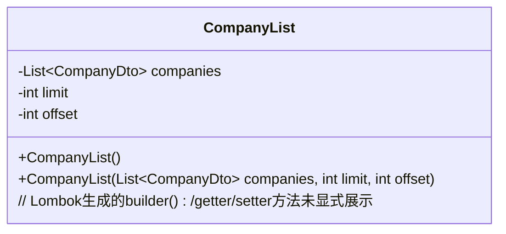
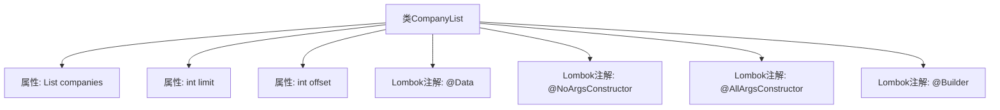

# 基础信息

|      |      |
|------|------|
| 名称 | CompanyList |
| 编码语言 | .java |
| 代码路径 | staffjoy/company-api/src/main/java/xyz/staffjoy/company/dto/CompanyList.java |
| 包名 | xyz.staffjoy.company.dto |
| 依赖项 | ['lombok.AllArgsConstructor', 'lombok.Builder', 'lombok.Data', 'lombok.NoArgsConstructor', 'java.util.List'] |
| 概述说明 | 公司列表类，包含公司集合、限制和偏移量。 |

# 说明

这是一个名为CompanyList的Java类，使用了Lombok库的注解来简化代码。类中包含三个成员变量：一个CompanyDto类型的列表companies，以及两个整型变量limit和offset。通过@NoArgsConstructor生成无参构造函数，@AllArgsConstructor生成全参构造函数，@Builder提供建造者模式支持。该类主要用于封装公司列表数据及分页信息。

# 类列表 Class Summary

| 名称   | 类型  | 说明 |
|-------|------|-------------|
| CompanyList | class | 公司列表类，含公司集合、分页限制和偏移量，支持构造器和建造者模式。 |

## 类 CompanyList

|      |      |
|------|------|
| 访问范围 | @Data;@NoArgsConstructor;@AllArgsConstructor;@Builder;public |
| 类型 | class |
| 名称 | CompanyList |
| 说明 | 公司列表类，含公司集合、分页限制和偏移量，支持构造器和建造者模式。 |

### UML类图

这段代码定义了一个名为`CompanyList`的Java类，使用Lombok注解自动生成构造器、Getter/Setter和Builder模式。类包含三个字段：存储`CompanyDto`对象的列表`companies`、分页限制参数`limit`和偏移量`offset`。通过`@AllArgsConstructor`和`@NoArgsConstructor`分别生成全参和无参构造器，`@Builder`提供链式创建对象的能力。类图省略了Lombok自动生成的方法，重点展示核心数据结构和构造逻辑。

### 内部方法调用关系图

这段流程图展示了CompanyList类的结构，包含三个核心属性（companies列表、limit和offset整型参数）以及四个Lombok注解（自动生成getter/setter、无参构造器、全参构造器和建造者模式）。通过@Data注解隐式包含了toString()、equals()和hashCode()方法，@Builder支持链式创建对象，整体设计简洁高效，适用于分页查询公司列表的场景。

### 字段列表 Field List

| 名称  | 类型  | 说明 |
|-------|-------|------|
| limit | int | 私有整型变量limit |
| companies | List<CompanyDto> | 私有公司列表变量 |
| offset | int | 私有整型变量offset |

### 方法列表 Method List

| 名称  | 类型  | 说明 |
|-------|-------|------|

