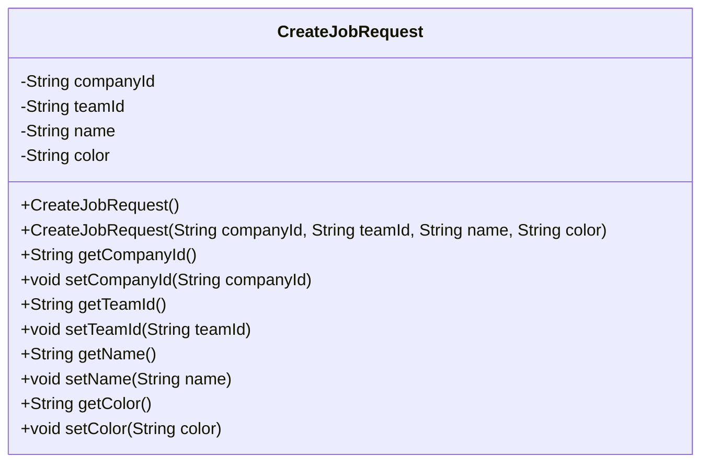
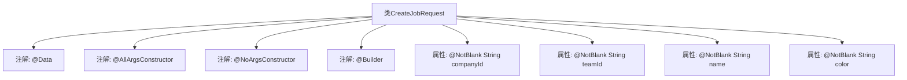

# 基础信息

|      |      |
|------|------|
| 名称 | CreateJobRequest |
| 编码语言 | .java |
| 代码路径 | staffjoy/company-api/src/main/java/xyz/staffjoy/company/dto/CreateJobRequest.java |
| 包名 | xyz.staffjoy.company.dto |
| 依赖项 | ['lombok.AllArgsConstructor', 'lombok.Builder', 'lombok.Data', 'lombok.NoArgsConstructor', 'javax.validation.constraints.NotBlank', 'javax.validation.constraints.NotEmpty'] |
| 概述说明 | 创建任务请求类，含公司ID、团队ID、名称和颜色字段，非空校验。 |

# 说明

这是一个名为CreateJobRequest的Java类定义，使用Lombok注解简化代码。类中包含四个必填字符串字段：companyId、teamId、name和color，每个字段都标注了@NotBlank注解表示不能为空。类使用了@AllArgsConstructor生成全参构造函数，@NoArgsConstructor生成无参构造函数，以及@Builder注解支持建造者模式创建对象。整个类结构用于创建职位请求的数据封装。

# 类列表 Class Summary

| 名称   | 类型  | 说明 |
|-------|------|-------------|
| CreateJobRequest | class | 创建职位请求类，包含公司ID、团队ID、名称和颜色字段，均为必填。 |

## 类 CreateJobRequest

|      |      |
|------|------|
| 访问范围 | @Data;@AllArgsConstructor;@NoArgsConstructor;@Builder;public |
| 类型 | class |
| 名称 | CreateJobRequest |
| 说明 | 创建职位请求类，包含公司ID、团队ID、名称和颜色字段，均为必填。 |

### UML类图

这段类图展示了一个名为CreateJobRequest的Java类，该类使用Lombok注解自动生成构造器、getter/setter和builder模式方法。类包含四个私有字符串字段：companyId、teamId、name和color，每个字段都标注了@NotBlank验证注解。类提供了无参构造器、全参构造器以及通过@Builder生成的链式构造方式，同时包含所有字段的标准getter和setter方法。这个类通常用于接收创建任务的请求数据，确保必要字段非空。

### 内部方法调用关系图

这段代码定义了一个使用Lombok注解的CreateJobRequest类，包含四个非空字符串属性和四个类级别注解。@Data自动生成getter/setter等方法，@AllArgsConstructor和@NoArgsConstructor分别生成全参和无参构造方法，@Builder提供建造者模式支持。每个属性都带有@NotBlank注解确保非空校验，整体结构简洁高效地实现了POJO类的标准功能。

### 字段列表 Field List

| 名称  | 类型  | 说明 |
|-------|-------|------|
| teamId | String | 非空团队ID字符串字段 |
| companyId | String | 私有字符串变量companyId，非空校验。 |
| name | String | 非空字符串字段name |
| color | String | 非空字符串字段color |

### 方法列表 Method List

| 名称  | 类型  | 说明 |
|-------|-------|------|

