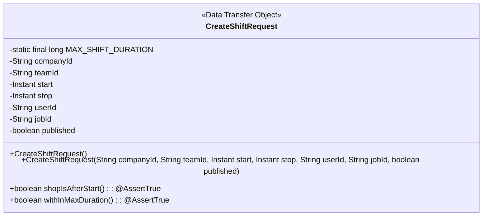
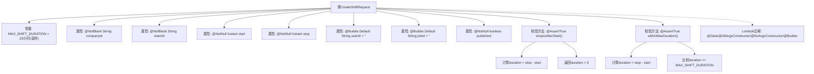

# 基础信息

|      |      |
|------|------|
| 名称 | CreateShiftRequest |
| 编码语言 | .java |
| 代码路径 | staffjoy/company-api/src/main/java/xyz/staffjoy/company/dto/CreateShiftRequest.java |
| 包名 | xyz.staffjoy.company.dto |
| 依赖项 | ['lombok.AllArgsConstructor', 'lombok.Builder', 'lombok.Data', 'lombok.NoArgsConstructor', 'javax.validation.constraints.AssertTrue', 'javax.validation.constraints.NotBlank', 'javax.validation.constraints.NotNull', 'java.time.Instant', 'java.util.concurrent.TimeUnit'] |
| 概述说明 | 创建班次请求类，含公司、团队ID，起止时间，用户和岗位ID，校验时间有效性和最大时长。 |

# 说明

这是一个用于创建班次请求的Java类，包含公司ID、团队ID、班次开始和结束时间等必填字段。类中定义了最大班次时长为23小时，并包含两个验证方法：确保结束时间晚于开始时间，以及班次时长不超过最大限制。可选字段包括用户ID和工作ID，默认值为空字符串。published字段标记班次是否发布。类使用了Lombok注解简化代码，支持全参数和无参数构造器，以及建造者模式。

# 类列表 Class Summary

| 名称   | 类型  | 说明 |
|-------|------|-------------|
| CreateShiftRequest | class | 创建班次请求类，包含公司、团队、起止时间等字段，校验时间有效性和最大时长。 |

## 类 CreateShiftRequest

|      |      |
|------|------|
| 访问范围 | @Data;@AllArgsConstructor;@NoArgsConstructor;@Builder;public |
| 类型 | class |
| 名称 | CreateShiftRequest |
| 说明 | 创建班次请求类，包含公司、团队、起止时间等字段，校验时间有效性和最大时长。 |

### UML类图

这段代码定义了一个名为CreateShiftRequest的数据传输对象(DTO)类，用于创建班次请求。该类包含公司ID、团队ID、班次开始/结束时间、用户ID、职位ID和发布状态等字段，并提供了全参和无参构造方法。类中定义了两个验证方法：shopIsAfterStart()确保结束时间晚于开始时间，withInMaxDuration()检查班次时长不超过23小时上限。该类使用了Lombok注解简化代码，并包含构建器模式支持。

### 内部方法调用关系图

这段代码定义了一个使用Lombok注解的CreateShiftRequest类，主要用于创建排班请求。类中包含基础字段校验、两个业务逻辑校验方法（确保结束时间晚于开始时间且不超过最大时长23小时），以及通过Lombok自动生成的构造器、Builder模式和Getter/Setter方法。流程图清晰展示了类结构、属性约束和校验方法的内部逻辑。

### 字段列表 Field List

| 名称  | 类型  | 说明 |
|-------|-------|------|
| start | Instant | 非空私有Instant类型变量start |
| teamId | String | 非空团队ID字符串字段 |
| stop | Instant | 非空Instant类型私有变量stop |
| userId = "" | String | 默认用户ID为空字符串 |
| companyId | String | 非空公司ID字符串 |
| published | boolean | 非空布尔类型变量published |
| jobId = "" | String | 默认空字符串的jobId变量声明 |
| MAX_SHIFT_DURATION = TimeUnit.HOURS.toMillis(23) | long | 定义最大轮班时长23小时的毫秒值常量。 |

### 方法列表 Method List

| 名称  | 类型  | 说明 |
|-------|-------|------|
| shopIsAfterStart | boolean | 验证结束时间晚于开始时间 |
| withInMaxDuration | boolean | 检查班次时长是否超过最大允许值 |

