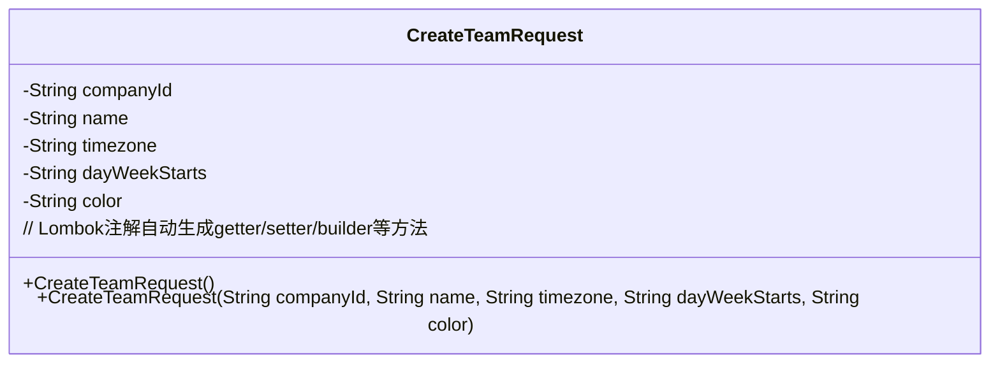
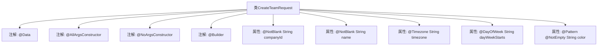

# 基础信息

|      |      |
|------|------|
| 名称 | CreateTeamRequest |
| 编码语言 | .java |
| 代码路径 | staffjoy/company-api/src/main/java/xyz/staffjoy/company/dto/CreateTeamRequest.java |
| 包名 | xyz.staffjoy.company.dto |
| 依赖项 | ['lombok.AllArgsConstructor', 'lombok.Builder', 'lombok.Data', 'lombok.NoArgsConstructor', 'xyz.staffjoy.common.validation.DayOfWeek', 'xyz.staffjoy.common.validation.Timezone', 'javax.validation.constraints.NotBlank', 'javax.validation.constraints.NotEmpty', 'javax.validation.constraints.Pattern'] |
| 概述说明 | 创建团队请求类，含公司ID、名称、时区、周起始日和颜色字段，带验证注解。 |

# 说明

这是一个名为CreateTeamRequest的Java类，用于创建团队请求的数据模型。类中包含五个字段：companyId（公司ID，非空字符串）、name（团队名称，非空字符串）、timezone（时区，需符合时区格式）、dayWeekStarts（周起始日，需符合星期格式）、color（颜色代码，需符合十六进制颜色格式且非空）。类使用了Lombok注解自动生成全参构造函数、无参构造函数和建造者模式，并通过校验注解确保字段数据的有效性。

# 类列表 Class Summary

| 名称   | 类型  | 说明 |
|-------|------|-------------|
| CreateTeamRequest | class | 创建团队请求类，含公司ID、名称、时区、周起始日和颜色字段，带验证注解。 |

## 类 CreateTeamRequest

|      |      |
|------|------|
| 访问范围 | @Data;@AllArgsConstructor;@NoArgsConstructor;@Builder;public |
| 类型 | class |
| 名称 | CreateTeamRequest |
| 说明 | 创建团队请求类，含公司ID、名称、时区、周起始日和颜色字段，带验证注解。 |

### UML类图

该类图表示一个团队创建请求对象，包含公司ID、团队名称、时区、周起始日和颜色编码五个核心字段。通过Lombok注解自动生成全参/无参构造器、建造者模式方法及标准getter/setter。字段使用JSR303校验注解确保数据有效性，如非空校验(@NotBlank)、时区格式(@Timezone)、颜色编码正则校验等，体现了请求参数的强类型约束和业务规则验证机制。

### 内部方法调用关系图

这段流程图展示了CreateTeamRequest类的结构，该类使用了Lombok的@Data、@AllArgsConstructor、@NoArgsConstructor和@Builder注解来自动生成getter/setter、全参构造器、无参构造器和建造者模式。类包含五个属性：companyId和name使用@NotBlank注解进行非空校验，timezone和dayWeekStarts使用自定义格式校验注解，color属性通过@Pattern校验十六进制颜色码格式并通过@NotEmpty确保非空。整个设计用于团队创建请求的数据封装与验证。

### 字段列表 Field List

| 名称  | 类型  | 说明 |
|-------|-------|------|
| color | String | 定义颜色字段，要求非空且符合十六进制格式。 |
| dayWeekStarts | String | 类变量dayWeekStarts，类型String，私有。 |
| name | String | 非空字符串字段name |
| companyId | String | 私有字符串类型公司ID |
| timezone | String | 时区字段，字符串类型，私有。 |

### 方法列表 Method List

| 名称  | 类型  | 说明 |
|-------|-------|------|

