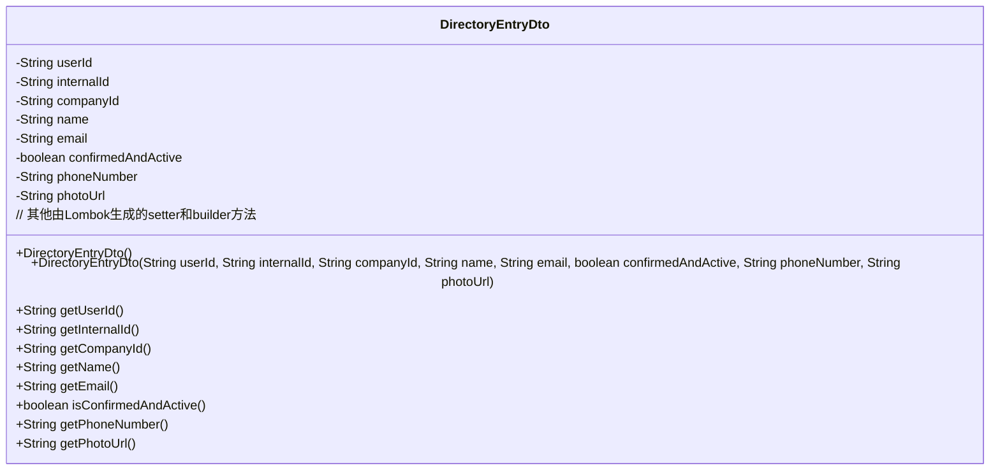
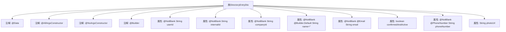

# 基础信息

|      |      |
|------|------|
| 名称 | DirectoryEntryDto |
| 编码语言 | .java |
| 代码路径 | staffjoy/company-api/src/main/java/xyz/staffjoy/company/dto/DirectoryEntryDto.java |
| 包名 | xyz.staffjoy.company.dto |
| 依赖项 | ['lombok.AllArgsConstructor', 'lombok.Builder', 'lombok.Data', 'lombok.NoArgsConstructor', 'xyz.staffjoy.common.validation.PhoneNumber', 'javax.validation.constraints.Email', 'javax.validation.constraints.NotBlank', 'javax.validation.constraints.NotEmpty'] |
| 概述说明 | 目录条目数据传输对象，包含用户ID、公司ID、姓名、邮箱、电话等必填字段。 |

# 说明

DirectoryEntryDto是一个数据传输对象类，用于表示目录条目信息。它包含以下字段：必填的用户ID、内部ID和公司ID；来自账户的必填名称（默认空字符串）、必填的电子邮件（需符合邮箱格式）和必填的电话号码（需符合电话号码格式）；以及确认激活状态标志和照片URL。该类使用了Lombok注解自动生成全参构造函数、无参构造函数和建造者模式，并支持默认值设置。

# 类列表 Class Summary

| 名称   | 类型  | 说明 |
|-------|------|-------------|
| DirectoryEntryDto | class | 目录条目数据传输对象，含用户ID、公司ID、姓名、邮箱、电话等必填字段。 |

## 类 DirectoryEntryDto

|      |      |
|------|------|
| 访问范围 | @Data;@AllArgsConstructor;@NoArgsConstructor;@Builder;public |
| 类型 | class |
| 名称 | DirectoryEntryDto |
| 说明 | 目录条目数据传输对象，含用户ID、公司ID、姓名、邮箱、电话等必填字段。 |

### UML类图

这段代码定义了一个名为DirectoryEntryDto的数据传输对象类，使用Lombok注解自动生成构造器、getter、setter和builder方法。类包含8个私有字段，其中userId、internalId、companyId、name、email和phoneNumber都有@NotBlank验证约束，email和phoneNumber还有额外的格式验证。photoUrl是可选的，confirmedAndActive是布尔类型。该类主要用于在系统各层之间传输目录条目数据，确保数据完整性和格式正确性。

### 内部方法调用关系图

这段代码展示了一个使用Lombok注解的Java数据传输对象(DTO)类DirectoryEntryDto。该流程图清晰地呈现了类结构，包括@Data注解自动生成getter/setter，@Builder支持建造者模式，以及多个字段的验证约束(@NotBlank, @Email等)。所有属性都通过注解进行了严格的输入校验，其中name字段设置了默认空字符串，phoneNumber使用自定义@PhoneNumber验证，体现了对数据完整性的高标准要求。

### 字段列表 Field List

| 名称  | 类型  | 说明 |
|-------|-------|------|
| internalId | String | 私有字符串变量internalId |
| name = "" | String | 非空字符串字段name，默认值为空。 |
| userId | String | 私有字符串类型变量userId，非空约束。 |
| companyId | String | 私有字符串类型公司ID |
| email | String | 非空邮箱字段校验 |
| confirmedAndActive | boolean | 私有布尔变量，表示确认并激活状态。 |
| phoneNumber | String | 字段phoneNumber需为非空且符合电话号码格式的字符串。 |
| photoUrl | String | 私有字符串变量photoUrl，存储照片链接。 |

### 方法列表 Method List

| 名称  | 类型  | 说明 |
|-------|-------|------|

