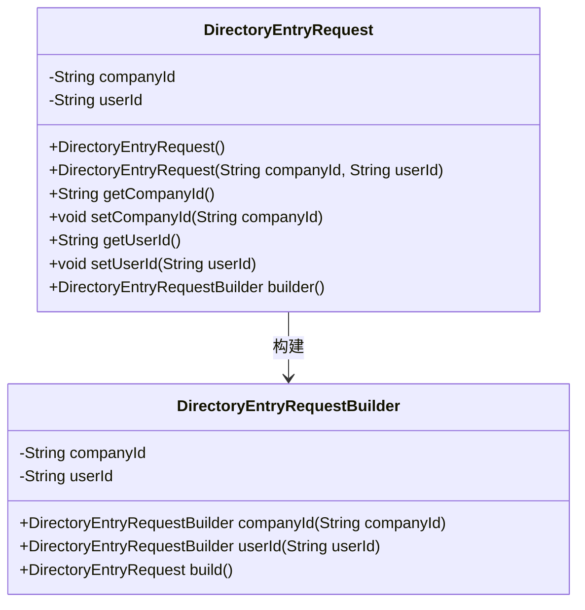
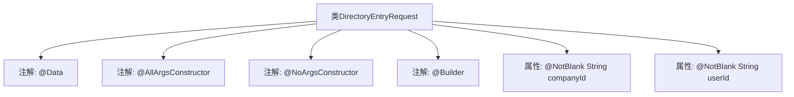

# 基础信息

|      |      |
|------|------|
| 名称 | DirectoryEntryRequest |
| 编码语言 | .java |
| 代码路径 | staffjoy/company-api/src/main/java/xyz/staffjoy/company/dto/DirectoryEntryRequest.java |
| 包名 | xyz.staffjoy.company.dto |
| 依赖项 | ['lombok.AllArgsConstructor', 'lombok.Builder', 'lombok.Data', 'lombok.NoArgsConstructor', 'javax.validation.constraints.NotBlank', 'javax.validation.constraints.NotEmpty'] |
| 概述说明 | 目录请求类，含公司ID和用户ID字段，支持全参无参构造和建造器模式。 |

# 说明

这是一个名为DirectoryEntryRequest的Java类定义，使用了Lombok注解简化代码。类中包含两个非空字符串字段：companyId和userId。通过@AllArgsConstructor生成全参构造函数，@NoArgsConstructor生成无参构造函数，@Builder提供建造者模式支持。类结构清晰，用于处理目录条目请求数据。

# 类列表 Class Summary

| 名称   | 类型  | 说明 |
|-------|------|-------------|
| DirectoryEntryRequest | class | 定义目录请求类，含公司ID和用户ID字段，支持全参、无参构造和建造器模式。 |

## 类 DirectoryEntryRequest

|      |      |
|------|------|
| 访问范围 | @Data;@AllArgsConstructor;@NoArgsConstructor;@Builder;public |
| 类型 | class |
| 名称 | DirectoryEntryRequest |
| 说明 | 定义目录请求类，含公司ID和用户ID字段，支持全参、无参构造和建造器模式。 |

### UML类图

该类图展示了一个使用Lombok注解的DirectoryEntryRequest类，包含companyId和userId两个私有字段，通过注解自动生成无参构造器、全参构造器、getter/setter方法以及Builder模式相关功能。Builder模式通过内部DirectoryEntryRequestBuilder类实现，提供了链式调用的构建方式。类图中清晰地展示了核心数据结构和构建器模式的关系，体现了现代Java开发中常用的简洁编码风格。

### 内部方法调用关系图

这段代码展示了一个使用Lombok注解的Java类DirectoryEntryRequest，通过@Data自动生成getter/setter等方法，@AllArgsConstructor和@NoArgsConstructor分别生成全参和无参构造器，@Builder提供建造者模式支持。类包含两个@NotBlank校验的字符串属性companyId和userId，整体结构简洁高效，适用于需要数据验证和快速构建对象的场景。

### 字段列表 Field List

| 名称  | 类型  | 说明 |
|-------|-------|------|
| companyId | String | 非空公司ID字符串 |
| userId | String | 私有字符串类型变量userId，非空约束。 |

### 方法列表 Method List

| 名称  | 类型  | 说明 |
|-------|-------|------|

