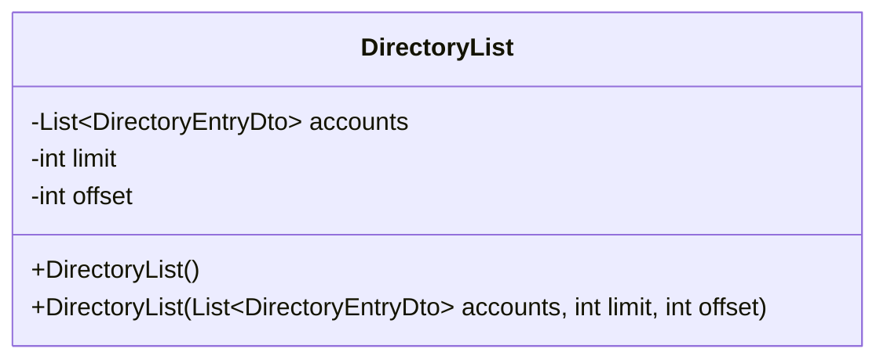
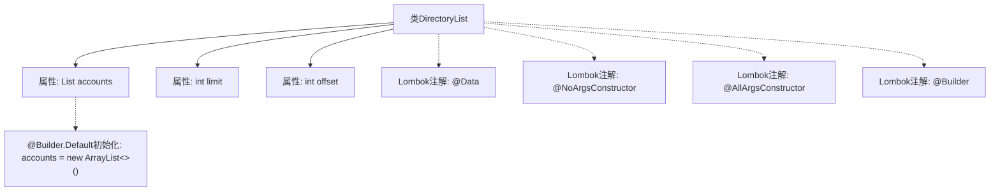

# 基础信息

|      |      |
|------|------|
| 名称 | DirectoryList |
| 编码语言 | .java |
| 代码路径 | staffjoy/company-api/src/main/java/xyz/staffjoy/company/dto/DirectoryList.java |
| 包名 | xyz.staffjoy.company.dto |
| 依赖项 | [None, 'java.util.ArrayList', 'java.util.List'] |
| 概述说明 | 类DirectoryList包含账户列表、限制和偏移量字段，支持无参、全参和构建器构造。 |

# 说明

这是一个名为DirectoryList的Java类，使用了Lombok库的注解来简化代码。类中包含三个主要部分：一个默认初始化为空ArrayList的DirectoryEntryDto类型列表accounts，以及两个整型变量limit和offset。通过@NoArgsConstructor生成无参构造器，@AllArgsConstructor生成全参构造器，@Builder提供建造者模式支持。@Builder.Default确保accounts列表在建造者模式中默认初始化为空列表。整个类设计用于表示分页目录列表数据结构。

# 类列表 Class Summary

| 名称   | 类型  | 说明 |
|-------|------|-------------|
| DirectoryList | class | 目录列表类，含账户列表、限制和偏移量字段，支持构建器模式。 |

## 类 DirectoryList

|      |      |
|------|------|
| 访问范围 | @Data;@NoArgsConstructor;@AllArgsConstructor;@Builder;public |
| 类型 | class |
| 名称 | DirectoryList |
| 说明 | 目录列表类，含账户列表、限制和偏移量字段，支持构建器模式。 |

### UML类图

这段代码定义了一个名为DirectoryList的类，使用Lombok注解自动生成构造器、建造者模式和默认值。该类包含三个主要成员：一个DirectoryEntryDto类型的泛型列表accounts（默认初始化为空ArrayList），以及limit和offset两个整型字段。类通过@AllArgsConstructor和@NoArgsConstructor分别生成全参数和无参构造器，@Builder支持链式调用创建对象。该设计常用于分页查询场景，accounts存储条目数据，limit/offset控制分页参数。

### 内部方法调用关系图

这段代码展示了一个使用Lombok注解的Java类DirectoryList，包含三个主要属性：accounts列表、limit和offset。通过@Data注解自动生成getter/setter，@Builder支持建造者模式，@NoArgsConstructor和@AllArgsConstructor分别提供无参和全参构造方法。@Builder.Default确保accounts属性在未指定时初始化为空ArrayList。该设计简化了分页目录数据的封装，适合作为API响应结构。

### 字段列表 Field List

| 名称  | 类型  | 说明 |
|-------|-------|------|
| limit | int | 私有整型变量limit |
| accounts = new ArrayList<DirectoryEntryDto>() | List<DirectoryEntryDto> | 私有账户列表初始化为空数组。 |
| offset | int | 私有整型变量offset |

### 方法列表 Method List

| 名称  | 类型  | 说明 |
|-------|-------|------|

