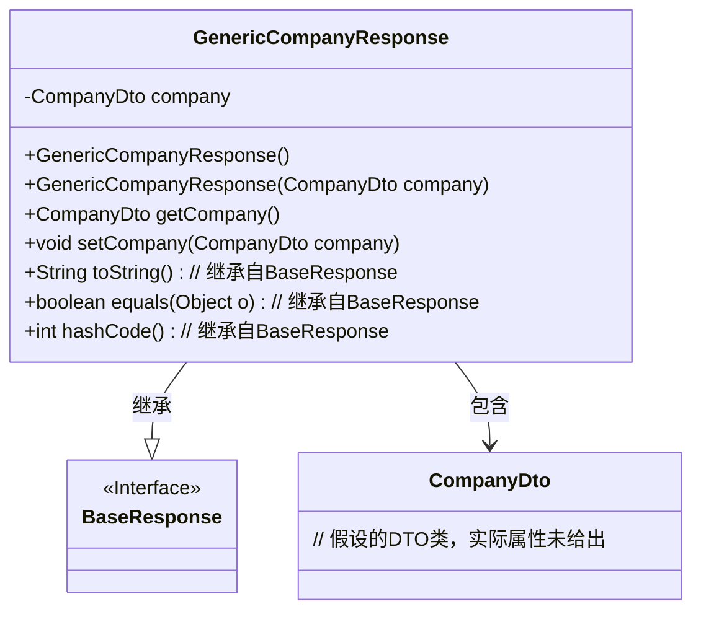
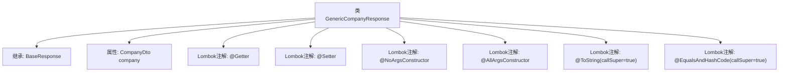

# 基础信息

|      |      |
|------|------|
| 名称 | GenericCompanyResponse |
| 编码语言 | .java |
| 代码路径 | staffjoy/company-api/src/main/java/xyz/staffjoy/company/dto/GenericCompanyResponse.java |
| 包名 | xyz.staffjoy.company.dto |
| 依赖项 | [None, 'xyz.staffjoy.common.api.BaseResponse'] |
| 概述说明 | Java类GenericCompanyResponse继承BaseResponse，包含CompanyDto属性，使用Lombok注解简化代码。 |

# 说明

该代码段定义了一个名为GenericCompanyResponse的Java类，继承自BaseResponse。类使用了Lombok注解自动生成getter、setter、无参构造器、全参构造器，并重写了toString和equals/hashCode方法（包含父类字段）。类包含一个CompanyDto类型的私有字段company，用于存储公司数据。

# 类列表 Class Summary

| 名称   | 类型  | 说明 |
|-------|------|-------------|
| GenericCompanyResponse | class | Java类GenericCompanyResponse继承BaseResponse，包含CompanyDto属性及常用注解。 |

## 类 GenericCompanyResponse

|      |      |
|------|------|
| 访问范围 | @Getter;@Setter;@NoArgsConstructor;@AllArgsConstructor;@ToString(callSuper = true);@EqualsAndHashCode(callSuper = true);public |
| 类型 | class |
| 名称 | GenericCompanyResponse |
| 说明 | Java类GenericCompanyResponse继承BaseResponse，包含CompanyDto属性及常用注解。 |

### UML类图

这段类图展示了GenericCompanyResponse继承自BaseResponse接口，并包含一个CompanyDto私有成员。该类通过Lombok注解自动生成了构造方法、getter/setter以及toString/equals/hashCode方法（其中后三个方法通过callSuper=true调用了父类逻辑）。图中清晰呈现了继承关系和组合关系，BaseResponse作为接口用<<Interface>>标注，而CompanyDto作为数据载体与响应类形成关联。整个结构体现了典型的DTO模式响应封装，符合企业级应用的分层设计规范。

### 内部方法调用关系图

该流程图展示了GenericCompanyResponse类的结构，这是一个继承自BaseResponse的Java类，使用Lombok注解自动生成getter、setter、无参构造器、全参构造器、toString和equals/hashCode方法。类包含一个CompanyDto类型的属性company，所有注解均配置了callSuper=true参数以确保父类字段参与相关方法逻辑。图中清晰呈现了继承关系和Lombok注解的修饰作用。

### 字段列表 Field List

| 名称  | 类型  | 说明 |
|-------|-------|------|
| company | CompanyDto | 私有公司对象变量company |

### 方法列表 Method List

| 名称  | 类型  | 说明 |
|-------|-------|------|

