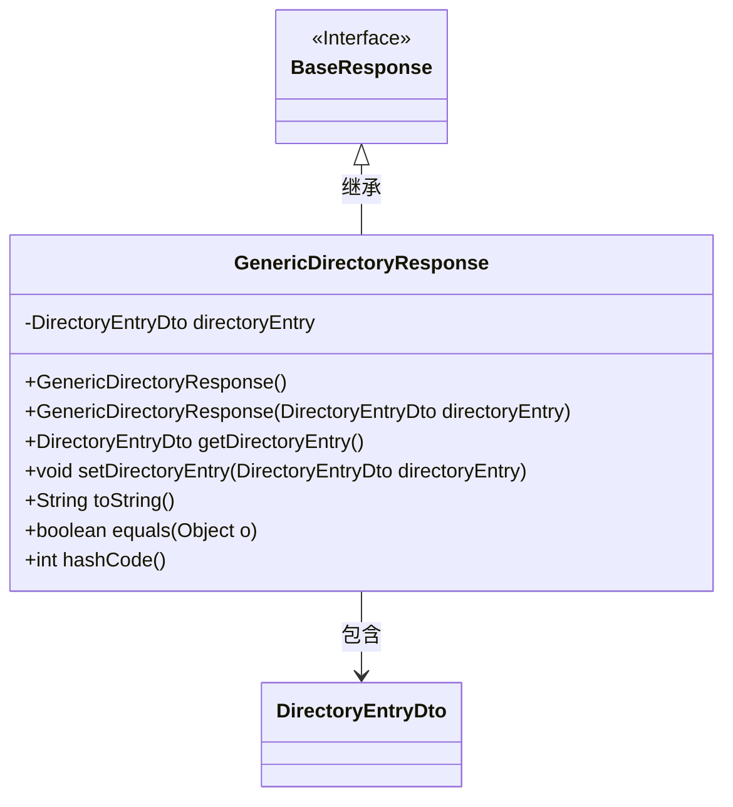
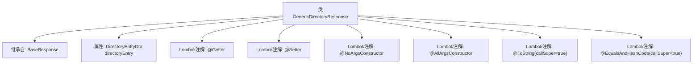

# 基础信息

|      |      |
|------|------|
| 名称 | GenericDirectoryResponse |
| 编码语言 | .java |
| 代码路径 | staffjoy/company-api/src/main/java/xyz/staffjoy/company/dto/GenericDirectoryResponse.java |
| 包名 | xyz.staffjoy.company.dto |
| 依赖项 | [None, 'xyz.staffjoy.common.api.BaseResponse'] |
| 概述说明 | Java类GenericDirectoryResponse继承BaseResponse，包含DirectoryEntryDto属性及常用注解。 |

# 说明

该代码定义了一个名为GenericDirectoryResponse的Java类，继承自BaseResponse。类使用了Lombok注解自动生成getter、setter、无参构造器、全参构造器，并重写了toString和equals/hashCode方法（包含父类属性）。包含一个DirectoryEntryDto类型的私有字段directoryEntry。

# 类列表 Class Summary

| 名称   | 类型  | 说明 |
|-------|------|-------------|
| GenericDirectoryResponse | class | Java类GenericDirectoryResponse继承BaseResponse，包含DirectoryEntryDto属性及常用注解。 |

## 类 GenericDirectoryResponse

|      |      |
|------|------|
| 访问范围 | @Getter;@Setter;@NoArgsConstructor;@AllArgsConstructor;@ToString(callSuper = true);@EqualsAndHashCode(callSuper = true);public |
| 类型 | class |
| 名称 | GenericDirectoryResponse |
| 说明 | Java类GenericDirectoryResponse继承BaseResponse，包含DirectoryEntryDto属性及常用注解。 |

### UML类图

这段类图展示了GenericDirectoryResponse类继承自BaseResponse接口，并包含一个DirectoryEntryDto类型的私有属性。该类通过Lombok注解自动生成了无参构造器、全参构造器、getter/setter方法、toString()、equals()和hashCode()方法。其中toString()、equals()和hashCode()方法都通过callSuper=true参数调用了父类方法。这个设计模式体现了响应对象的通用结构，其中BaseResponse定义基础响应格式，而GenericDirectoryResponse扩展了特定目录条目的响应能力。

### 内部方法调用关系图

该流程图展示了GenericDirectoryResponse类的结构，它是一个继承自BaseResponse的DTO类，包含一个DirectoryEntryDto类型的属性。通过Lombok注解自动生成getter/setter、无参构造器、全参构造器、toString和equals/hashCode方法，其中后两个方法通过callSuper=true参数确保包含父类字段。整个设计体现了简洁的POJO类规范，适合用于响应数据封装场景。

### 字段列表 Field List

| 名称  | 类型  | 说明 |
|-------|-------|------|
| directoryEntry | DirectoryEntryDto | 私有目录条目对象directoryEntry。 |

### 方法列表 Method List

| 名称  | 类型  | 说明 |
|-------|-------|------|

