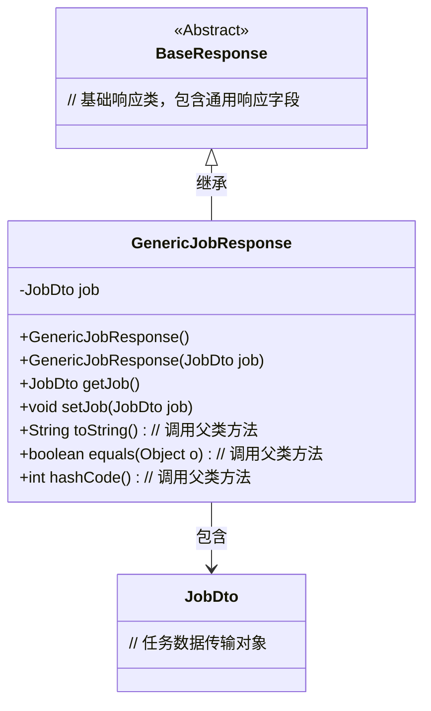
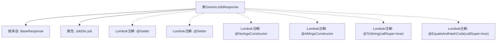

# 基础信息

|      |      |
|------|------|
| 名称 | GenericJobResponse |
| 编码语言 | .java |
| 代码路径 | staffjoy/company-api/src/main/java/xyz/staffjoy/company/dto/GenericJobResponse.java |
| 包名 | xyz.staffjoy.company.dto |
| 依赖项 | [None, 'xyz.staffjoy.common.api.BaseResponse'] |
| 概述说明 | Java类GenericJobResponse继承BaseResponse，包含JobDto属性，使用Lombok注解生成方法。 |

# 说明

这段内容描述了一个名为GenericJobResponse的Java类，该类继承自BaseResponse。它使用了多个Lombok注解来简化代码：@Getter和@Setter自动生成getter和setter方法，@NoArgsConstructor和@AllArgsConstructor分别生成无参和全参构造函数。@ToString和@EqualsAndHashCode注解用于自动生成toString、equals和hashCode方法，并通过callSuper=true包含父类属性。该类包含一个JobDto类型的私有字段job。

# 类列表 Class Summary

| 名称   | 类型  | 说明 |
|-------|------|-------------|
| GenericJobResponse | class | Java类GenericJobResponse继承BaseResponse，包含JobDto属性及常用注解。 |

## 类 GenericJobResponse

|      |      |
|------|------|
| 访问范围 | @Getter;@Setter;@NoArgsConstructor;@AllArgsConstructor;@ToString(callSuper = true);@EqualsAndHashCode(callSuper = true);public |
| 类型 | class |
| 名称 | GenericJobResponse |
| 说明 | Java类GenericJobResponse继承BaseResponse，包含JobDto属性及常用注解。 |

### UML类图

这段类图展示了GenericJobResponse继承自BaseResponse，并包含一个JobDto对象。GenericJobResponse通过Lombok注解自动生成构造方法、getter/setter、toString、equals和hashCode方法，其中toString和equals/hashCode会调用父类方法。BaseResponse作为抽象基类提供通用响应结构，JobDto则封装具体任务数据。该设计实现了响应对象的层次化结构，便于扩展和维护。

### 内部方法调用关系图

这段代码展示了一个使用Lombok注解的Java类GenericJobResponse，它继承自BaseResponse类。主要结构包括一个JobDto类型的属性job，以及通过Lombok自动生成的getter/setter方法、无参构造器、全参构造器、包含父类字段的toString()方法和equals()/hashCode()方法。该设计简化了样板代码，同时保持了完整的对象功能，适用于需要扩展基础响应并携带作业信息的场景。

### 字段列表 Field List

| 名称  | 类型  | 说明 |
|-------|-------|------|
| job | JobDto | 私有JobDto类型变量job。 |

### 方法列表 Method List

| 名称  | 类型  | 说明 |
|-------|-------|------|

