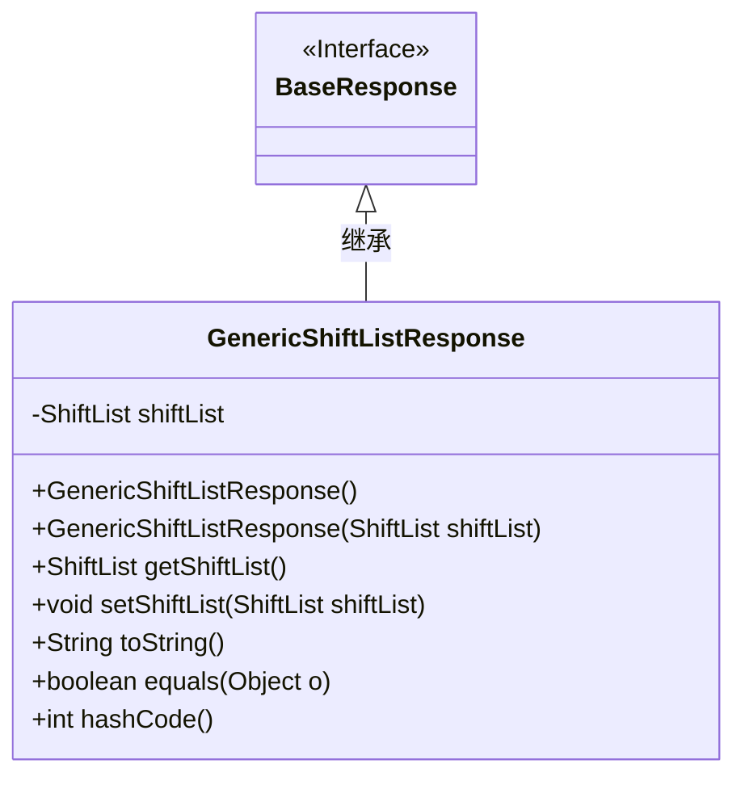
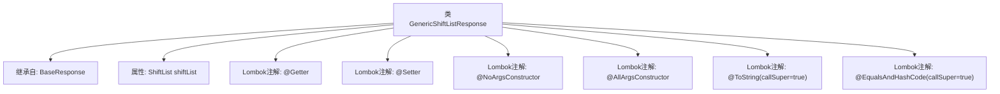

# 基础信息

|      |      |
|------|------|
| 名称 | GenericShiftListResponse |
| 编码语言 | .java |
| 代码路径 | staffjoy/company-api/src/main/java/xyz/staffjoy/company/dto/GenericShiftListResponse.java |
| 包名 | xyz.staffjoy.company.dto |
| 依赖项 | [None, 'xyz.staffjoy.common.api.BaseResponse'] |
| 概述说明 | Java类GenericShiftListResponse继承BaseResponse，包含ShiftList字段，提供Getter/Setter、全参/无参构造方法，重写toString和equals/hashCode。 |

# 说明

该代码定义了一个名为GenericShiftListResponse的Java类，继承自BaseResponse。类使用了Lombok库的多个注解：@Getter和@Setter自动生成getter和setter方法，@NoArgsConstructor和@AllArgsConstructor分别生成无参和全参构造函数。@ToString和@EqualsAndHashCode注解启用了callSuper特性，确保在生成toString和哈希值时会包含父类属性。类中包含一个ShiftList类型的私有字段shiftList。

# 类列表 Class Summary

| 名称   | 类型  | 说明 |
|-------|------|-------------|
| GenericShiftListResponse | class | Java类GenericShiftListResponse继承BaseResponse，包含ShiftList属性及常用注解。 |

## 类 GenericShiftListResponse

|      |      |
|------|------|
| 访问范围 | @Getter;@Setter;@NoArgsConstructor;@AllArgsConstructor;@ToString(callSuper = true);@EqualsAndHashCode(callSuper = true);public |
| 类型 | class |
| 名称 | GenericShiftListResponse |
| 说明 | Java类GenericShiftListResponse继承BaseResponse，包含ShiftList属性及常用注解。 |

### UML类图

这段类图展示了GenericShiftListResponse类继承自BaseResponse接口的结构。GenericShiftListResponse包含一个私有ShiftList类型成员变量shiftList，通过Lombok注解自动生成了无参构造器、全参构造器、getter/setter方法以及toString()、equals()和hashCode()方法。该类通过@ToString和@EqualsAndHashCode注解配置了callSuper=true属性，表明在生成相关方法时会考虑父类的字段。图中清晰呈现了类与接口的继承关系以及类的主要成员结构。

### 内部方法调用关系图

该流程图展示了GenericShiftListResponse类的结构，这是一个继承BaseResponse的实体类，包含ShiftList类型属性，并使用Lombok自动生成getter/setter、全参/无参构造器，以及覆写了toString和equals/hashCode方法（均包含父类字段）。所有注解配置均通过callSuper=true确保父类字段参与相关方法逻辑。

### 字段列表 Field List

| 名称  | 类型  | 说明 |
|-------|-------|------|
| shiftList | ShiftList | 私有ShiftList类型变量shiftList。 |

### 方法列表 Method List

| 名称  | 类型  | 说明 |
|-------|-------|------|

