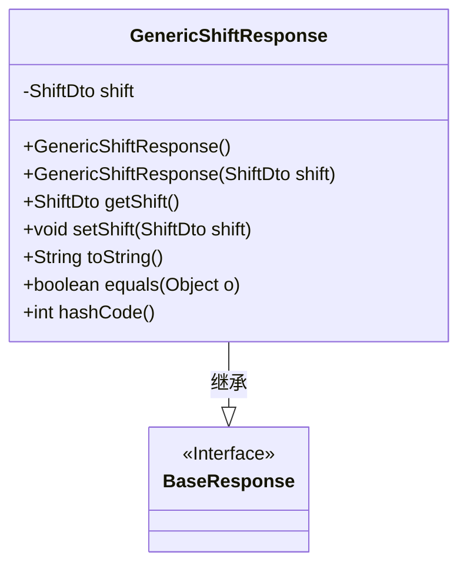
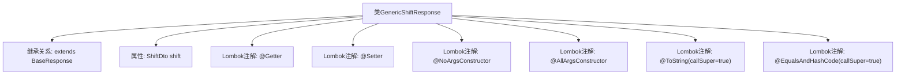

# 基础信息

|      |      |
|------|------|
| 名称 | GenericShiftResponse |
| 编码语言 | .java |
| 代码路径 | staffjoy/company-api/src/main/java/xyz/staffjoy/company/dto/GenericShiftResponse.java |
| 包名 | xyz.staffjoy.company.dto |
| 依赖项 | [None, 'xyz.staffjoy.common.api.BaseResponse'] |
| 概述说明 | Java类GenericShiftResponse继承BaseResponse，包含ShiftDto字段及常用注解。 |

# 说明

该代码定义了一个名为GenericShiftResponse的Java类，继承自BaseResponse。类使用了Lombok库的多个注解：@Getter和@Setter自动生成getter和setter方法，@NoArgsConstructor和@AllArgsConstructor分别生成无参和全参构造函数。@ToString和@EqualsAndHashCode注解启用了包含父类属性的toString和equals/hashCode方法。类包含一个ShiftDto类型的私有字段shift。

# 类列表 Class Summary

| 名称   | 类型  | 说明 |
|-------|------|-------------|
| GenericShiftResponse | class | Java类GenericShiftResponse继承BaseResponse，包含ShiftDto字段，使用Lombok注解生成getter、setter、构造方法等。 |

## 类 GenericShiftResponse

|      |      |
|------|------|
| 访问范围 | @Getter;@Setter;@NoArgsConstructor;@AllArgsConstructor;@ToString(callSuper = true);@EqualsAndHashCode(callSuper = true);public |
| 类型 | class |
| 名称 | GenericShiftResponse |
| 说明 | Java类GenericShiftResponse继承BaseResponse，包含ShiftDto字段，使用Lombok注解生成getter、setter、构造方法等。 |

### UML类图

这段类图展示了GenericShiftResponse与BaseResponse的继承关系。GenericShiftResponse是一个具体实现类，通过Lombok注解自动生成了构造器、getter/setter、toString、equals和hashCode方法。它包含一个私有ShiftDto类型字段shift，并通过继承BaseResponse接口获得基础响应特性。类结构简洁明了，体现了Java实体类的典型设计模式，其中BaseResponse作为父接口定义了基础响应规范，而GenericShiftResponse则扩展了具体的业务数据字段。

### 内部方法调用关系图

这段流程图展示了GenericShiftResponse类的结构，该类继承自BaseResponse并包含一个ShiftDto类型的属性。通过Lombok注解自动生成getter/setter方法、无参/全参构造函数，以及覆写了toString()和equals/hashCode方法（包含父类字段）。该设计简化了响应对象的模板代码，特别适用于需要包含班次信息且具有统一响应基类的场景。

### 字段列表 Field List

| 名称  | 类型  | 说明 |
|-------|-------|------|
| shift | ShiftDto | 私有ShiftDto类型变量shift |

### 方法列表 Method List

| 名称  | 类型  | 说明 |
|-------|-------|------|

