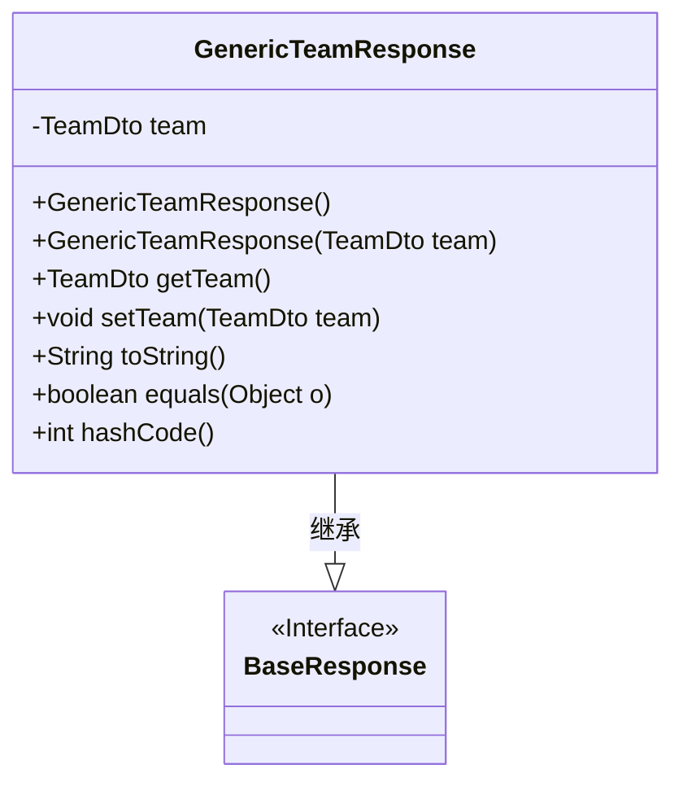
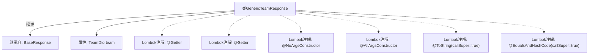

# 基础信息

|      |      |
|------|------|
| 名称 | GenericTeamResponse |
| 编码语言 | .java |
| 代码路径 | staffjoy/company-api/src/main/java/xyz/staffjoy/company/dto/GenericTeamResponse.java |
| 包名 | xyz.staffjoy.company.dto |
| 依赖项 | [None, 'xyz.staffjoy.common.api.BaseResponse'] |
| 概述说明 | Java类GenericTeamResponse继承BaseResponse，包含TeamDto属性及常用注解。 |

# 说明

这段内容描述了一个名为GenericTeamResponse的Java类，该类继承自BaseResponse。它使用了Lombok库的多个注解来自动生成常用方法：@Getter和@Setter用于生成getter和setter方法，@NoArgsConstructor和@AllArgsConstructor分别生成无参和全参构造函数，@ToString和@EqualsAndHashCode用于生成toString和equals/hashCode方法，并设置callSuper=true以包含父类属性。类中包含一个TeamDto类型的私有字段team。

# 类列表 Class Summary

| 名称   | 类型  | 说明 |
|-------|------|-------------|
| GenericTeamResponse | class | Java类GenericTeamResponse继承BaseResponse，包含TeamDto属性及常用注解。 |

## 类 GenericTeamResponse

|      |      |
|------|------|
| 访问范围 | @Getter;@Setter;@NoArgsConstructor;@AllArgsConstructor;@ToString(callSuper = true);@EqualsAndHashCode(callSuper = true);public |
| 类型 | class |
| 名称 | GenericTeamResponse |
| 说明 | Java类GenericTeamResponse继承BaseResponse，包含TeamDto属性及常用注解。 |

### UML类图

这段类图展示了GenericTeamResponse类继承自BaseResponse接口的结构。GenericTeamResponse包含一个私有TeamDto类型成员变量team，通过Lombok注解自动生成了无参构造器、全参构造器、getter/setter方法以及toString()、equals()和hashCode()方法。类图清晰地体现了继承关系和类成员结构，其中BaseResponse作为父接口被标记为<<Interface>>，而GenericTeamResponse作为实现类继承了其所有特性并扩展了团队数据相关的功能。

### 内部方法调用关系图

这段代码定义了一个名为GenericTeamResponse的类，该类继承自BaseResponse。通过Lombok注解自动生成了getter、setter方法，无参构造器和全参构造器，并重写了toString和equals/hashCode方法（包含父类字段）。核心属性是TeamDto类型的team字段，用于封装团队数据响应。流程图展示了类继承关系和注解的元数据修饰。

### 字段列表 Field List

| 名称  | 类型  | 说明 |
|-------|-------|------|
| team | TeamDto | 私有团队数据对象 |

### 方法列表 Method List

| 名称  | 类型  | 说明 |
|-------|-------|------|

