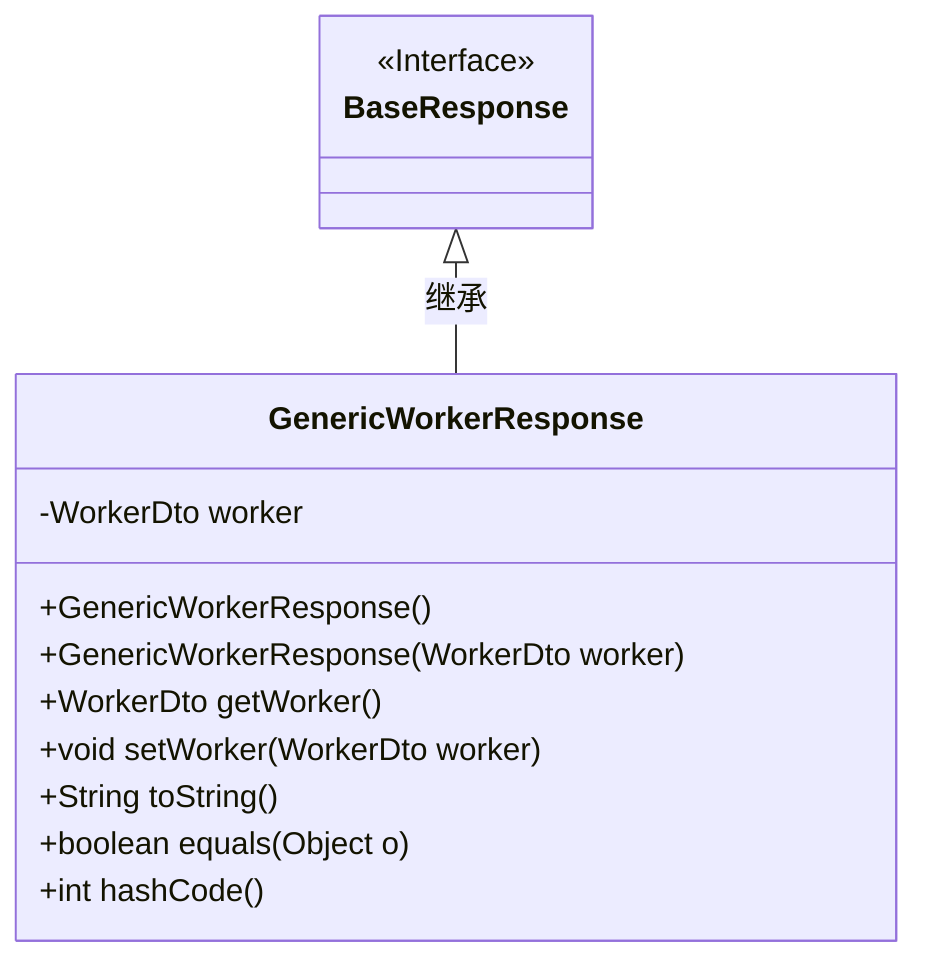
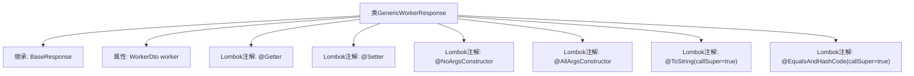

# 基础信息

|      |      |
|------|------|
| 名称 | GenericWorkerResponse |
| 编码语言 | .java |
| 代码路径 | staffjoy/company-api/src/main/java/xyz/staffjoy/company/dto/GenericWorkerResponse.java |
| 包名 | xyz.staffjoy.company.dto |
| 依赖项 | [None, 'xyz.staffjoy.common.api.BaseResponse'] |
| 概述说明 | Java类GenericWorkerResponse继承BaseResponse，包含WorkerDto属性及常用注解。 |

# 说明

该内容定义了一个名为GenericWorkerResponse的Java类，继承自BaseResponse类。该类使用了Lombok库的多个注解：@Getter和@Setter自动生成getter和setter方法，@NoArgsConstructor和@AllArgsConstructor分别生成无参和全参构造函数，@ToString和@EqualsAndHashCode用于生成toString和equals/hashCode方法，并通过callSuper=true包含父类属性。类中包含一个WorkerDto类型的私有字段worker。

# 类列表 Class Summary

| 名称   | 类型  | 说明 |
|-------|------|-------------|
| GenericWorkerResponse | class | Java类GenericWorkerResponse继承BaseResponse，包含WorkerDto属性及常用注解。 |

## 类 GenericWorkerResponse

|      |      |
|------|------|
| 访问范围 | @Getter;@Setter;@NoArgsConstructor;@AllArgsConstructor;@ToString(callSuper = true);@EqualsAndHashCode(callSuper = true);public |
| 类型 | class |
| 名称 | GenericWorkerResponse |
| 说明 | Java类GenericWorkerResponse继承BaseResponse，包含WorkerDto属性及常用注解。 |

### UML类图

这段类图展示了GenericWorkerResponse与BaseResponse的继承关系。GenericWorkerResponse是一个具体实现类，通过Lombok注解自动生成了构造器、getter/setter、toString等方法，并继承了BaseResponse接口的核心功能。WorkerDto作为成员变量封装了工作者数据，类通过重写equals和hashCode确保对象比较的正确性，体现了Java实体类的典型设计模式。

### 内部方法调用关系图

这段代码展示了一个使用Lombok注解的Java类GenericWorkerResponse，它继承自BaseResponse类。主要包含一个WorkerDto类型的属性worker，并通过Lombok自动生成getter/setter方法、无参构造器、全参构造器，同时重写了toString和equals/hashCode方法（包含父类字段）。该设计简化了POJO类的模板代码，适用于Worker业务实体的响应封装场景。

### 字段列表 Field List

| 名称  | 类型  | 说明 |
|-------|-------|------|
| worker | WorkerDto | 私有WorkerDto类型变量worker |

### 方法列表 Method List

| 名称  | 类型  | 说明 |
|-------|-------|------|

