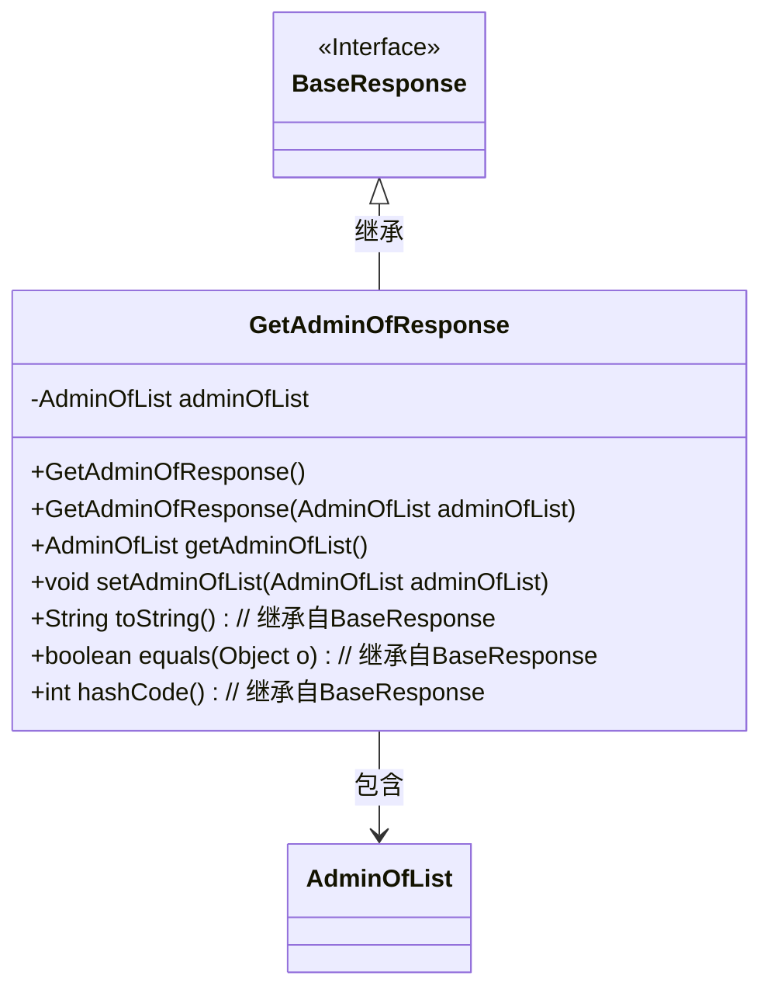
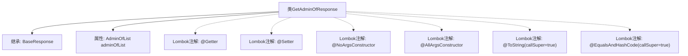

# 基础信息

|      |      |
|------|------|
| 名称 | GetAdminOfResponse |
| 编码语言 | .java |
| 代码路径 | staffjoy/company-api/src/main/java/xyz/staffjoy/company/dto/GetAdminOfResponse.java |
| 包名 | xyz.staffjoy.company.dto |
| 依赖项 | [None, 'xyz.staffjoy.common.api.BaseResponse'] |
| 概述说明 | Java类GetAdminOfResponse继承BaseResponse，包含AdminOfList属性，提供Getter/Setter和构造方法。 |

# 说明

该内容描述了一个名为GetAdminOfResponse的Java类，继承自BaseResponse类。该类使用了Lombok库的多个注解：@Getter和@Setter自动生成getter和setter方法，@NoArgsConstructor和@AllArgsConstructor分别生成无参和全参构造函数，@ToString和@EqualsAndHashCode用于生成toString和equals/hashCode方法，并设置callSuper=true以包含父类属性。类中包含一个AdminOfList类型的私有成员变量adminOfList。

# 类列表 Class Summary

| 名称   | 类型  | 说明 |
|-------|------|-------------|
| GetAdminOfResponse | class | Java类GetAdminOfResponse继承BaseResponse，包含AdminOfList属性，提供Getter/Setter、无参/全参构造及ToString/EqualsAndHashCode方法。 |

## 类 GetAdminOfResponse

|      |      |
|------|------|
| 访问范围 | @Getter;@Setter;@NoArgsConstructor;@AllArgsConstructor;@ToString(callSuper = true);@EqualsAndHashCode(callSuper = true);public |
| 类型 | class |
| 名称 | GetAdminOfResponse |
| 说明 | Java类GetAdminOfResponse继承BaseResponse，包含AdminOfList属性，提供Getter/Setter、无参/全参构造及ToString/EqualsAndHashCode方法。 |

### UML类图

这段类图描述了GetAdminOfResponse类继承自BaseResponse接口，并包含一个AdminOfList类型的私有成员。通过Lombok注解自动生成了构造方法、getter/setter以及toString/equals/hashCode方法。类图清晰地展示了继承关系和组合关系，其中GetAdminOfResponse作为子类扩展了基类的功能，同时通过聚合方式持有一个AdminOfList对象，体现了面向对象设计中"组合优于继承"的原则。

### 内部方法调用关系图

该流程图展示了GetAdminOfResponse类的结构，它是一个继承自BaseResponse的实体类，包含一个AdminOfList类型的属性。通过Lombok注解自动生成getter/setter、无参构造器、全参构造器，并重写了toString和equals/hashCode方法（调用父类逻辑）。所有注解和继承关系通过箭头清晰标注，体现了类定义的简洁性和Lombok的自动化特性。

### 字段列表 Field List

| 名称  | 类型  | 说明 |
|-------|-------|------|
| adminOfList | AdminOfList | 私有管理员列表变量adminOfList |

### 方法列表 Method List

| 名称  | 类型  | 说明 |
|-------|-------|------|

