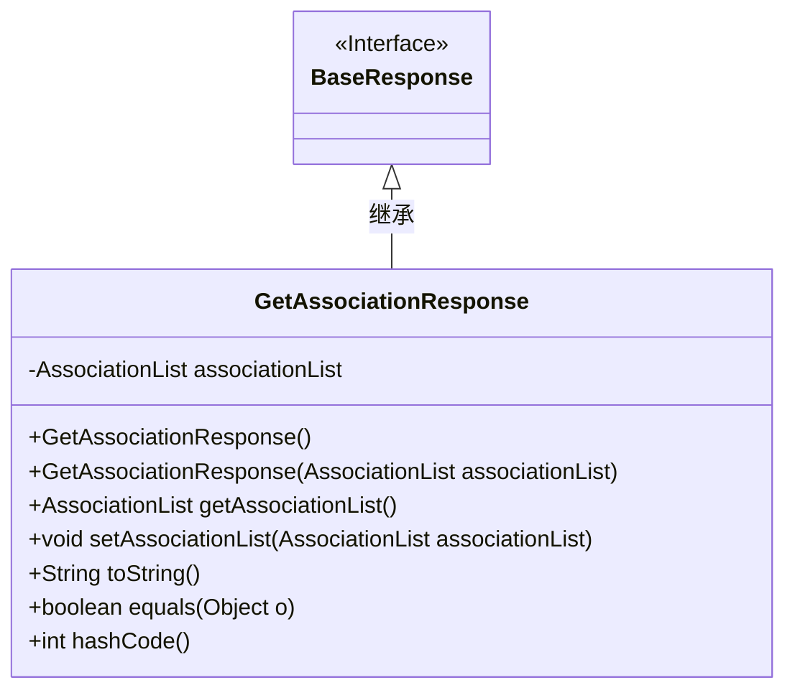
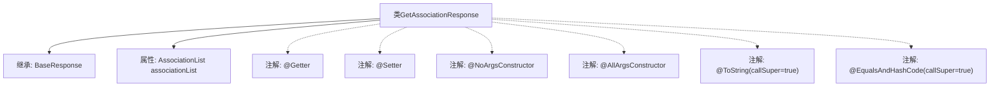

# 基础信息

|      |      |
|------|------|
| 名称 | GetAssociationResponse |
| 编码语言 | .java |
| 代码路径 | staffjoy/company-api/src/main/java/xyz/staffjoy/company/dto/GetAssociationResponse.java |
| 包名 | xyz.staffjoy.company.dto |
| 依赖项 | [None, 'xyz.staffjoy.common.api.BaseResponse'] |
| 概述说明 | Java类GetAssociationResponse继承BaseResponse，包含AssociationList属性及常用注解。 |

# 说明

该内容描述了一个名为GetAssociationResponse的Java类，继承自BaseResponse。类中使用了多个Lombok注解：@Getter和@Setter自动生成getter和setter方法，@NoArgsConstructor和@AllArgsConstructor分别生成无参和全参构造函数，@ToString和@EqualsAndHashCode用于生成toString和equals/hashCode方法，并设置callSuper=true以包含父类属性。类中包含一个AssociationList类型的私有成员变量associationList。

# 类列表 Class Summary

| 名称   | 类型  | 说明 |
|-------|------|-------------|
| GetAssociationResponse | class | Java类GetAssociationResponse继承BaseResponse，包含AssociationList属性及常用注解。 |

## 类 GetAssociationResponse

|      |      |
|------|------|
| 访问范围 | @Getter;@Setter;@NoArgsConstructor;@AllArgsConstructor;@ToString(callSuper = true);@EqualsAndHashCode(callSuper = true);public |
| 类型 | class |
| 名称 | GetAssociationResponse |
| 说明 | Java类GetAssociationResponse继承BaseResponse，包含AssociationList属性及常用注解。 |

### UML类图

类图描述：
该图展示了一个继承结构的类关系，GetAssociationResponse类继承自BaseResponse接口。GetAssociationResponse包含一个私有AssociationList类型成员变量，提供了完整的构造方法、getter/setter方法，以及重写了toString()、equals()和hashCode()方法。通过Lombok注解自动生成这些方法，体现了Java实体类的典型结构，同时保持了与父接口的继承关系。

### 内部方法调用关系图

这段代码展示了一个使用Lombok注解的Java类`GetAssociationResponse`，它继承自`BaseResponse`并包含一个`AssociationList`类型的属性。类通过注解自动生成getter/setter、无参构造器、全参构造器，以及重写了`toString()`和`equals/hashCode`方法（包含父类字段）。流程图清晰地呈现了类的继承关系、属性声明和Lombok注解的应用，体现了简洁的POJO设计模式。

### 字段列表 Field List

| 名称  | 类型  | 说明 |
|-------|-------|------|
| associationList | AssociationList | 私有关联列表变量associationList。 |

### 方法列表 Method List

| 名称  | 类型  | 说明 |
|-------|-------|------|

