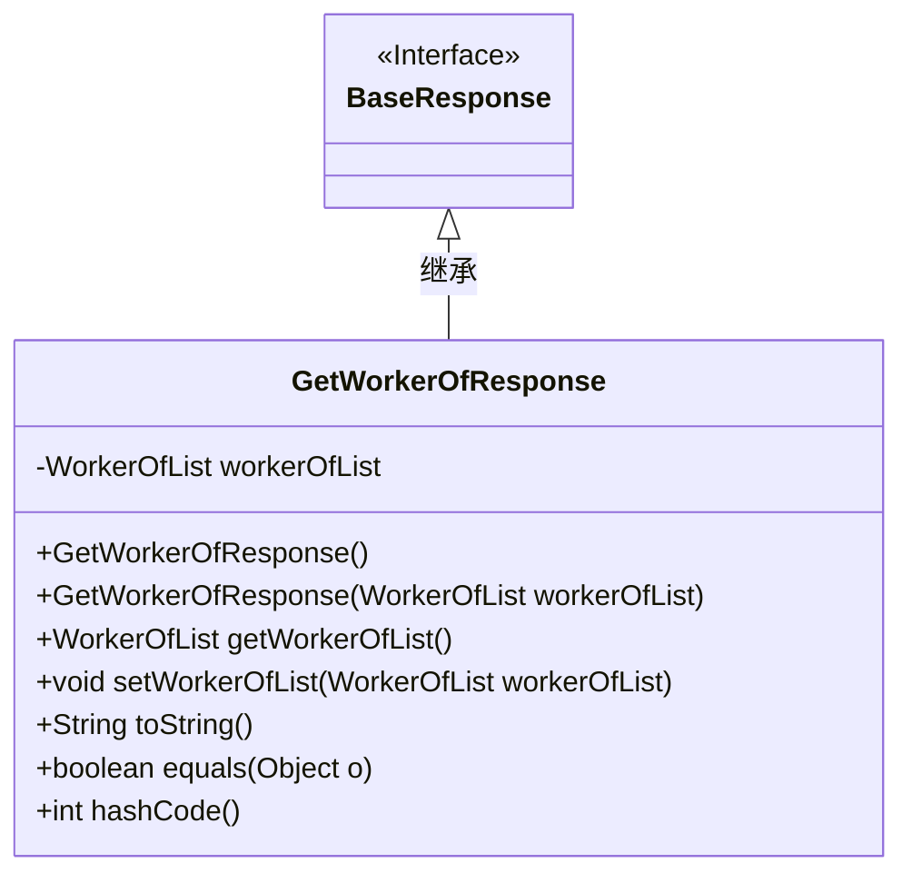
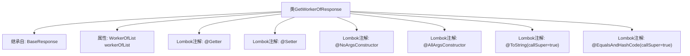

# 基础信息

|      |      |
|------|------|
| 名称 | GetWorkerOfResponse |
| 编码语言 | .java |
| 代码路径 | staffjoy/company-api/src/main/java/xyz/staffjoy/company/dto/GetWorkerOfResponse.java |
| 包名 | xyz.staffjoy.company.dto |
| 依赖项 | [None, 'xyz.staffjoy.common.api.BaseResponse'] |
| 概述说明 | Java类GetWorkerOfResponse继承BaseResponse，包含WorkerOfList字段，使用Lombok注解简化代码。 |

# 说明

该内容描述了一个名为GetWorkerOfResponse的Java类，继承自BaseResponse类。该类使用了多个Lombok注解：@Getter和@Setter自动生成getter和setter方法，@NoArgsConstructor和@AllArgsConstructor分别生成无参和全参构造函数，@ToString和@EqualsAndHashCode用于生成toString和equals/hashCode方法，并设置callSuper=true以包含父类属性。类中包含一个WorkerOfList类型的私有字段workerOfList。

# 类列表 Class Summary

| 名称   | 类型  | 说明 |
|-------|------|-------------|
| GetWorkerOfResponse | class | Java类GetWorkerOfResponse继承BaseResponse，包含WorkerOfList属性，使用Lombok注解生成方法。 |

## 类 GetWorkerOfResponse

|      |      |
|------|------|
| 访问范围 | @Getter;@Setter;@NoArgsConstructor;@AllArgsConstructor;@ToString(callSuper = true);@EqualsAndHashCode(callSuper = true);public |
| 类型 | class |
| 名称 | GetWorkerOfResponse |
| 说明 | Java类GetWorkerOfResponse继承BaseResponse，包含WorkerOfList属性，使用Lombok注解生成方法。 |

### UML类图

这段类图展示了GetWorkerOfResponse类继承自BaseResponse接口的结构。GetWorkerOfResponse包含一个WorkerOfList类型的私有字段，通过Lombok注解自动生成了无参构造器、全参构造器、getter/setter方法以及toString/equals/hashCode方法。类图清晰地体现了继承关系和类成员结构，其中BaseResponse作为父接口用<<Interface>>标注，GetWorkerOfResponse作为实现类包含完整的字段和方法定义。

### 内部方法调用关系图

这段代码展示了一个使用Lombok注解的Java类GetWorkerOfResponse，它继承自BaseResponse并包含一个WorkerOfList类型的属性。通过Lombok注解自动生成了getter/setter方法、无参构造器、全参构造器，并重写了toString()和equals()/hashCode()方法（包含父类字段）。流程图清晰地呈现了类的继承关系和注解功能，体现了Lombok简化POJO类开发的典型用法。

### 字段列表 Field List

| 名称  | 类型  | 说明 |
|-------|-------|------|
| workerOfList | WorkerOfList | 私有WorkerOfList类型变量workerOfList |

### 方法列表 Method List

| 名称  | 类型  | 说明 |
|-------|-------|------|

