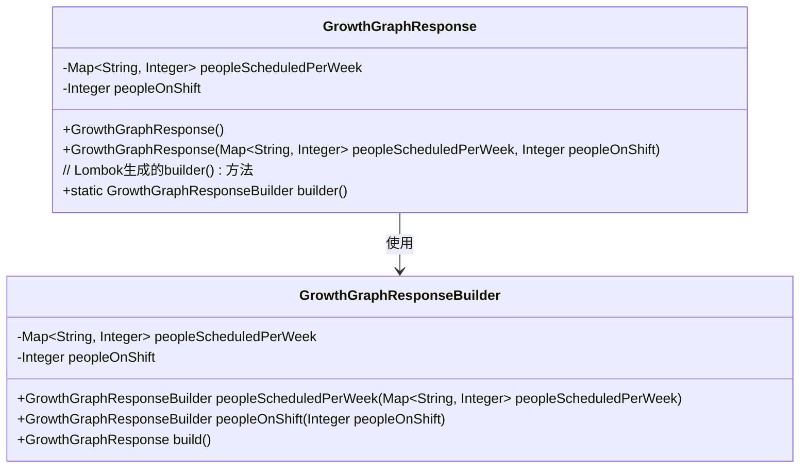
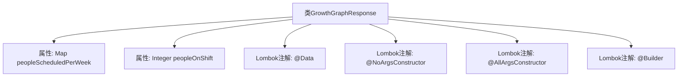

# 基础信息

|      |      |
|------|------|
| 名称 | GrowthGraphResponse |
| 编码语言 | .java |
| 代码路径 | staffjoy/company-api/src/main/java/xyz/staffjoy/company/dto/GrowthGraphResponse.java |
| 包名 | xyz.staffjoy.company.dto |
| 依赖项 | ['lombok.AllArgsConstructor', 'lombok.Builder', 'lombok.Data', 'lombok.NoArgsConstructor', 'java.util.Map'] |
| 概述说明 | GrowthGraphResponse类包含每周排班人数和当前在岗人数。 |

# 说明

这是一个名为GrowthGraphResponse的Java类，使用了Lombok库的注解来简化代码。类中包含两个主要属性：peopleScheduledPerWeek是一个以周为键、人数为值的映射表，用于记录每周排班人数；peopleOnShift则是一个整数类型变量，表示当前在岗人数。通过@NoArgsConstructor、@AllArgsConstructor和@Builder注解，该类自动生成了无参构造器、全参构造器以及建造者模式的支持。整个类结构简洁，专门用于处理与人员排班统计相关的数据响应。

# 类列表 Class Summary

| 名称   | 类型  | 说明 |
|-------|------|-------------|
| GrowthGraphResponse | class | GrowthGraphResponse类包含每周排班人数和当前在岗人数。 |

## 类 GrowthGraphResponse

|      |      |
|------|------|
| 访问范围 | @Data;@NoArgsConstructor;@AllArgsConstructor;@Builder;public |
| 类型 | class |
| 名称 | GrowthGraphResponse |
| 说明 | GrowthGraphResponse类包含每周排班人数和当前在岗人数。 |

### UML类图

这段代码展示了一个使用Lombok注解的GrowthGraphResponse类及其关联的Builder模式实现。类中包含两个核心字段：按周统计的人员排班映射表(peopleScheduledPerWeek)和在岗人员数(peopleOnShift)。通过@Builder注解自动生成的GrowthGraphResponseBuilder类，提供了流畅的链式API来构造复杂对象。整体设计体现了不可变对象与建造者模式的结合，适用于需要灵活构造且线程安全的数据传输场景。

### 内部方法调用关系图

这段流程图展示了GrowthGraphResponse类的结构，该类使用Lombok注解自动生成getter/setter、无参构造器、全参构造器和建造者模式。核心属性包括按周统计的人员排班映射表peopleScheduledPerWeek和当前在岗人数peopleOnShift。通过Lombok简化了样板代码，使类定义更简洁，适用于数据响应场景。

### 字段列表 Field List

| 名称  | 类型  | 说明 |
|-------|-------|------|
| peopleScheduledPerWeek | Map<String, Integer> | 私有变量：按周统计人员安排的映射表。 |
| peopleOnShift | Integer | 私有整型变量，记录当班人数。 |

### 方法列表 Method List

| 名称  | 类型  | 说明 |
|-------|-------|------|

