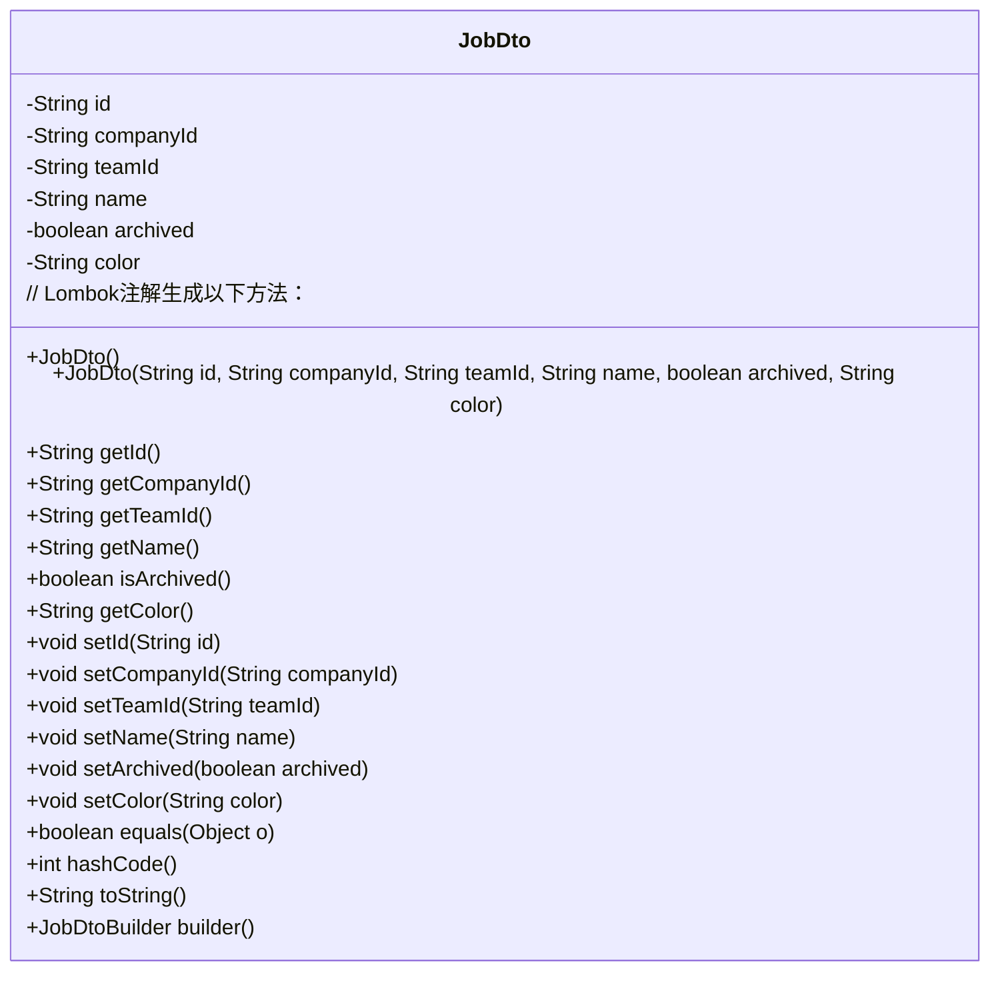
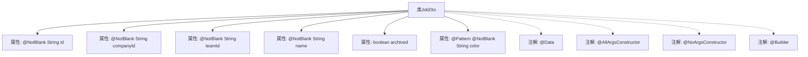

# 基础信息

|      |      |
|------|------|
| 名称 | JobDto |
| 编码语言 | .java |
| 代码路径 | staffjoy/company-api/src/main/java/xyz/staffjoy/company/dto/JobDto.java |
| 包名 | xyz.staffjoy.company.dto |
| 依赖项 | ['lombok.AllArgsConstructor', 'lombok.Builder', 'lombok.Data', 'lombok.NoArgsConstructor', 'javax.validation.constraints'] |
| 概述说明 | JobDto类包含id、公司ID、团队ID、名称、归档状态和颜色字段，使用Lombok注解简化代码。 |

# 说明

这是一个名为JobDto的Java类，用于表示工作职位的数据传输对象。该类包含以下字段：id（非空字符串）、companyId（非空字符串）、teamId（非空字符串）、name（非空字符串）、archived（布尔值）和color（非空字符串，必须符合十六进制颜色代码格式）。类使用了Lombok注解自动生成全参数构造函数、无参数构造函数和建造者模式，并使用了数据注解。所有字符串字段都标记为不可为空，color字段还额外增加了正则表达式验证。

# 类列表 Class Summary

| 名称   | 类型  | 说明 |
|-------|------|-------------|
| JobDto | class | JobDto类包含id、公司ID、团队ID、名称、归档状态和颜色字段，使用Lombok注解并验证非空和颜色格式。 |

## 类 JobDto

|      |      |
|------|------|
| 访问范围 | @Data;@AllArgsConstructor;@NoArgsConstructor;@Builder;public |
| 类型 | class |
| 名称 | JobDto |
| 说明 | JobDto类包含id、公司ID、团队ID、名称、归档状态和颜色字段，使用Lombok注解并验证非空和颜色格式。 |

### UML类图

这段代码展示了一个使用Lombok注解的Java数据传输对象（DTO）类`JobDto`。该类包含6个字段：`id`、`companyId`、`teamId`、`name`、`archived`和`color`，其中前四个字段和`color`字段都有`@NotBlank`验证约束，`color`字段还有正则表达式验证。Lombok的`@Data`、`@AllArgsConstructor`、`@NoArgsConstructor`和`@Builder`注解自动生成了构造函数、getter/setter、equals/hashCode/toString方法以及builder模式支持。这个类主要用于在应用程序的不同层之间传递职位相关信息。

### 内部方法调用关系图

该流程图展示了JobDto类的结构，包含6个属性和4个Lombok注解。属性中包含4个@NotBlank字符串字段、1个布尔值字段和1个带正则校验的颜色字段。注解@Data提供getter/setter，@AllArgsConstructor/@NoArgsConstructor生成构造方法，@Builder支持建造者模式。所有属性均通过注解实现数据校验和对象构造功能，符合DTO设计规范。

### 字段列表 Field List

| 名称  | 类型  | 说明 |
|-------|-------|------|
| name | String | 非空字符串字段name |
| teamId | String | 非空团队ID字符串字段。 |
| archived | boolean | 私有布尔型变量archived，表示归档状态。 |
| companyId | String | 非空公司ID字符串 |
| id | String | 非空字符串ID字段 |
| color | String | 校验颜色字段：非空且符合十六进制格式。 |

### 方法列表 Method List

| 名称  | 类型  | 说明 |
|-------|-------|------|

