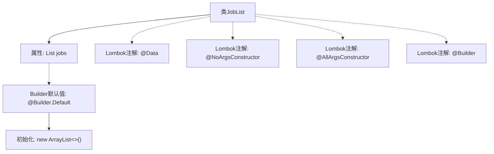

# 基础信息

|      |      |
|------|------|
| 名称 | JobList |
| 编码语言 | .java |
| 代码路径 | staffjoy/company-api/src/main/java/xyz/staffjoy/company/dto/JobList.java |
| 包名 | xyz.staffjoy.company.dto |
| 依赖项 | [None, 'java.util.ArrayList', 'java.util.List'] |
| 概述说明 | Java类JobList，包含jobs列表，使用Lombok注解简化代码。 |

# 说明

该内容定义了一个名为JobList的Java类，使用了Lombok库的注解来简化代码。类中包含一个JobDto类型的列表字段jobs，初始化为空ArrayList。通过@NoArgsConstructor生成无参构造器，@AllArgsConstructor生成全参构造器，@Builder提供建造者模式支持，并用@Builder.Default确保jobs字段在建造时默认初始化为空列表。整个类结构简洁，专注于封装工作任务列表数据。

# 类列表 Class Summary

| 名称   | 类型  | 说明 |
|-------|------|-------------|
| JobList | class | Java类JobList，包含JobDto列表，支持无参、全参构造及Builder模式。 |


## 类 JobList

|      |      |
|------|------|
| 访问范围 | @Data;@NoArgsConstructor;@AllArgsConstructor;@Builder;public |
| 类型 | class |
| 名称 | JobList |
| 说明 | Java类JobList，包含JobDto列表，支持无参、全参构造及Builder模式。 |


### UML类图

```mermaid
classDiagram
    class JobList {
        -List~JobDto~ jobs
        +JobList()
        +JobList(List~JobDto~ jobs)
        +List~JobDto~ getJobs()
        +void setJobs(List~JobDto~ jobs)
        +String toString()
        +boolean equals(Object o)
        +int hashCode()
    }
    // JobList 使用Lombok注解自动生成构造器、getter/setter和builder模式
    // 默认初始化jobs为空ArrayList，支持链式构建和全参数构造
```

这段类图展示了一个使用Lombok注解的JobList类，其主要功能是封装JobDto对象的列表。通过@Builder实现建造者模式，@Data自动生成getter/setter和基础方法，@NoArgsConstructor/@AllArgsConstructor提供无参和全参构造。类内部维护一个泛型为JobDto的ArrayList，默认通过@Builder.Default初始化。该设计简化了POJO类的样板代码，支持灵活的对象构建和集合操作。


### 内部方法调用关系图



这段代码定义了一个使用Lombok注解的JobList类，主要功能是管理JobDto对象的列表。通过@Data自动生成getter/setter，@NoArgsConstructor和@AllArgsConstructor分别提供无参和全参构造方法，@Builder支持链式创建对象，@Builder.Default确保jobs属性在未赋值时初始化为空ArrayList。该设计简化了POJO类的样板代码，适用于需要动态维护任务列表的场景。

### 字段列表 Field List

| 名称  | 类型  | 说明 |
|-------|-------|------|
| jobs = new ArrayList<>() | List<JobDto> | 默认初始化jobs为空列表。 |

### 方法列表 Method List

| 名称  | 类型  | 说明 |
|-------|-------|------|


