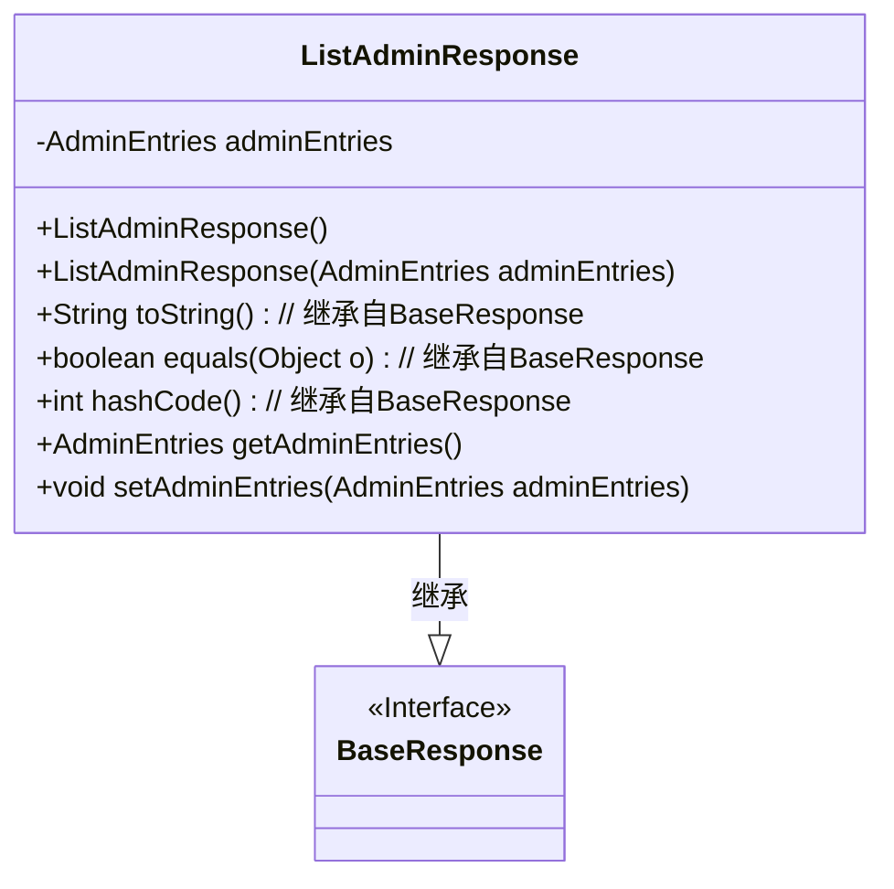
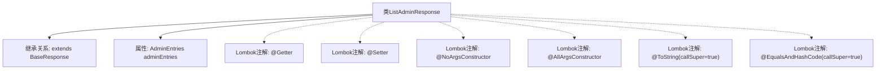

# 基础信息

|      |      |
|------|------|
| 名称 | ListAdminResponse |
| 编码语言 | .java |
| 代码路径 | staffjoy/company-api/src/main/java/xyz/staffjoy/company/dto/ListAdminResponse.java |
| 包名 | xyz.staffjoy.company.dto |
| 依赖项 | [None, 'xyz.staffjoy.common.api.BaseResponse'] |
| 概述说明 | Java类ListAdminResponse继承BaseResponse，包含AdminEntries字段，使用Lombok注解。 |

# 说明

该内容描述了一个名为ListAdminResponse的Java类，继承自BaseResponse类。该类使用了多个Lombok注解以简化代码：@Getter和@Setter自动生成字段的getter和setter方法；@NoArgsConstructor和@AllArgsConstructor分别生成无参和全参构造函数；@ToString和@EqualsAndHashCode用于自动生成toString和equals/hashCode方法，并通过callSuper参数确保包含父类属性。类中包含一个AdminEntries类型的私有字段adminEntries。

# 类列表 Class Summary

| 名称   | 类型  | 说明 |
|-------|------|-------------|
| ListAdminResponse | class | Java类ListAdminResponse继承BaseResponse，包含AdminEntries字段及常用注解。 |

## 类 ListAdminResponse

|      |      |
|------|------|
| 访问范围 | @Getter;@Setter;@NoArgsConstructor;@AllArgsConstructor;@ToString(callSuper = true);@EqualsAndHashCode(callSuper = true);public |
| 类型 | class |
| 名称 | ListAdminResponse |
| 说明 | Java类ListAdminResponse继承BaseResponse，包含AdminEntries字段及常用注解。 |

### UML类图

这段类图展示了ListAdminResponse类继承自BaseResponse接口的结构。ListAdminResponse包含一个私有AdminEntries类型的成员变量adminEntries，通过Lombok注解自动生成了无参构造器、全参构造器、getter/setter方法，并重写了toString()、equals()和hashCode()方法（通过callSuper=true确保包含父类属性）。类图清晰地体现了继承关系和类的基本结构，符合Java类定义规范。

### 内部方法调用关系图

这段代码展示了一个使用Lombok注解的Java类ListAdminResponse，它继承自BaseResponse类。类中包含一个AdminEntries类型的属性adminEntries，并通过Lombok自动生成了getter、setter、无参构造器、全参构造器、toString和equals/hashCode方法。其中toString和equals/hashCode方法通过callSuper=true参数包含了父类的字段。该设计简化了样板代码，同时保持了对象的完整功能性和可维护性。

### 字段列表 Field List

| 名称  | 类型  | 说明 |
|-------|-------|------|
| adminEntries | AdminEntries | 私有管理员条目变量adminEntries。 |

### 方法列表 Method List

| 名称  | 类型  | 说明 |
|-------|-------|------|

