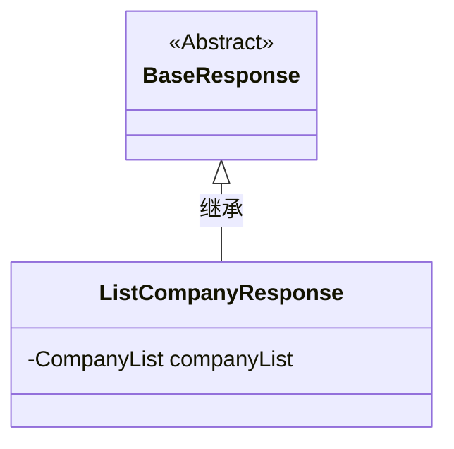
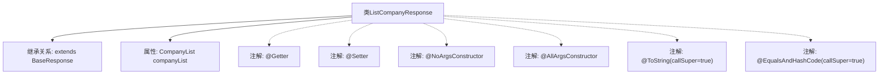

# 基础信息

|      |      |
|------|------|
| 名称 | ListCompanyResponse |
| 编码语言 | .java |
| 代码路径 | staffjoy/company-api/src/main/java/xyz/staffjoy/company/dto/ListCompanyResponse.java |
| 包名 | xyz.staffjoy.company.dto |
| 依赖项 | [None, 'xyz.staffjoy.common.api.BaseResponse'] |
| 概述说明 | Java类ListCompanyResponse继承BaseResponse，包含公司列表属性及常用注解。 |

# 说明

这是一个名为ListCompanyResponse的Java类，继承自BaseResponse。类使用了Lombok注解自动生成getter、setter方法，包含无参构造器和全参构造器。重写了toString和equals/hashCode方法，并调用父类方法。类中包含一个CompanyList类型的私有字段companyList。

# 类列表 Class Summary

| 名称   | 类型  | 说明 |
|-------|------|-------------|
| ListCompanyResponse | class | Java类ListCompanyResponse继承BaseResponse，包含CompanyList字段及常用注解。 |

## 类 ListCompanyResponse

|      |      |
|------|------|
| 访问范围 | @Getter;@Setter;@NoArgsConstructor;@AllArgsConstructor;@ToString(callSuper = true);@EqualsAndHashCode(callSuper = true);public |
| 类型 | class |
| 名称 | ListCompanyResponse |
| 说明 | Java类ListCompanyResponse继承BaseResponse，包含CompanyList字段及常用注解。 |

### UML类图

这段类图展示了ListCompanyResponse继承自BaseResponse的关系。ListCompanyResponse是一个具体类，包含一个私有CompanyList类型成员变量companyList，通过Lombok注解自动生成getter/setter、无参构造器、全参构造器、toString和equals/hashCode方法。BaseResponse被标记为抽象类，作为所有响应类的基类。该设计遵循了Java的继承体系，通过注解简化了样板代码的编写，同时保持了对象的封装性和可扩展性。

### 内部方法调用关系图

这段代码描述了一个名为ListCompanyResponse的类，它继承了BaseResponse基类，包含一个CompanyList类型的属性companyList。类上使用了Lombok库的多个注解：@Getter/@Setter自动生成getter/setter方法，@NoArgsConstructor/@AllArgsConstructor生成无参和全参构造方法，@ToString和@EqualsAndHashCode在生成方法时会考虑父类字段（callSuper=true）。该设计主要用于封装公司列表数据的响应对象，通过注解简化了样板代码的编写。

### 字段列表 Field List

| 名称  | 类型  | 说明 |
|-------|-------|------|
| companyList | CompanyList | 私有公司列表变量companyList。 |

### 方法列表 Method List

| 名称  | 类型  | 说明 |
|-------|-------|------|

