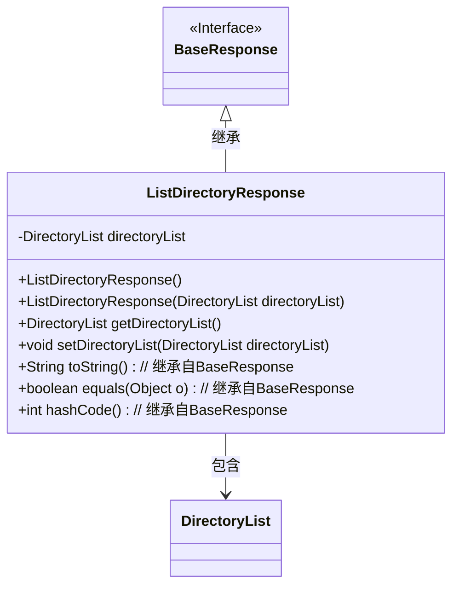
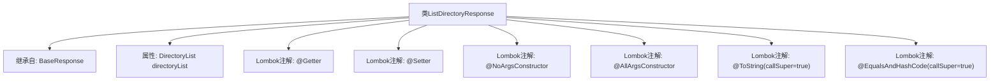

# 基础信息

|      |      |
|------|------|
| 名称 | ListDirectoryResponse |
| 编码语言 | .java |
| 代码路径 | staffjoy/company-api/src/main/java/xyz/staffjoy/company/dto/ListDirectoryResponse.java |
| 包名 | xyz.staffjoy.company.dto |
| 依赖项 | [None, 'xyz.staffjoy.common.api.BaseResponse'] |
| 概述说明 | Java类ListDirectoryResponse继承BaseResponse，包含目录列表属性及常用注解。 |

# 说明

这是一个名为ListDirectoryResponse的Java类，继承自BaseResponse。类上使用了多个Lombok注解：@Getter和@Setter自动生成getter和setter方法，@NoArgsConstructor和@AllArgsConstructor分别生成无参和全参构造函数，@ToString和@EqualsAndHashCode在生成方法时会包含父类属性。类中包含一个DirectoryList类型的私有字段directoryList。

# 类列表 Class Summary

| 名称   | 类型  | 说明 |
|-------|------|-------------|
| ListDirectoryResponse | class | Java类ListDirectoryResponse继承BaseResponse，包含目录列表属性及常用注解。 |

## 类 ListDirectoryResponse

|      |      |
|------|------|
| 访问范围 | @Getter;@Setter;@NoArgsConstructor;@AllArgsConstructor;@ToString(callSuper = true);@EqualsAndHashCode(callSuper = true);public |
| 类型 | class |
| 名称 | ListDirectoryResponse |
| 说明 | Java类ListDirectoryResponse继承BaseResponse，包含目录列表属性及常用注解。 |

### UML类图

这段类图展示了ListDirectoryResponse继承自BaseResponse接口，并包含一个DirectoryList私有成员。类中通过Lombok注解自动生成了构造方法、getter/setter以及toString/equals/hashCode方法（部分继承自基类）。DirectoryList作为组合关系被ListDirectoryResponse持有，体现了目录列表查询响应的数据结构设计。

### 内部方法调用关系图

这段代码定义了一个名为ListDirectoryResponse的类，它继承自BaseResponse类，并包含一个DirectoryList类型的属性directoryList。该类使用了多个Lombok注解来简化代码，包括自动生成getter和setter方法、无参构造方法、全参构造方法、toString方法以及equals和hashCode方法。这些注解通过callSuper=true参数确保在生成方法时会考虑父类的字段。整个类结构简洁，主要用于封装目录列表的响应数据。

### 字段列表 Field List

| 名称  | 类型  | 说明 |
|-------|-------|------|
| directoryList | DirectoryList | 私有目录列表对象directoryList。 |

### 方法列表 Method List

| 名称  | 类型  | 说明 |
|-------|-------|------|

