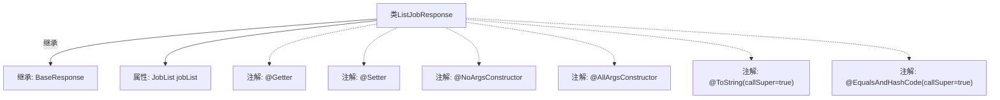

# 基础信息

|      |      |
|------|------|
| 名称 | ListJobResponse |
| 编码语言 | .java |
| 代码路径 | staffjoy/company-api/src/main/java/xyz/staffjoy/company/dto/ListJobResponse.java |
| 包名 | xyz.staffjoy.company.dto |
| 依赖项 | [None, 'xyz.staffjoy.common.api.BaseResponse'] |
| 概述说明 | Java类ListJobResponse继承BaseResponse，包含JobList字段及常用注解。 |

# 说明

这段内容描述了一个名为ListJobResponse的Java类，该类继承自BaseResponse。类中使用了多个Lombok注解：@Getter和@Setter为所有字段生成getter和setter方法；@NoArgsConstructor生成无参构造器；@AllArgsConstructor生成全参构造器；@ToString和@EqualsAndHashCode分别生成toString和equals/hashCode方法，并通过callSuper=true包含父类属性。类中包含一个JobList类型的私有字段jobList。

# 类列表 Class Summary

| 名称   | 类型  | 说明 |
|-------|------|-------------|
| ListJobResponse | class | Java类ListJobResponse继承BaseResponse，包含JobList字段及常用注解。 |


## 类 ListJobResponse

|      |      |
|------|------|
| 访问范围 | @Getter;@Setter;@NoArgsConstructor;@AllArgsConstructor;@ToString(callSuper = true);@EqualsAndHashCode(callSuper = true);public |
| 类型 | class |
| 名称 | ListJobResponse |
| 说明 | Java类ListJobResponse继承BaseResponse，包含JobList字段及常用注解。 |


### UML类图

```mermaid
classDiagram
    class BaseResponse {
        <<Abstract>>
        // 基础响应类，其他响应类继承此类
    }
    
    class ListJobResponse {
        -JobList jobList
        +ListJobResponse()
        +ListJobResponse(JobList jobList)
        +JobList getJobList()
        +void setJobList(JobList jobList)
        +String toString()  // 调用父类方法
        +boolean equals(Object o)  // 调用父类方法
        +int hashCode()  // 调用父类方法
    }
    
    class JobList {
        // 表示工作列表的类
    }
    
    BaseResponse <|-- ListJobResponse  // 继承关系
    ListJobResponse --> JobList : 包含  // 关联关系
```

这段类图展示了ListJobResponse继承自BaseResponse，并包含一个JobList成员的结构。ListJobResponse通过Lombok注解自动生成了构造方法、getter/setter以及toString/equals/hashCode方法（其中后三个方法调用父类实现）。BaseResponse作为抽象基类提供通用响应属性，JobList则封装具体的工作列表数据。整个设计体现了响应对象的层次结构和组合关系。


### 内部方法调用关系图



这段代码定义了一个名为ListJobResponse的Java类，该类继承自BaseResponse。类中包含一个JobList类型的属性jobList，并通过Lombok注解自动生成getter/setter方法、无参构造器、全参构造器，以及重写了toString和equals/hashCode方法（调用父类逻辑）。流程图清晰展示了类的继承关系、属性定义和注解标记，体现了Lombok简化POJO类开发的典型用法。

### 字段列表 Field List

| 名称  | 类型  | 说明 |
|-------|-------|------|
| jobList | JobList | 私有JobList对象jobList |

### 方法列表 Method List

| 名称  | 类型  | 说明 |
|-------|-------|------|


