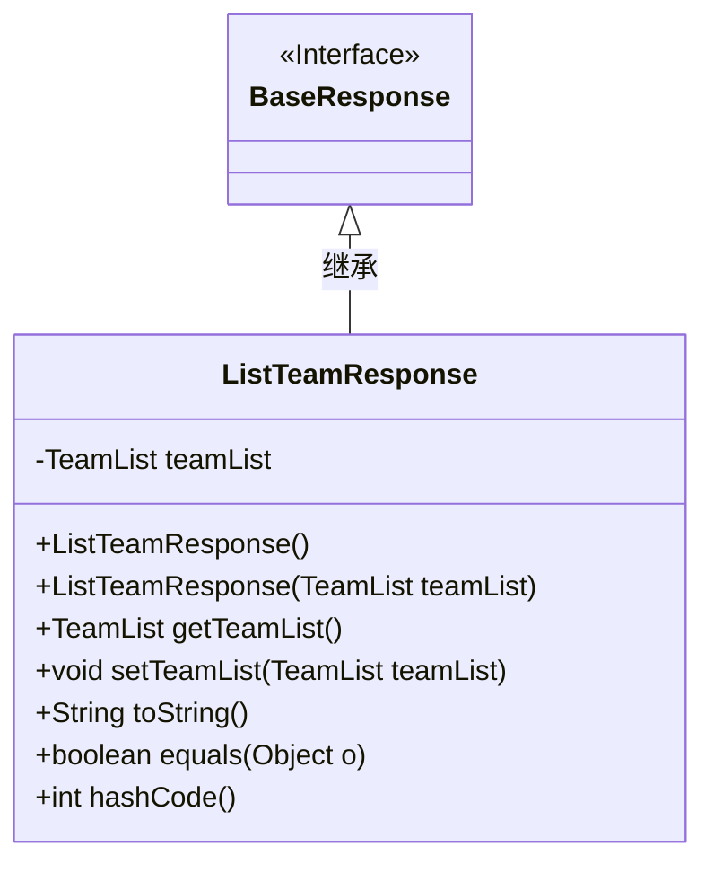
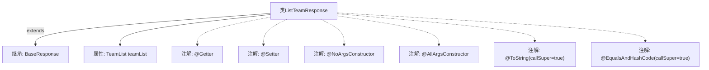

# 基础信息

|      |      |
|------|------|
| 名称 | ListTeamResponse |
| 编码语言 | .java |
| 代码路径 | staffjoy/company-api/src/main/java/xyz/staffjoy/company/dto/ListTeamResponse.java |
| 包名 | xyz.staffjoy.company.dto |
| 依赖项 | [None, 'xyz.staffjoy.common.api.BaseResponse'] |
| 概述说明 | Java类ListTeamResponse继承BaseResponse，包含TeamList属性，使用Lombok注解生成getter/setter等方法。 |

# 说明

这段内容描述了一个名为ListTeamResponse的Java类，该类继承自BaseResponse。类中使用了多个Lombok注解：@Getter和@Setter自动生成getter和setter方法，@NoArgsConstructor和@AllArgsConstructor分别生成无参和全参构造函数，@ToString和@EqualsAndHashCode用于生成toString和equals/hashCode方法，并设置callSuper=true以包含父类属性。类中包含一个TeamList类型的私有字段teamList。

# 类列表 Class Summary

| 名称   | 类型  | 说明 |
|-------|------|-------------|
| ListTeamResponse | class | Java类ListTeamResponse继承BaseResponse，包含TeamList字段，使用Lombok注解生成方法。 |

## 类 ListTeamResponse

|      |      |
|------|------|
| 访问范围 | @Getter;@Setter;@NoArgsConstructor;@AllArgsConstructor;@ToString(callSuper = true);@EqualsAndHashCode(callSuper = true);public |
| 类型 | class |
| 名称 | ListTeamResponse |
| 说明 | Java类ListTeamResponse继承BaseResponse，包含TeamList字段，使用Lombok注解生成方法。 |

### UML类图

这段类图展示了`ListTeamResponse`继承自`BaseResponse`接口的结构。`ListTeamResponse`包含私有成员`teamList`，通过Lombok注解自动生成了无参/全参构造器、getter/setter方法，以及覆写了`toString()`、`equals()`和`hashCode()`方法。类图清晰地反映了继承关系和成员方法，符合Java类规范，且通过泛型标注保证了类型安全。

### 内部方法调用关系图

这段代码展示了一个使用Lombok注解的Java类`ListTeamResponse`，它继承自`BaseResponse`并包含一个`TeamList`类型的属性。类上标注了多个Lombok注解，包括自动生成getter/setter、无参构造器、全参构造器、toString和equals/hashCode方法（均调用父类实现）。流程图清晰地呈现了类的继承关系、属性定义和注解标记，体现了Lombok简化POJO类开发的典型用法。

### 字段列表 Field List

| 名称  | 类型  | 说明 |
|-------|-------|------|
| teamList | TeamList | 私有团队列表变量 |

### 方法列表 Method List

| 名称  | 类型  | 说明 |
|-------|-------|------|

