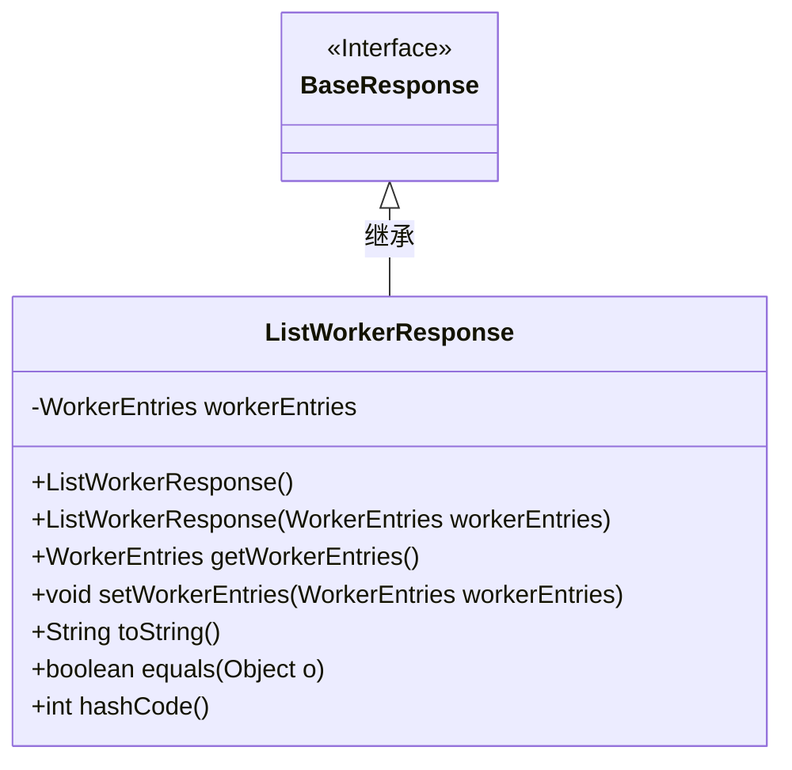
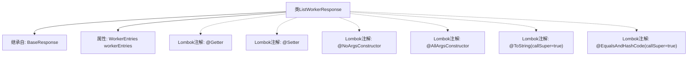

# 基础信息

|      |      |
|------|------|
| 名称 | ListWorkerResponse |
| 编码语言 | .java |
| 代码路径 | staffjoy/company-api/src/main/java/xyz/staffjoy/company/dto/ListWorkerResponse.java |
| 包名 | xyz.staffjoy.company.dto |
| 依赖项 | [None, 'xyz.staffjoy.common.api.BaseResponse'] |
| 概述说明 | Java类ListWorkerResponse继承BaseResponse，包含WorkerEntries字段，提供Getter/Setter和构造方法。 |

# 说明

该内容描述了一个名为ListWorkerResponse的Java类，该类继承自BaseResponse。使用了Lombok库的多个注解：@Getter和@Setter自动生成getter和setter方法，@NoArgsConstructor和@AllArgsConstructor分别生成无参和全参构造函数，@ToString和@EqualsAndHashCode在生成toString和equals/hashCode方法时包含父类属性。类中包含一个WorkerEntries类型的私有字段workerEntries。

# 类列表 Class Summary

| 名称   | 类型  | 说明 |
|-------|------|-------------|
| ListWorkerResponse | class | Java类ListWorkerResponse继承BaseResponse，包含WorkerEntries字段，提供Getter/Setter、无参/全参构造及toString/equals/hashCode方法。 |

## 类 ListWorkerResponse

|      |      |
|------|------|
| 访问范围 | @Getter;@Setter;@NoArgsConstructor;@AllArgsConstructor;@ToString(callSuper = true);@EqualsAndHashCode(callSuper = true);public |
| 类型 | class |
| 名称 | ListWorkerResponse |
| 说明 | Java类ListWorkerResponse继承BaseResponse，包含WorkerEntries字段，提供Getter/Setter、无参/全参构造及toString/equals/hashCode方法。 |

### UML类图

这段类图展示了`ListWorkerResponse`继承自`BaseResponse`接口的结构。`ListWorkerResponse`包含一个私有`WorkerEntries`类型成员变量，通过Lombok注解自动生成了无参/全参构造函数、getter/setter方法以及`toString()`、`equals()`和`hashCode()`方法。类图清晰地反映了继承关系和类成员结构，符合Java Bean规范的设计模式。

### 内部方法调用关系图

这段代码展示了一个使用Lombok注解的Java类`ListWorkerResponse`，它继承自`BaseResponse`并包含一个`WorkerEntries`类型的属性。流程图清晰地呈现了类的继承关系、属性定义以及6个Lombok注解的关联关系，包括自动生成getter/setter、无参/全参构造器、包含父类字段的toString和equals/hashCode方法。该设计通过注解简化了样板代码，体现了Java项目中常见的DTO实现模式。

### 字段列表 Field List

| 名称  | 类型  | 说明 |
|-------|-------|------|
| workerEntries | WorkerEntries | 私有WorkerEntries对象workerEntries |

### 方法列表 Method List

| 名称  | 类型  | 说明 |
|-------|-------|------|

